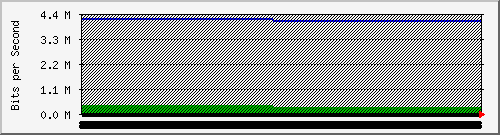

### 一、mrtg的配置


#### 1.1 生成监控文件	cfgmaker  Create mrtg.cfg files 

cfgmaker [Options] [community@]router

```shell
cfgmaker -output /var/www/mrtg/172.172.1.2.mrtg.cfg public@172.172.1.2

cfgmaker -output /var/www/mrtg/172.22.0.254.mrtg.cfg ruijie@172.22.0.254

/usr/bin/cfgmaker --snmp-option=:::::2 -output /var/www/mrtg/172.172.1.1.mrtg.cfg public@172.172.1.1

/usr/bin/cfgmaker --subdirs=HOSTNAME --snmp-option=:::::2 --no-down sggt@10.14.100.171
```

重要参数说明：

- --no-down 采集时，接口不通也显示。
- --subdirs=HOSTNAME   按照HOSTAME 生成目录

```
give each router its own subdirectory, naming each per "format", in which HOSTNAME and SNMPNAME will be replaced by the values of those items -- for instance, --subdirs=HOSTNAME or --subdirs="HOSTNAME (SNMPNAME)"
```

- 

以下内容为解决，MRTG监控端口流量大于100M的交换机，数据不准确的问题所用的参考。

--snmp-option=:::::2  //在cfgmaker中加入此项用于支持snmpv2.


#### 1.2 修改配置文件

```shell
### Global Config Options

#  for UNIX
# WorkDir: /home/http/mrtg

#  for Debian
WorkDir: /var/www/mrtg

#  or for NT
# WorkDir: c:\mrtgdata

### Global Defaults

#  to get bits instead of bytes and graphs growing to the right
Options[_]: growright, bits

EnableIPv6: no
```


```shell
WorkDir: c:\www\mrtg    //修改后面的工作目录和实际相符
RunAsDaemon:yes        //让命令每五分钟（默认值）运行一次，如果要改变时间则可以用下面的命令。
Interval:5                       //可以自由设置时间的长度，是分钟数。
Options[_]: growright, bits

```

#### 1.3  建立MRTG统计首页（使用indexmaker） 

```shell
	indexmaker --output=/var/ww/html/index.html  /var/www/html/mrtg.cfg 
```

#### 1.4 自动执行

```shell
	
contab -e	
[root@localhost mrtg]# crontab -l
*/5 * * * * env LANG=C /usr/bin/mrtg /var/www/mrtg/172.172.1.1.mrtg.cfg --logging /var/log/mrtg.log
*/5 * * * * env LANG=C /usr/bin/mrtg /var/www/mrtg/172.172.1.2.mrtg.cfg --logging /var/log/mrtg.log
```

在/etc/cron.d中创建单独的配置文件mrtg

```
*/5 * * * * root env LANG=c /usr/bin/mrtg /etc/mrtg/all.cfg 2>&1 |tee -a /var/log/mrtg/mrtg.log
```


### 二、详细

#### 2.1 cfgmaker 常用参数

***--subdirs format***

每个主机生成的文件放在单独的目录中。

Give each router its own subdirectory for the HTML and graphics (or .rrd) files. The directory name is the given format string with a couple of pattern replacements. The string "HOSTNAME" will be replaced by the hostname of the router (however you specified it on the cfgmaker commandline -- it may be an actual hostname or just an IP address), and "SNMPNAME" will be replaced with the device's idea of its own name (the same name that appears on the right side of the "Title" lines). For instance, a call like:

````shell
 cfgmaker --subdirs=HOSTNAME__SNMPNAME public@10.10.0.18
would result in the generation of lines looking something like:

 Directory[10.10.0.18_1]: 10.10.0.18__fp2200-bothrip-1.3
````

### 三、遇到的问题

#### 3.1 时间不准确导致的问题

由于主机电池失效，导致重启后时间不准确。从而导致生成的数据不准确。生成的图像如下：



修改成正确的时间，图像还是如此，一直没有找到原因。

