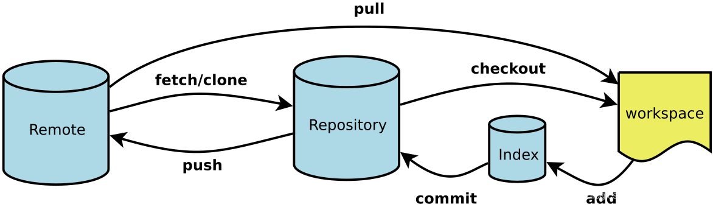

```
git -v 
```

### 一、基本配置

#### 1.1初始化配置

```
git config --global user.name "Jasper Yang"
git config --global user.email sunliguo2006@qq.com
git config --global credential.helper store
git config --glboal --list
--global:全局配置，所有仓库生效
--system：系统配置，对所有用户生效
```

##### 1.1.1 列出所有的全局配置

```
git config --global -l
```

##### 1.1.2 删除错误的配置

要删除 Git 的全局配置中错误的项目，你可以使用 `git config --global --unset` 命令。

```
git config --global --unset
```

### 二、创建仓库

```
git init 
git clone
```

#### 2.1回退版本

```
git reset --soft
git reset --hard
git reset --mixed
```

#### 2.2查看差异

```
git diff
```

#### 2.3删除文件

```
rm file;git add file 先从工作区删除文件，然后再暂存删除内容

git rm file 把文件从工作区和暂存区同时删除
git rm --cached file 把文件从暂存区删除，但保留再当前工作区
git rm -r * 递归删除某个目录
删除后提交
```

 ```
 git remote add <shortname> <url>
 git remote -v # 查看当前仓库所对应的远程仓库的别名和地址
 ```

### 三、项目分支

#### 3.1查看项目分支

```
git branch 列出本地已经存在的分支，并且当前分支会用*标记
git branch -r 查看远程版本库的分支列表
git branch -a 查看所有分支列表（包括本地和远程，remotes/开头的表示远程分支）
git branch -v 查看一个分支的最后一次提交
git branch --merged  查看哪些分支已经合并到当前分支
git branch --no-merged 查看所有未合并工作的分支
```

#### 3.2创建分支

创建并切换到新分支

```
git checkout -b feature-A
```

等同于

```
git branch feature-A 	#	创建新分支
git chekcout feature-A	# 切换到新分支
```

分支上传 本地仓库推送版本记录到远程仓库

```
git push 远程仓库别名 远程仓库分支
git push orgin feature-A
```

```
git push -u origin main 
# -u的作用是将本地分支和远程分支进行关联，这样以后的git push命令就可以简化为git push 而不需要指定远程分支和本地分支的对应关系。
git push origin main
```

#### 3.3从远程仓库pull（拉取）代码到本地分支

1、指定远程分支和本地分支

```
git pull origin 远程分支名称:本地分支名称
```

origin 是远程仓库连接默认的对象名称。

2、如果不写本地分支名称，则默认和远程分支同名

```
git pull origin 远程分支名称
```

#### git拉取远程分支并切换到该分支

整理了五种方法，这五种方法（除了第4中已经写了fetch的步骤）执行前都需要执行git fetch来同步远程仓库

（1）git checkout -b 本地分支名 origin/远程分支名

（2）git checkout --track origin/远程分支名 （这种写法是上面的简化版，效果完全一样）

（3）git checkout -t origin/远程分支名（这种写法是2的简化版）

（4）fetch指定的一个分支：git fetch [repo] [remote_branch_name]:[local_branch_name]

​     git checkout [local_branch_name]

​    （第一行的:[local_branch_name]如果不写，则本地新建的分支名默认与远程分支名相同）

（5）git fetch 获取远程所有分支

​     git branch -r 可以看到所有远程分支，假设有一个分支叫origin/mybranch

​     git checkout mybranch即可，会在本地新建一个同名分支，并与该远程分支关联

​     （git checkout origin/mybranch 会进入detached head状态，不会在本地新建分支，不要这样写）


#### 3.4将新分支推送到远程仓库

方法1：使用git命令

```
git push orgin 分支名称
```

假如本地新建了dev的分支，远程仓库还没有这个分支，推送的命令为：

```
git push --set-upstream origin dev
```

>
>
>分析：
>
>git分支与远程主机存在对应分支，可能是单个可能是多个。 
>
>simple方式：如果当前分支只有一个追踪分支，那么git push origin到主机时，可以省略主机名。 
>
>matching方式：如果当前分支与多个主机存在追踪关系，那么git push --set-upstream origin master（省略形式为：git push -u origin master）将本地的master分支推送到origin主机（--set-upstream选项会指定一个默认主机），同时指定该主机为默认主机，后面使用可以不加任何参数使用git push。
>
>注意：
>
>Git 2.0版本之前，默认采用matching方法，现在改为默认采用simple方式。
>

方法2：直接使用GUI面板上使用Push功能。

3.3远程仓库

```
git remote add 远程仓库别名 远程仓库地址

git remote remove 远程仓库别名
```

```
git remote add origin https://github.com/username/repo.git
#在这个示例中，我们为远程仓库设置了别名 origin，并将其 URL 设置为 https://github.com/username/repo.git。之后，我们就可以使用 git push origin main 或 git pull origin main 等命令来与这个远程仓库进行交互了。
```

#### 3.4获取远程的分支

同步远程分支到本地

```bash
git checkout -b feature-D origin/feature-D
```

-b 参数的后面是本地仓库中新建分支的名称。

为了便于理解，我们仍将器命名为feature-D,让它与远程仓库的对应分支保持同名。新建分支名称后面是获取来源的分支名称。

如果你想要下载（检出）一个远程分支并在本地开始工作，你可以使用 `git checkout` 命令。这将在本地创建一个与远程分支对应的跟踪分支。

```bash
git checkout -b <local-branch-name> origin/<remote-branch-name>
```

这里<local-branch-name> `` 是你想要在本地创建的分支的名称，``<remote-branch-name> 是你想要下载的远程分支的名称。

例如，如果你想要下载名为 `feature-branch` 的远程分支，并在本地创建一个名为 `my-feature-branch` 的跟踪分支，你可以执行：

```bash
git checkout -b my-feature-branch origin/feature-branch
```

#### 3.5合并分支

分支合并有两种方式：

##### 3.5.1本地分支间的合并

  比如，我在本地分支dev开发完一个功能后，先要把dev合并到本地的master分支，然后再推到远程仓库
  先从dev分支切换到master分支，使用checkout命令
  ```
  git checkout master
  ```
  这样就从当前分支（也就是dev分支）分支切换到了master分支
  现在我们已经位于master分支了，那么接下来我们就需要用merge命令来进行分支间的合并

```
git merge dev
```

  OK，键入这个命令后我们就成功地将本地的dev合并到了master分支上，之后再使用push命令将本地的master推送到远程仓库就可以啦。

```
git merge dev --no-ff
```

在合并的时加上--no-ff参数，可以在历史记录中明确记录下本次分支合并。

##### 3.5.2远程分支合并到本地分支

远程分支合并到本地分支的前提是已经将dev分支的代码提交到远程仓库，那么此时远程仓库中的dev分支就是已经开发完成的代码。然后我们直接使用checkout命令从dev分支切换到master分支，接着使用pull命令将远程仓库的代码拉到本地的master即可
```
git pull origin dev
```

之后我们就可以使用push命令把本地的master分支合并到远程仓库啦

```
git pull <远程仓库名> <远程仓库分支名>:<本地分支名>
```

#### 3.6删除分支

1、删除本地分支（不能删除当前所在分支，如果要删除，必须先切换到其他分支上）

```
git branch -d <branchName>
```

如果删除时报错，error:The branch '分支名称' is not fully merged.使用-D强制删除。

2、删除远程分支

```
git push origin :f2
git push origin --delete [branch_name]
```

注意：分支名称前有个冒号，分之前的冒号代表删除。

```
git branch -d -r <branchname> 
命令 git branch -r -d origin/f2 的作用是删除本地的远程跟踪分支 origin/f2，而不是删除远程仓库中的 f2 分支。
```

```
sunliguo@DESKTOP-A6J0GE8 MINGW64 /d/github/webcamSnapshot (master)
$ git branch -a
  feature
* master
  remotes/origin/f2
  remotes/origin/feature
  remotes/origin/master

sunliguo@DESKTOP-A6J0GE8 MINGW64 /d/github/webcamSnapshot (master)
$ git branch -r -d f2
error: remote-tracking branch 'f2' not found.

sunliguo@DESKTOP-A6J0GE8 MINGW64 /d/github/webcamSnapshot (master)
$ git branch -r -d origin/f2
Deleted remote-tracking branch origin/f2 (was 4615058).

```

没有删除远程分支，接着使用下面的命令：

```
sunliguo@DESKTOP-A6J0GE8 MINGW64 /d/github/webcamSnapshot (master)
$ git branch -a
  feature
* master
  remotes/origin/feature
  remotes/origin/master

sunliguo@DESKTOP-A6J0GE8 MINGW64 /d/github/webcamSnapshot (master)
$ git push origin --delete f2
To https://github.com/sunliguo2020/webcamSnapshot.git
 - [deleted]         f2

```

以图表形式查看分支

```
git log --graph
```


### 例1：

以从http://git.xxx.com/test.git上拉取fast分支为例：

1、新建空文件夹
2、初始化git

```
git init
```

3、与远程仓库建立连接
命令：git remote add origin <远程git地址>
例如：

```
git remote add origin http://git.xxx.com/test.git
```

4、把远程分支拉去到本地
命令：git fetch origin <远程分支名称>
例如：

```
git fetch origin fast
```

5、在本地建立分支localfast并切换到该分支，与远程分支建立连接
命令：git checkout -b <本地分支名称> origin/<远程分支>
例如：

```
git checkout -b localfast origin/fast
```

6、拉取分支内容到本地分支
命令：git pull origin <远程分支名称>

```
git pull origin fast
```

### 例2：

1、我们现在位于dev分支，已经开发完自己负责的功能。

```
git add .
git commit -m '功能已经完成，提交到xx分支'
git push -u origin 分支名称
```

2、切换到master主分支

```
git checkout master
```

3、如果多人开发，需要拉取远程master

```
git pull origin master
```

4、dev合并到master

```
git merge dev
```

5、查看状态

```
git status
```

6、push到远程仓库

```
git push origin master
```

### 例3：

1、本地新建分支，开发完成

```
git add .
git commit  -m ''
```

git push 出现提示：

```
$ git push
fatal: The current branch gui has no upstream branch.
To push the current branch and set the remote as upstream, use

    git push --set-upstream origin gui
```


### 疑难杂症

#### 终端乱码

```
git config --global core.quotepath false
```

#### git checkout的作用

1、切换分支

2、恢复工作区文件

当你想丢弃工作区中对某些文件的修改时，可以使用 `git checkout` 命令。

它会用仓库中最后一次提交的状态来覆盖工作区中的文件。例如：

```bash
git checkout -- filename.txt
```

这条命令会恢复 `filename.txt` 到其最后提交的状态，丢弃你对这个文件的所有本地修改。

****

3、检出特定提交的文件：
你可以使用 `git checkout` 来检出特定提交中的文件版本，而不必切换分支。这对于查看或临时使用某个旧版本的文件很有用。例如：

```bash
git checkout commit-hash -- filename.txt
```

这条命令会将 `filename.txt` 恢复到 `commit-hash` 提交时的状态。

4、创建新分支并切换：
通过带 `-b` 选项的 `git checkout` 命令，你可以创建一个新的分支并立即切换到这个新分支。例如：

```bash
git checkout -b new-branch
```

这条命令会创建一个名为 `new-branch` 的新分支，并立即切换到这个新分支。

****