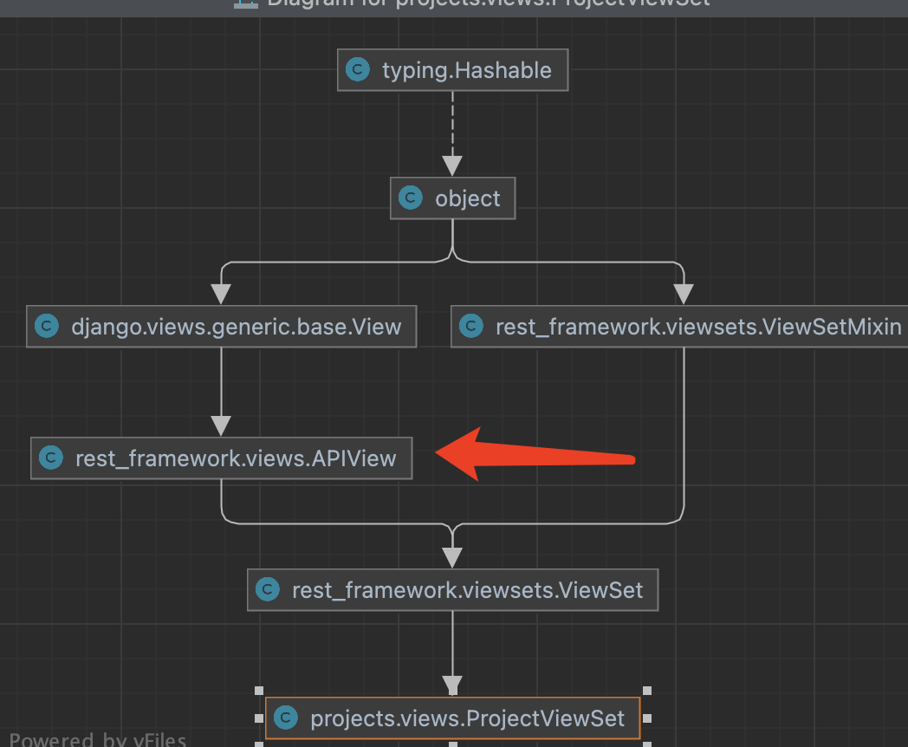

详细介绍基于类的视图

[Classy Class-Based Views](https://ccbv.co.uk/) is a class explorer for the class-based view (CBV) hierarchy in Django


# 安装

```python
pip install djangorestframework
```

# settings.py 中添加

```
INSTALLED_APPS = {
	'rest_framework'
}
```

# 二、DRF中的序列化器serializer

## 2.1 Django框架实现查询接口的步骤

- models.py-->views.py-->urls.py
- 数据模型->视图（处理数据的具体逻辑）->路由（将路由地址映射到视图中的方法）


  

- 在视图函数中手动处理数据

  - ```python
    from django.http import JsonResponse
    from django.views.decorators.csrf import csrf_exempt
    from .models import Project
     
    @csrf_exempt
    def project_list(request):
        projects = Project.objects.all()
        data = [{'id': project.id, 'name': project.name} for project in projects]
        return JsonResponse(data, safe=False)
     
    @csrf_exempt
    def create_project(request):
        if request.method == 'POST':
            name = request.POST.get('name')
            leader = request.POST.get('leader')
            # 获取其他字段的值
            project = Project(name=name, leader=leader)
            project.save()
            
            return JsonResponse({'message': 'Project created successfully'})
        
        return JsonResponse({'message': 'Invalid request'})
     
    @csrf_exempt
    def update_project(request, pk):
        project = Project.objects.get(pk=pk)
        if request.method == 'PUT':
            name = request.PUT.get('name')
            leader = request.PUT.get('leader')
            # 获取其他字段的值
            
            project.name = name
            project.leader = leader
            # 更新其他字段的值
            project.save()
            return JsonResponse({'message': 'Project updated successfully'})
        
        return JsonResponse({'message': 'Invalid request'})
     
    @csrf_exempt
    def delete_project(request, pk):
        project = Project.objects.get(pk=pk)
        project.delete()
        return JsonResponse({'message': 'Project deleted successfully'})
    ```

- **我们实现了哪些功能点：**

  - 在视图文件中，手写处理数据的方法，并与请求方法做匹配
  - 在路由文件中，将路由映射到视图函数中具体某个方法上

## 2.2引入serializer类

### 2.2.1 序列化器的作用

 使用序列化器serializers，直接将从表中取出的对象，转成我们需要的json的数据格式。 

### 2.2.2 使用序列化器的步骤

- 1、创建模型类文件

  ```python
  class Goods(models.Model):
      pass
  ```

  

- 2、创建序列化文件 app/serializers.py

```python
from rest_framework import serializers
class GoodsSerializer(serializers.Serializer):
    id = serializers.IntegerField(read_only=True)
    name = serializers.CharField()
    
class GoodsModelSerializer(serializers.ModelSerializer):
      class Meta:
        model = models.Goods
        fields = '__all__'
    
```

- 3、 编写视图函数或者创建视图类

注意事项：

- serializer.data 是序列化后的值

- Serializer的参数

  - ```python
    class BaseSerializer(Field):
    	def __init__(self, instance=None, data=empty, **kwargs):
    ```

  - data

    - ```
      When a serializer is passed a `data` keyword argument you must call `.is_valid()` before attempting to access the serialized `.data` representation.
      You should either call `.is_valid()` first, or access `.initial_data` instead.
      ```

    - 

  - instance

  - many

```python
from rest_framework.response import Response
@api_view(['GET'])
def goodsListView(request)：
	goods = Goods.objects.all()[:10]
        # 开始序列化多条数据，加上many=True
        goods_json = GoodsSerializer(goods, many=True)
        #goods_json = GoodsModelSerializer(goods, many=True)
        # 返回序列化对象。goods_json.data 是序列化后的值
        print(goods_json.data)

        return Response(goods_json.data)
    	# 自定义返回的格式
    	#data = {"code": 200, "data": serializer.data}
        #return Response(data)
```


```python
from rest_framework.response import Response

class GoodsView(APIView):
    def get(self, request, *args, **kwargs):
        # 获取queryset
        goods = Goods.objects.all()[:10]
        # 开始序列化多条数据，加上many=True
        goods_json = GoodsSerializer(goods, many=True)
        #goods_json = GoodsModelSerializer(goods, many=True)
        # 返回序列化对象。goods_json.data 是序列化后的值
        print(goods_json.data)

        return Response(goods_json.data)
```

- 4、配置路由并运行

```

```

### 2.2.3总结：

**我们实现了哪些功能点：**

- **使用序列化器类代替了手动组装返回数据**

# 三、引入视图类 APIView


1、继承APIView 视图类

2、需要手写get post 等方法实现的具体逻辑

```
get(self, request, *args, **kwargs)：处理 GET 请求，用于获取项目列表。
post(self, request, *args, **kwargs)：处理 POST 请求，用于创建新的项目。
put(self, request, *args, **kwargs)：处理 PUT 请求，用户更新某个项目下的所有字段（资源）
patch(self, request, *args, **kwargs)：处理 PATCH 请求，用户更新某个项目下的部分字段（资源）
delete(self, request, *args, **kwargs)：处理 DELETE 请求，用于删除项目列表。
```

**我们实现了哪些功能点：**

- **继承视图类 APIView，手动实现get post put等数据处理逻辑**
- **路由自动生成**

# 四、引入视图类 viewsets.ViewSet

## 介绍

在DRF中，允许在一个类中组合一组相关视图的逻辑，这被称为VIewSets。

ViewSets和APIView的不同：ViewSets不提供get()、post()方法，而提供list()、create()方法；ViewSets对路由配置做了简化。

## 	4、1基本步骤

- 创建一个继承自viewsets.ViewSet的类，并编写对应的方法和逻辑

  - ```
     
    from .models import Project
    from .serializers import ProjectSerializer
    from rest_framework import viewsets
    from rest_framework.response import Response
     
     
    class ProjectViewSet(viewsets.ViewSet):
        def list(self, request):
            # 列出所有项目的列表
            projects = Project.objects.all()
            serializer = ProjectSerializer(projects, many=True)
            return Response(serializer.data)
     
        def retrieve(self, request, pk=None):
            # 检索某一个项目的详细信息
            project = Project.objects.get(pk=pk)
            serializer = ProjectSerializer(project)
            return Response(serializer.data)
     
        def create(self, request):
            # 创建一条数据
            serializer = ProjectSerializer(data=request.data)
            if serializer.is_valid():
                serializer.save()
                return Response(serializer.data, status=201)
            return Response(serializer.errors, status=400)
     
        def update(self, request, pk=None):
            # 更新列表
            project = Project.objects.get(pk=pk)
            serializer = ProjectSerializer(project, data=request.data)
            if serializer.is_valid():
                serializer.save()
                return Response(serializer.data)
            return Response(serializer.errors, status=400)
     
        def partial_update(self, request, pk=None):
            # 更新一条数据
            project = Project.objects.get(pk=pk)
            serializer = ProjectSerializer(project, data=request.data, partial=True)
            if serializer.is_valid():
                serializer.save()
                return Response(serializer.data)
            return Response(serializer.errors, status=400)
     
        def destroy(self, request, pk=None):
            # 删除数据
            project = Project.objects.get(pk=pk)
            project.delete()
            return Response(status=204)
     
    ```

- 在这个示例中，我们创建了一个名为 ProjectViewSet 的视图集，继承自 viewsets.ViewSet。

  .list()：列出所有项目的列表  -> get
  .retrieve()：检索某一个项目的详细信息 -> get
  .create() : 创建一条数据 -> post
  update(): 更新列表 -> put
  .partial_update():更新一条数据 -> patch
  .destroy()：删除数据 -> delete


## 总结

**我们实现了哪些功能点：**

- **继承视图类 ViewSet\**，\**手动实现list create 等action**
- **路由自动生成**

## **4.2 list()方法如何实现关联GET请求**

  

 父类APIView，dispatch 方法实现的。

dispatch()方法是Django Rest Framework中APIView类的一个重要方法，它负责将传入的HTTP请求分派到适当的处理方法上。该方法在处理请求之前被调用。

在APIView中，dispatch()方法执行以下主要任务：

确定要调用的具体处理方法：dispatch()方法会根据请求的HTTP方法（例如GET、POST、PUT等）和URL中的路径参数，确定应该调用哪个具体的处理方法来处理请求。
调用前置钩子方法：在实际执行处理方法之前，dispatch()方法会调用一些前置钩子方法，如initial()和get_serializer()，这些钩子方法用于进行准备工作，例如对请求进行验证、获取序列化器等。
执行处理方法：一旦确定了要调用的处理方法，并完成了必要的准备工作，dispatch()方法将执行相应的处理方法，例如get()、post()、put()等，来处理请求。
处理异常：如果在执行处理方法时出现异常，dispatch()方法会捕获异常并调用相应的异常处理方法，例如handle_exception()，来处理异常情况。
调用后置钩子方法：在请求处理完毕后，dispatch()方法会调用一些后置钩子方法，如finalize_response()和get_renderers()，用于进行清理工作，例如生成响应、选择渲染器等。
通过重写dispatch()方法，您可以自定义请求的处理过程。例如，您可以添加额外的前置或后置处理逻辑，或者修改请求调度的方式。
