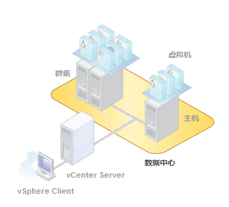
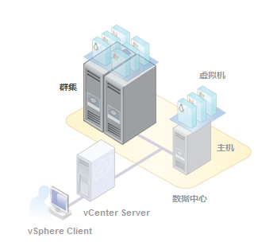

什么是数据中心？

数据中心是主机和虚拟机等清单对象的主要容器。从数据中心可添加和组织清单对象。通常，您会将主机、文件夹和群集添加到数据中心。

vCenter Server可包含多个数据中心。大公司可能使用多个数据中心来表示企业内的组织单位。

清单对象可以在数据中心内交互，但是数据中心之间的交互式受限制的。例如，您可以采用vMotion技术在一个数据中心内的主机之间移动虚拟机，但不能将虚拟机移动到另一个数据中心的主机上。

### 什么是群集？

群集是一组主机。向群集添加主机时，主机的资源会成为群集资源的一部分。群集管理其中所有主机的资源。

群集启用vSphere High Availability（HA）和vSphere Distributed Resource Scheduler（DRS）解决方案。

