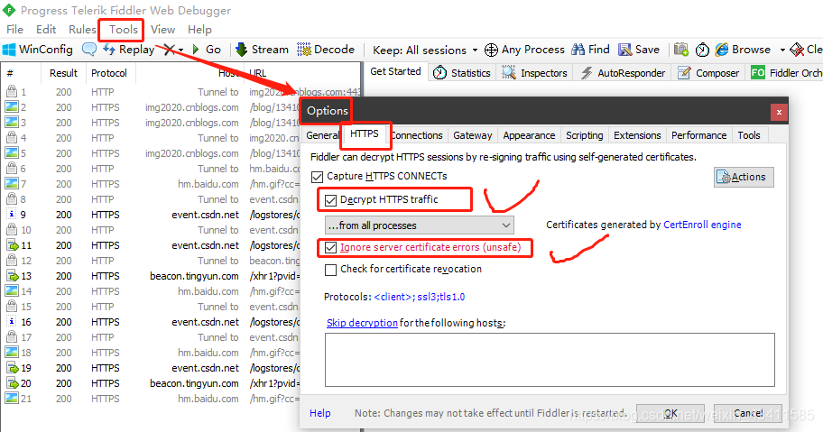
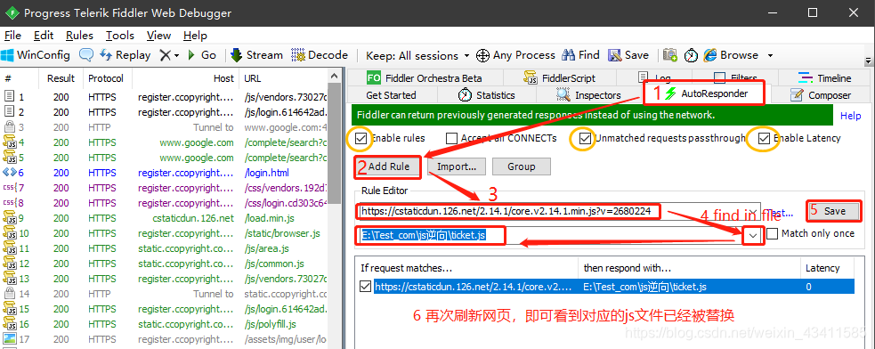

### 1、安装证书，解析https请求
在工具栏找到Tools>Options>HTTPS >勾选Decrypt HTTPS traffic选项，勾选后安装证书>点击yes>选择是>点击是>提示安装完成；点击右边的Actions按钮选择Trust Root Certificate选项

  

### 2、替换js文件

首先，将网页端的js文件保存到本地，并修改js内容里面想要改的地方，比如保存为ticket.js；
其次，打开Fiddler，选择AutoResponder
第一步：勾选Enable rules，Unmatched requests passthrough, Enable Latency
第二步：然后 Add Rule
第三步：修改对应的源js文件链接；此处的js文件链接，可以从左侧抓包直接点击生成；也可以是你从源网页右击js文件copy link address复制粘贴的；两种方式随便选一种
第四步：选择下拉找到Find a file...，导入你保存在本地已修改好的的js文件
第五步：save保存
第六步：重新刷新一下你的网页，即可看到js文件已经被替换

  

最后，刷新一下网页，查看js文件是否已经被替换成你想替换的内容，并做相应的测试；
