# day11 x平台登录

地址：https://xuexi.chinabett.com/

需求：

- 账户和密码加密
- 图片验证码

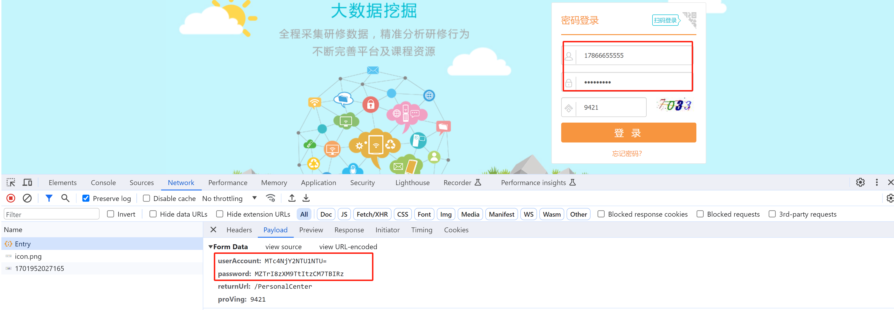


# 1.必备知识点

本节以上述案例引出接下来的通用知识点，当前知识点不仅可用于本案例，其他案例也可使用。


## 1.1 执行JavaScript代码

假如在逆向分析时，发现某个js加密算法比较繁琐，用Python还原同样的算法比较费劲。此时，可以不必使用Python还原，而是利用Python去直接调用JavaScript中定义的功能。

想实现Python调用JavaScript代码，需如下步骤：

- 在电脑上安装node.js（软件）
- 安装Python的第三方模块pyexecjs
- 利用 pyexecjs 调用 nodejs 去执行JavaScript代码


### 1.安装Node.js

最新版本：https://nodejs.org/en/download

历史版本：https://nodejs.org/en/about/previous-releases

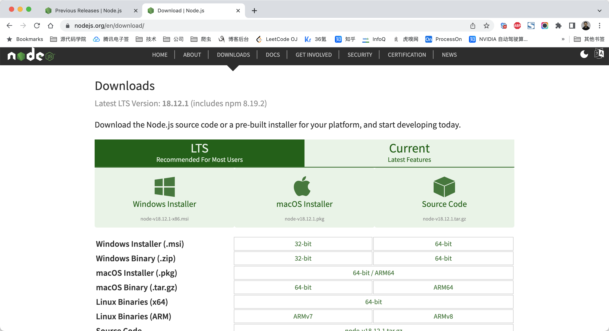


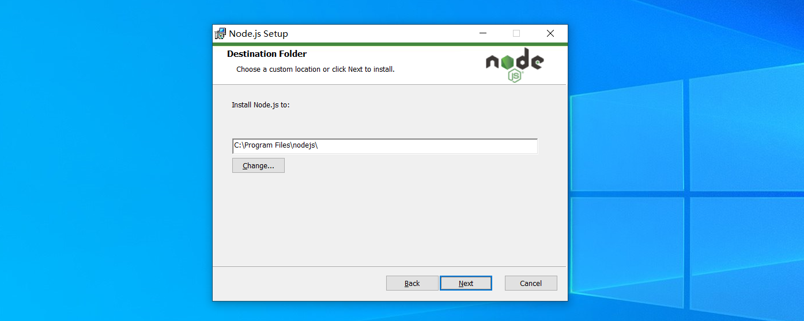

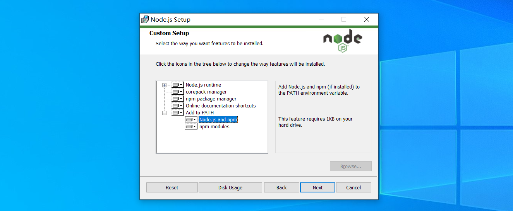

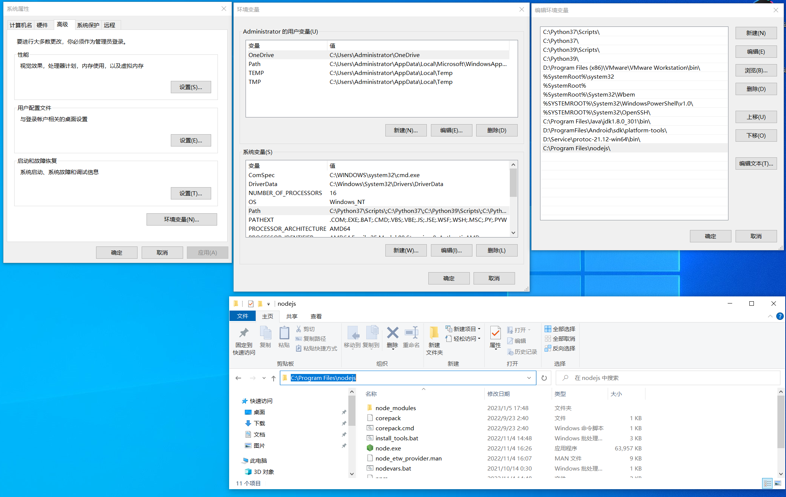

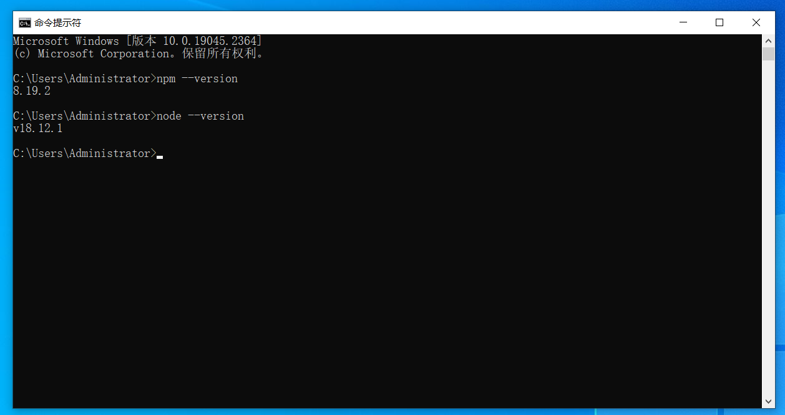


安装完成之后，再进行如下环境变量的配置：

```
>>>npm root -g
```


**第二步：打开环境变量去添加**


### 2.运行测试

- v1.js

  ```javascript
  function func(arg) {
      return arg + 'i666';
  }
  var a1 = process.argv[0]
  var data = func(a1);
  console.log(data)
  ```

- node编译执行 
  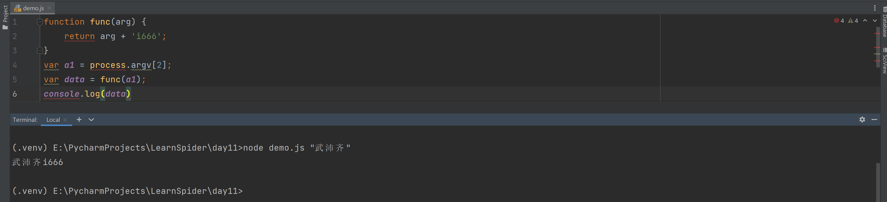

- python执行执行本地命令：
  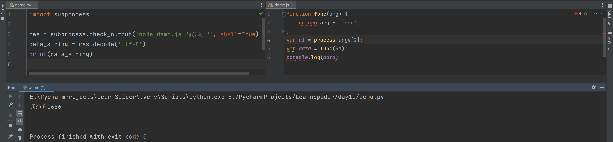

  ```python
  import subprocess
  
  res = subprocess.check_output('node demo.js "武沛齐"', shell=True)
  data_string = res.decode('utf-8')
  print(data_string)
  ```


### 3.安装pyexecjs

```
pip3.11 install pyexecjs
```

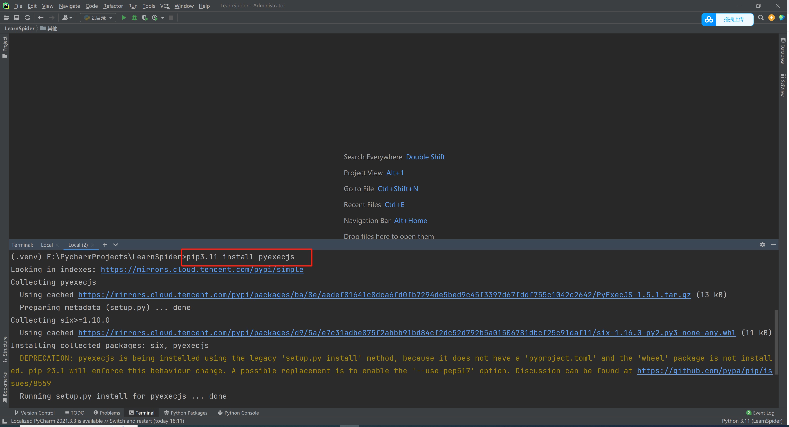


### 4.运行测试

```python
# @课程    : 爬虫逆向实战课
# @讲师    : 武沛齐
# @课件获取 : wupeiqi666

import execjs

js_string = """
function func(arg) {
    return arg + '666';
}
"""
JS = execjs.compile(js_string)

sign = JS.call("func", "wupeiqi")
print(sign)  # wupeiqi666

```

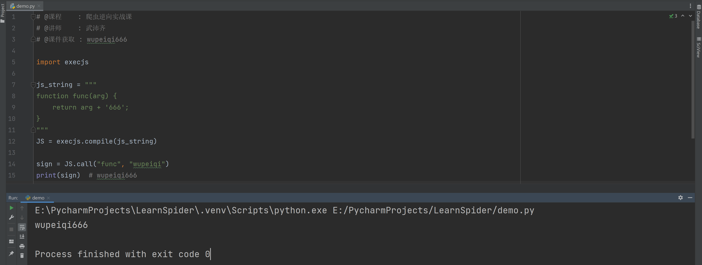


## 1.2 验证码识别

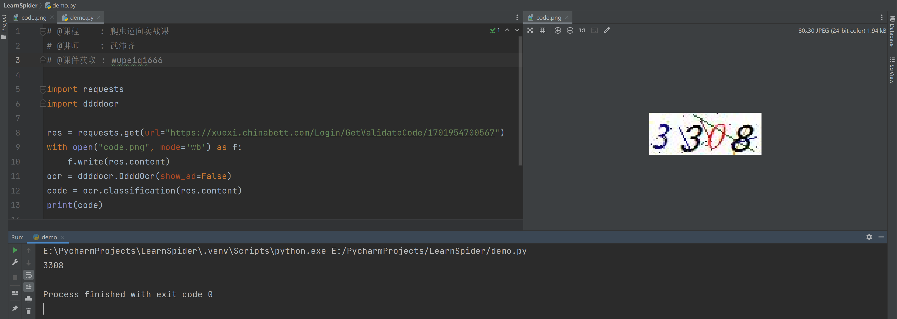

```python
# @课程    : 爬虫逆向实战课
# @讲师    : 武沛齐
# @课件获取 : wupeiqi666

import requests
import ddddocr

res = requests.get(url="https://xuexi.chinabett.com/Login/GetValidateCode/1701954700567")
with open("code.png", mode='wb') as f:
    f.write(res.content)
ocr = ddddocr.DdddOcr(show_ad=False)
code = ocr.classification(res.content)
print(code)
```


# 2.逆向分析

## 2.1 用户名

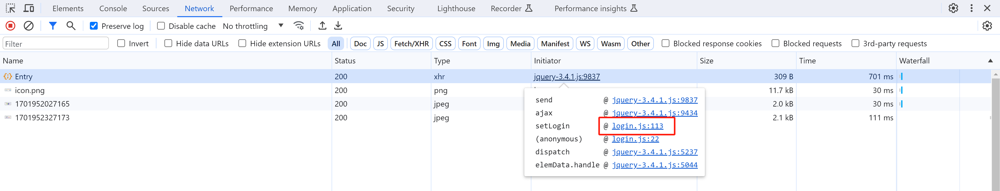


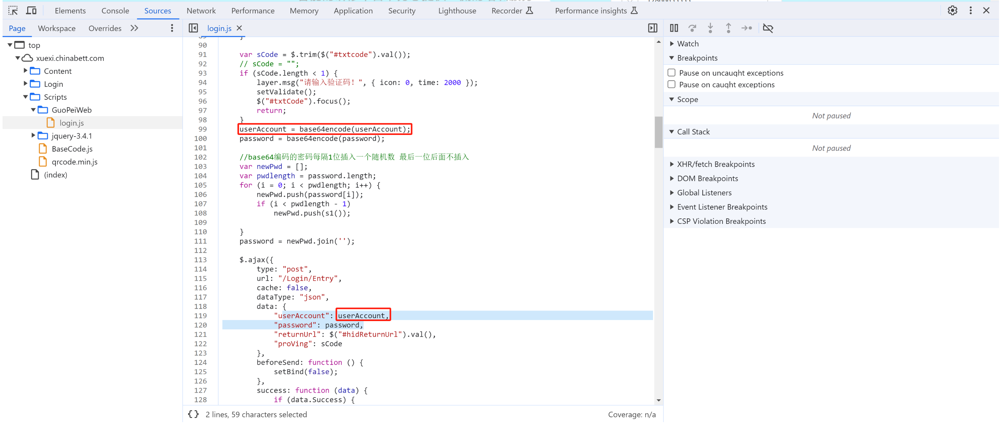


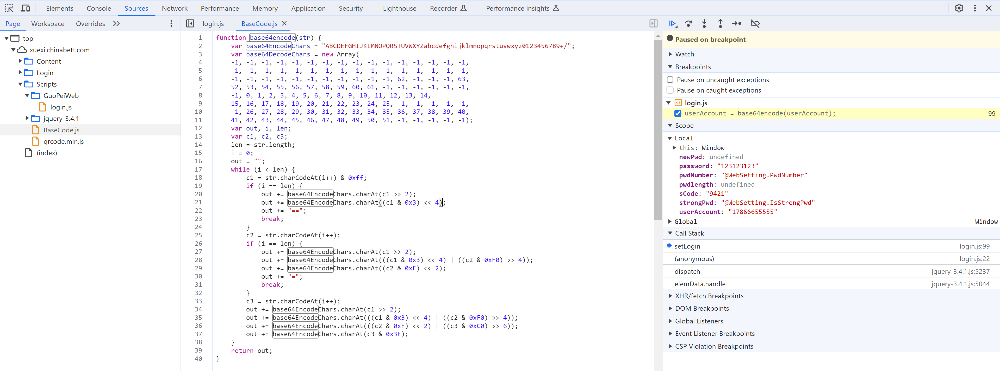

```javascript
function base64encode(str) {
    var base64EncodeChars = "ABCDEFGHIJKLMNOPQRSTUVWXYZabcdefghijklmnopqrstuvwxyz0123456789+/";
    var base64DecodeChars = new Array(
    -1, -1, -1, -1, -1, -1, -1, -1, -1, -1, -1, -1, -1, -1, -1, -1,
    -1, -1, -1, -1, -1, -1, -1, -1, -1, -1, -1, -1, -1, -1, -1, -1,
    -1, -1, -1, -1, -1, -1, -1, -1, -1, -1, -1, 62, -1, -1, -1, 63,
    52, 53, 54, 55, 56, 57, 58, 59, 60, 61, -1, -1, -1, -1, -1, -1,
    -1, 0, 1, 2, 3, 4, 5, 6, 7, 8, 9, 10, 11, 12, 13, 14,
    15, 16, 17, 18, 19, 20, 21, 22, 23, 24, 25, -1, -1, -1, -1, -1,
    -1, 26, 27, 28, 29, 30, 31, 32, 33, 34, 35, 36, 37, 38, 39, 40,
    41, 42, 43, 44, 45, 46, 47, 48, 49, 50, 51, -1, -1, -1, -1, -1);
    var out, i, len;
    var c1, c2, c3;
    len = str.length;
    i = 0;
    out = "";
    while (i < len) {
        c1 = str.charCodeAt(i++) & 0xff;
        if (i == len) {
            out += base64EncodeChars.charAt(c1 >> 2);
            out += base64EncodeChars.charAt((c1 & 0x3) << 4);
            out += "==";
            break;
        }
        c2 = str.charCodeAt(i++);
        if (i == len) {
            out += base64EncodeChars.charAt(c1 >> 2);
            out += base64EncodeChars.charAt(((c1 & 0x3) << 4) | ((c2 & 0xF0) >> 4));
            out += base64EncodeChars.charAt((c2 & 0xF) << 2);
            out += "=";
            break;
        }
        c3 = str.charCodeAt(i++);
        out += base64EncodeChars.charAt(c1 >> 2);
        out += base64EncodeChars.charAt(((c1 & 0x3) << 4) | ((c2 & 0xF0) >> 4));
        out += base64EncodeChars.charAt(((c2 & 0xF) << 2) | ((c3 & 0xC0) >> 6));
        out += base64EncodeChars.charAt(c3 & 0x3F);
    }
    return out;
}
```


```python
# @课程    : 爬虫逆向实战课
# @讲师    : 武沛齐
# @课件获取 : wupeiqi666

import execjs

js_string = """
function base64encode(str) {
    var base64EncodeChars = "ABCDEFGHIJKLMNOPQRSTUVWXYZabcdefghijklmnopqrstuvwxyz0123456789+/";
    var base64DecodeChars = new Array(
    -1, -1, -1, -1, -1, -1, -1, -1, -1, -1, -1, -1, -1, -1, -1, -1,
    -1, -1, -1, -1, -1, -1, -1, -1, -1, -1, -1, -1, -1, -1, -1, -1,
    -1, -1, -1, -1, -1, -1, -1, -1, -1, -1, -1, 62, -1, -1, -1, 63,
    52, 53, 54, 55, 56, 57, 58, 59, 60, 61, -1, -1, -1, -1, -1, -1,
    -1, 0, 1, 2, 3, 4, 5, 6, 7, 8, 9, 10, 11, 12, 13, 14,
    15, 16, 17, 18, 19, 20, 21, 22, 23, 24, 25, -1, -1, -1, -1, -1,
    -1, 26, 27, 28, 29, 30, 31, 32, 33, 34, 35, 36, 37, 38, 39, 40,
    41, 42, 43, 44, 45, 46, 47, 48, 49, 50, 51, -1, -1, -1, -1, -1);
    var out, i, len;
    var c1, c2, c3;
    len = str.length;
    i = 0;
    out = "";
    while (i < len) {
        c1 = str.charCodeAt(i++) & 0xff;
        if (i == len) {
            out += base64EncodeChars.charAt(c1 >> 2);
            out += base64EncodeChars.charAt((c1 & 0x3) << 4);
            out += "==";
            break;
        }
        c2 = str.charCodeAt(i++);
        if (i == len) {
            out += base64EncodeChars.charAt(c1 >> 2);
            out += base64EncodeChars.charAt(((c1 & 0x3) << 4) | ((c2 & 0xF0) >> 4));
            out += base64EncodeChars.charAt((c2 & 0xF) << 2);
            out += "=";
            break;
        }
        c3 = str.charCodeAt(i++);
        out += base64EncodeChars.charAt(c1 >> 2);
        out += base64EncodeChars.charAt(((c1 & 0x3) << 4) | ((c2 & 0xF0) >> 4));
        out += base64EncodeChars.charAt(((c2 & 0xF) << 2) | ((c3 & 0xC0) >> 6));
        out += base64EncodeChars.charAt(c3 & 0x3F);
    }
    return out;
}
"""
JS = execjs.compile(js_string)

sign = JS.call("base64encode", "17866655555")
print(sign)
```


## 2.2 密码

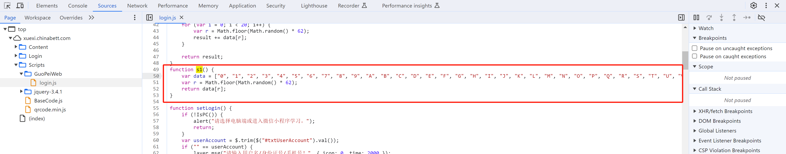

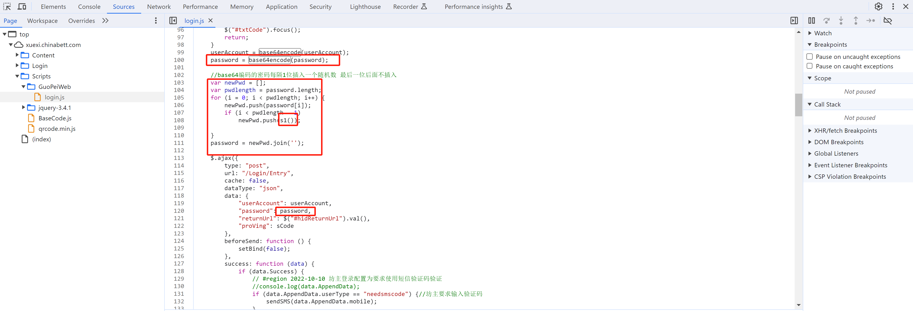


```python
# @课程    : 爬虫逆向实战课
# @讲师    : 武沛齐
# @课件获取 : wupeiqi666

import execjs

js_string = """
function base64encode(str) {
    var base64EncodeChars = "ABCDEFGHIJKLMNOPQRSTUVWXYZabcdefghijklmnopqrstuvwxyz0123456789+/";
    var base64DecodeChars = new Array(
    -1, -1, -1, -1, -1, -1, -1, -1, -1, -1, -1, -1, -1, -1, -1, -1,
    -1, -1, -1, -1, -1, -1, -1, -1, -1, -1, -1, -1, -1, -1, -1, -1,
    -1, -1, -1, -1, -1, -1, -1, -1, -1, -1, -1, 62, -1, -1, -1, 63,
    52, 53, 54, 55, 56, 57, 58, 59, 60, 61, -1, -1, -1, -1, -1, -1,
    -1, 0, 1, 2, 3, 4, 5, 6, 7, 8, 9, 10, 11, 12, 13, 14,
    15, 16, 17, 18, 19, 20, 21, 22, 23, 24, 25, -1, -1, -1, -1, -1,
    -1, 26, 27, 28, 29, 30, 31, 32, 33, 34, 35, 36, 37, 38, 39, 40,
    41, 42, 43, 44, 45, 46, 47, 48, 49, 50, 51, -1, -1, -1, -1, -1);
    var out, i, len;
    var c1, c2, c3;
    len = str.length;
    i = 0;
    out = "";
    while (i < len) {
        c1 = str.charCodeAt(i++) & 0xff;
        if (i == len) {
            out += base64EncodeChars.charAt(c1 >> 2);
            out += base64EncodeChars.charAt((c1 & 0x3) << 4);
            out += "==";
            break;
        }
        c2 = str.charCodeAt(i++);
        if (i == len) {
            out += base64EncodeChars.charAt(c1 >> 2);
            out += base64EncodeChars.charAt(((c1 & 0x3) << 4) | ((c2 & 0xF0) >> 4));
            out += base64EncodeChars.charAt((c2 & 0xF) << 2);
            out += "=";
            break;
        }
        c3 = str.charCodeAt(i++);
        out += base64EncodeChars.charAt(c1 >> 2);
        out += base64EncodeChars.charAt(((c1 & 0x3) << 4) | ((c2 & 0xF0) >> 4));
        out += base64EncodeChars.charAt(((c2 & 0xF) << 2) | ((c3 & 0xC0) >> 6));
        out += base64EncodeChars.charAt(c3 & 0x3F);
    }
    return out;
};

function s1() {
    var data = ["0", "1", "2", "3", "4", "5", "6", "7", "8", "9", "A", "B", "C", "D", "E", "F", "G", "H", "I", "J", "K", "L", "M", "N", "O", "P", "Q", "R", "S", "T", "U", "V", "W", "X", "Y", "Z", "a", "b", "c", "d", "e", "f", "g", "h", "i", "j", "k", "l", "m", "n", "o", "p", "q", "r", "s", "t", "u", "v", "w", "x", "y", "z"];
    var r = Math.floor(Math.random() * 62);
    return data[r];
}

function encryptPwd(password){
    //base64编码的密码每隔1位插入一个随机数 最后一位后面不插入
    var newPwd = [];
    var pwdlength = password.length;
    for (i = 0; i < pwdlength; i++) {
        newPwd.push(password[i]);
        if (i < pwdlength - 1)
            newPwd.push(s1());

    }
    var res = newPwd.join('');
    return res;
}
"""
JS = execjs.compile(js_string)

pwd = JS.call("base64encode", "123")
pwd_string = JS.call("encryptPwd", pwd)
print(pwd_string)
```


# 3.整合实现

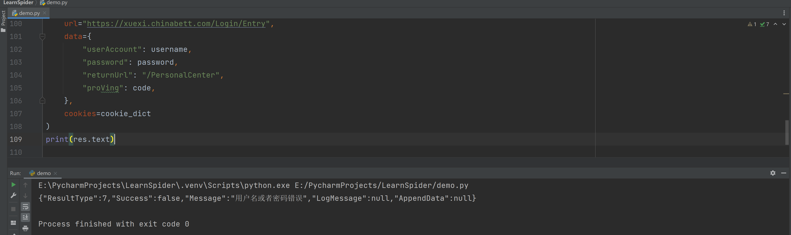

```python
# @课程    : 爬虫逆向实战课
# @讲师    : 武沛齐
# @课件获取 : wupeiqi666

import execjs
import requests
import ddddocr
from bs4 import BeautifulSoup

# 1.首页请求
cookie_dict = {}
res = requests.get(url="https://xuexi.chinabett.com/")
cookie_dict.update(res.cookies.get_dict())

# 2.获取验证码地址
soup = BeautifulSoup(res.text, features="html.parser")
image_tag = soup.find(name="img", attrs={"id": "imgVerifity"})
code_src = image_tag.attrs['src']

# 3.读取验证码并实现
res = requests.get(url=f"https://xuexi.chinabett.com{code_src}", cookies=cookie_dict)
cookie_dict.update(res.cookies.get_dict())
ocr = ddddocr.DdddOcr(show_ad=False)
code = ocr.classification(res.content)

# 4.处理用户名&密码

js_string = """
function base64encode(str) {
    var base64EncodeChars = "ABCDEFGHIJKLMNOPQRSTUVWXYZabcdefghijklmnopqrstuvwxyz0123456789+/";
    var base64DecodeChars = new Array(
    -1, -1, -1, -1, -1, -1, -1, -1, -1, -1, -1, -1, -1, -1, -1, -1,
    -1, -1, -1, -1, -1, -1, -1, -1, -1, -1, -1, -1, -1, -1, -1, -1,
    -1, -1, -1, -1, -1, -1, -1, -1, -1, -1, -1, 62, -1, -1, -1, 63,
    52, 53, 54, 55, 56, 57, 58, 59, 60, 61, -1, -1, -1, -1, -1, -1,
    -1, 0, 1, 2, 3, 4, 5, 6, 7, 8, 9, 10, 11, 12, 13, 14,
    15, 16, 17, 18, 19, 20, 21, 22, 23, 24, 25, -1, -1, -1, -1, -1,
    -1, 26, 27, 28, 29, 30, 31, 32, 33, 34, 35, 36, 37, 38, 39, 40,
    41, 42, 43, 44, 45, 46, 47, 48, 49, 50, 51, -1, -1, -1, -1, -1);
    var out, i, len;
    var c1, c2, c3;
    len = str.length;
    i = 0;
    out = "";
    while (i < len) {
        c1 = str.charCodeAt(i++) & 0xff;
        if (i == len) {
            out += base64EncodeChars.charAt(c1 >> 2);
            out += base64EncodeChars.charAt((c1 & 0x3) << 4);
            out += "==";
            break;
        }
        c2 = str.charCodeAt(i++);
        if (i == len) {
            out += base64EncodeChars.charAt(c1 >> 2);
            out += base64EncodeChars.charAt(((c1 & 0x3) << 4) | ((c2 & 0xF0) >> 4));
            out += base64EncodeChars.charAt((c2 & 0xF) << 2);
            out += "=";
            break;
        }
        c3 = str.charCodeAt(i++);
        out += base64EncodeChars.charAt(c1 >> 2);
        out += base64EncodeChars.charAt(((c1 & 0x3) << 4) | ((c2 & 0xF0) >> 4));
        out += base64EncodeChars.charAt(((c2 & 0xF) << 2) | ((c3 & 0xC0) >> 6));
        out += base64EncodeChars.charAt(c3 & 0x3F);
    }
    return out;
};

function s1() {
    var data = ["0", "1", "2", "3", "4", "5", "6", "7", "8", "9", "A", "B", "C", "D", "E", "F", "G", "H", "I", "J", "K", "L", "M", "N", "O", "P", "Q", "R", "S", "T", "U", "V", "W", "X", "Y", "Z", "a", "b", "c", "d", "e", "f", "g", "h", "i", "j", "k", "l", "m", "n", "o", "p", "q", "r", "s", "t", "u", "v", "w", "x", "y", "z"];
    var r = Math.floor(Math.random() * 62);
    return data[r];
}

function encryptPwd(password){
    //base64编码的密码每隔1位插入一个随机数 最后一位后面不插入
    var newPwd = [];
    var pwdlength = password.length;
    for (i = 0; i < pwdlength; i++) {
        newPwd.push(password[i]);
        if (i < pwdlength - 1)
            newPwd.push(s1());

    }
    var res = newPwd.join('');
    return res;
}
"""
JS = execjs.compile(js_string)

# 用户名
username = JS.call("base64encode", "18630087660")
# 密码
temp = JS.call("base64encode", "123")
password = JS.call("encryptPwd", temp)

# 5.登录
res = requests.post(
    url="https://xuexi.chinabett.com/Login/Entry",
    data={
        "userAccount": username,
        "password": password,
        "returnUrl": "/PersonalCenter",
        "proVing": code,
    },
    cookies=cookie_dict
)
print(res.text)
```