# day12 xx儿

需求：

- 逆向滑块请求
- 发送短信登录

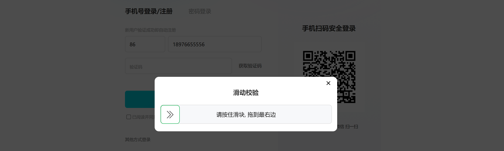


地址：https://user.qunar.com/passport/login.jsp

# 1.必备知识点


## 1.1 页面滑动

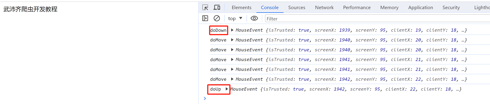

```html
<!DOCTYPE html>
<html lang="en">
<head>
    <meta charset="UTF-8">
    <title>Title</title>
</head>
<body>

<div onmousedown="doDown(event)">武沛齐爬虫开发教程</div>

<script>
    function doDown(e) {
        console.log("doDown", e);
        document.addEventListener("mousemove", doMove);
        document.addEventListener("mouseup", doUp)

    }
    function doMove(e) {
        console.log("doMove", e)
    }
    function doUp(e) {
        console.log("doUp", e)
        document.removeEventListener("mousemove", doMove);
        document.removeEventListener("mouseup", doUp);
    }
</script>
</body>
</html>
```


## 1.2 滑动轨迹

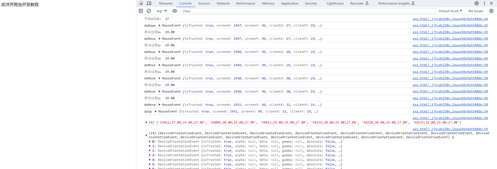

```html
<!DOCTYPE html>
<html lang="en">
<head>
    <meta charset="UTF-8">
    <title>Title</title>
</head>
<body>

<div onmousedown="doDown(event)">武沛齐爬虫开发教程</div>

<script>
    t = {
        state: {},
        sliderInfo: {
            track: [],
            deviceMotion:[]
        }
    }

    function doDown(e) {
        // n = e   n.clientX是点击的x坐标
        var n = (e.changedTouches || e.touches || [e])[0];
        t.state.downX = n.clientX;
        console.log("开始x坐标：", n.clientX);

        console.log("doDown", e);
        document.addEventListener("mousemove", doMove);
        document.addEventListener("mouseup", doUp)

    }

    function doMove(e) {
        var o = (e.changedTouches || e.touches || [e])[0];
        var n = t.state.downX;
        var u = (e = e || window.event, o.clientX - n);
		var n = u;
        
        var i = Date.now() % 1e5
          , s = (e.changedTouches || e.touches || [e])[0]
          , o = s.clientX.toFixed(2)
          , u = s.clientY.toFixed(2)
          , a = n.toFixed(2)
          , f = "".concat(i, ";").concat(o, ";").concat(u, ";").concat(a);

        t.sliderInfo.track.push(f);
		window.addEventListener("deviceorientation", function(e) {
            t.sliderInfo.deviceMotion.push(e)
        }, !1)
        
        console.log("滑动过程u：", u)
        console.log("doMove", e)
    }

    function doUp(e) {
        console.log("doUp", e)
        document.removeEventListener("mousemove", doMove);
        document.removeEventListener("mouseup", doUp);

        console.log(t.sliderInfo.track)
        console.log(t.sliderInfo.deviceMotion)
    }
</script>
</body>
</html>
```


## 1.3 浏览器环境

在使用pyexecjs执行JavaScript代码时，如果存在读取浏览器环境，会失败。例如：

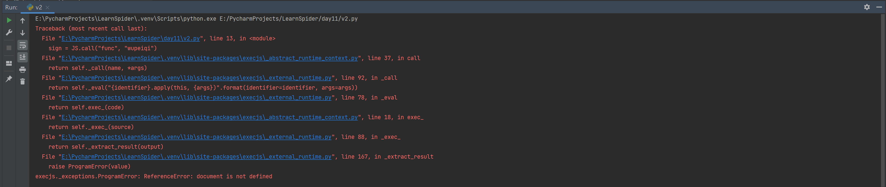

```python
import execjs

js_string = """
function func(arg) {
    return arg + '666' + document.location.hostname + window.navigator.userAgent;
}
"""
JS = execjs.compile(js_string)

sign = JS.call("func", "wupeiqi")
print(sign)  
```

此时，就需要创造浏览器环境然后再执行JavaScript代码。

```
npm config set registry https://registry.npm.taobao.org
```

```
npm install -g jsdom       【主要】
npm install -g node-gyp 
npm install -g canvas --canvas_binary_host_mirror=https://npm.taobao.org/mirrors/canvas/
```


安装后就可以补浏览器环境：

```python
# @课程    : 爬虫逆向实战课
# @讲师    : 武沛齐
# @课件获取 : wupeiqi666
import execjs

js_string = """
const jsdom = require("jsdom");
const {JSDOM} = jsdom;

const html = `<!DOCTYPE html><p>Hello world</p>`;
const dom = new JSDOM(html, {
    url: "https://www.toutiao.com",
    referrer: "https://example.com/",
    contentType: "text/html"
});
document = dom.window.document;

window = global;
Object.assign(global, {
    location: {
        hash: "",
        host: "user.qunar.com",
        hostname: "user.qunar.com",
        href: "https://user.qunar.com/passport/login.jsp",
        origin: "https://user.qunar.com",
        pathname: "/",
        port: "",
        protocol: "https:",
        search: "",
    },
    navigator: {
        appCodeName: "Mozilla",
        appName: "Netscape",
        appVersion: "5.0 (Macintosh; Intel Mac OS X 10_15_7) AppleWebKit/537.36 (KHTML, like Gecko) Chrome/93.0.4577.82 Safari/537.36",
        cookieEnabled: true,
        deviceMemory: 8,
        doNotTrack: null,
        hardwareConcurrency: 4,
        language: "zh-CN",
        languages: ["zh-CN", "zh"],
        maxTouchPoints: 0,
        onLine: true,
        platform: "MacIntel",
        product: "Gecko",
        productSub: "20030107",
        userAgent: "Mozilla/5.0 (Macintosh; Intel Mac OS X 10_15_7) AppleWebKit/537.36 (KHTML, like Gecko) Chrome/93.0.4577.82 Safari/537.36",
        vendor: "Google Inc.",
        vendorSub: "",
        webdriver: false
    }
});

function func(arg) {
    return arg + '666' + document.location.hostname + window.navigator.userAgent;
}
"""
JS = execjs.compile(js_string)

sign = JS.call("func", "wupeiqi")
print(sign) 

```


## 1.4 关于补环境

上述示例中只是补充了浏览器中常见的window、document对象，有些算法中还有其他的值和变量，此时就需要根据环境提示来进行补环境。

- 分析提示错误信息
- 补充 & 测试

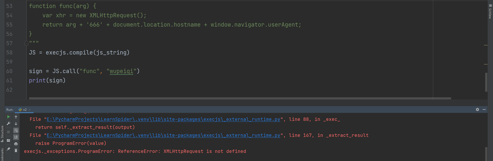

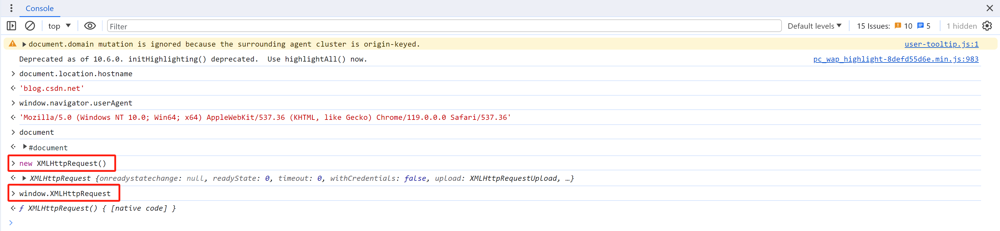


根据提示补环境并运行：

```python
# @课程    : 爬虫逆向实战课
# @讲师    : 武沛齐
# @课件获取 : wupeiqi666
import execjs

js_string = """
const jsdom = require("jsdom");
const {JSDOM} = jsdom;

const html = `<!DOCTYPE html><p>Hello world</p>`;
const dom = new JSDOM(html, {
    url: "https://user.qunar.com/passport/login.jsp",
    referrer: "https://www.qunar.com/",
    contentType: "text/html"
});
document = dom.window.document;

window = global;
Object.assign(global, {
    location: {
        hash: "",
        host: "user.qunar.com",
        hostname: "user.qunar.com",
        href: "https://user.qunar.com/passport/login.jsp",
        origin: "https://user.qunar.com",
        pathname: "/passport/login.jsp",
        port: "",
        protocol: "https:",
        search: "",
    },
    navigator: {
        appCodeName: "Mozilla",
        appName: "Netscape",
        appVersion: "5.0 (Macintosh; Intel Mac OS X 10_15_7) AppleWebKit/537.36 (KHTML, like Gecko) Chrome/93.0.4577.82 Safari/537.36",
        cookieEnabled: true,
        deviceMemory: 8,
        doNotTrack: null,
        hardwareConcurrency: 4,
        language: "zh-CN",
        languages: ["zh-CN", "zh"],
        maxTouchPoints: 0,
        onLine: true,
        platform: "MacIntel",
        product: "Gecko",
        productSub: "20030107",
        userAgent: "Mozilla/5.0 (Macintosh; Intel Mac OS X 10_15_7) AppleWebKit/537.36 (KHTML, like Gecko) Chrome/93.0.4577.82 Safari/537.36",
        vendor: "Google Inc.",
        vendorSub: "",
        webdriver: false
    }
});

XMLHttpRequest = function(){};
function func(arg) {
    var xhr = new XMLHttpRequest();
    return arg + '666' + document.location.hostname + window.navigator.userAgent;
}
"""
JS = execjs.compile(js_string)

sign = JS.call("func", "wupeiqi")
print(sign)
```

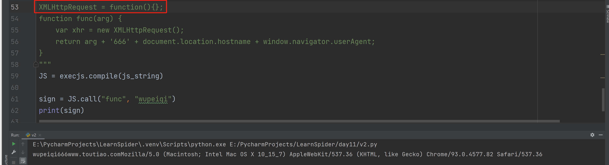


## 1.5 关于XMLHttpRequest 

```javascript
xhr = new XMLHttpRequest();
xhr.onreadystatechange = function(){
    if(xhr.readyState == 4){
        // 已经接收到全部响应数据，执行以下操作
        var data = xhr.responseText;
        console.log(data);
    }
};

xhr.open('POST', "/test/", true);

xhr.setRequestHeader('Content-Type', 'application/x-www-form-urlencoded; charset-UTF-8');

xhr.send('n1=1;n2=2;');
```

参考：https://www.cnblogs.com/wupeiqi/articles/5703697.html


# 2.逆向轨迹snapshot

## 2.1 请求分析

分析请求：搞定 `data` 就行了。

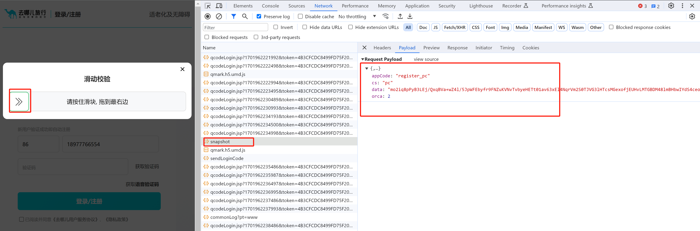


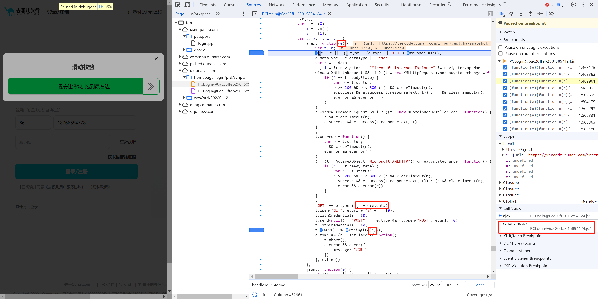

```javascript
e.data = {
	appCode: "register_pc",
	cs: "pc",
	data: "/rbk3gF/w9E6nxeN9/KAwvVH5vtVuJBW3+TBsSJY5ZH9nURD0....",
	orca: 2
}
```


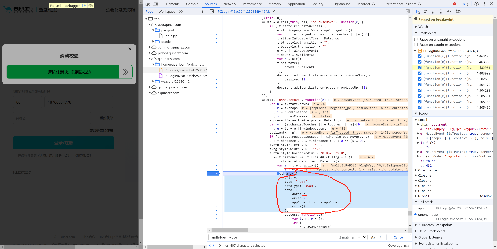

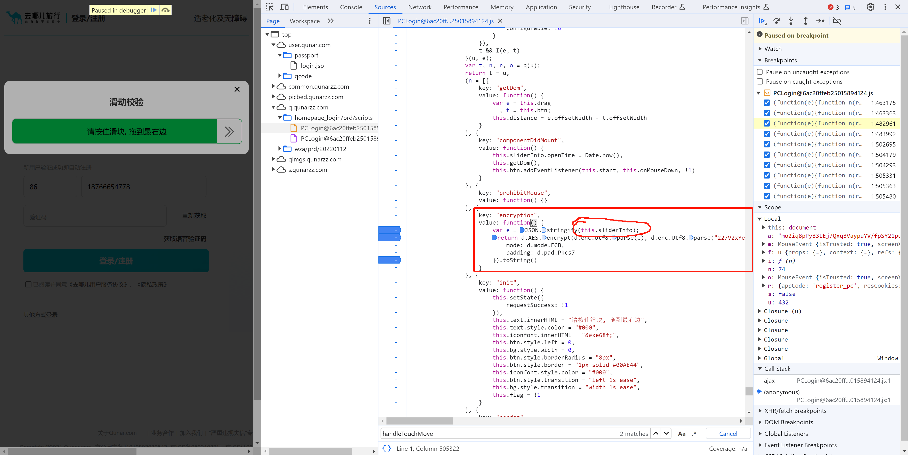


此处的 `a` 就是我们要的数据，此数据是由：`var a = t.encryption()` 执行获取，内部：

- 序列化 `this.sliderInfo` 【滑动轨迹】

  ```
  "{"openTime":1701958250076,"startTime":1701958331349,"endTime":1701958331492,"userAgent":"Mozilla/5.0 (Windows NT 10.0; Win64; x64) AppleWebKit/537.36 (KHTML, like Gecko) Chrome/119.0.0.0 Safari/537.36","uid":"0000ff0025405942b0d0087b","track":["31364;136.00;342.00;1.00","31384;150.00;342.00;15.00","31404;231.00;347.00;96.00","31425;315.00;347.00;180.00","31447;457.00;349.00;322.00","31468;505.00;349.00;370.00","31489;555.00;349.00;420.00"],"acc":[],"ori":[],"deviceMotion":[{"isTrusted":true},{"isTrusted":true},{"isTrusted":true},{"isTrusted":true},{"isTrusted":true},{"isTrusted":true},{"isTrusted":true},{"isTrusted":true},{"isTrusted":true},{"isTrusted":true},{"isTrusted":true},{"isTrusted":true}]}"
  ```

- 对轨迹进行AES加密

最终生成的就是data数据（其实就是模拟滑块的滑动）。


## 2.2 轨迹

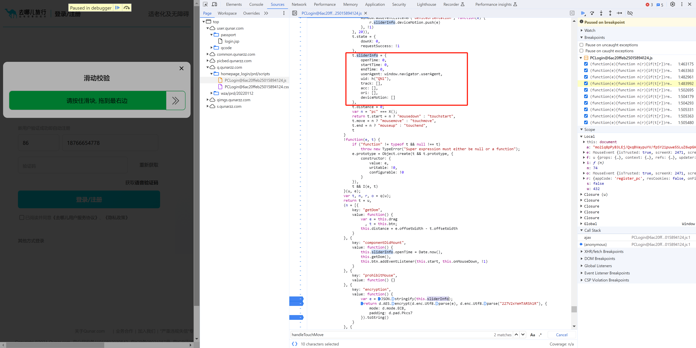


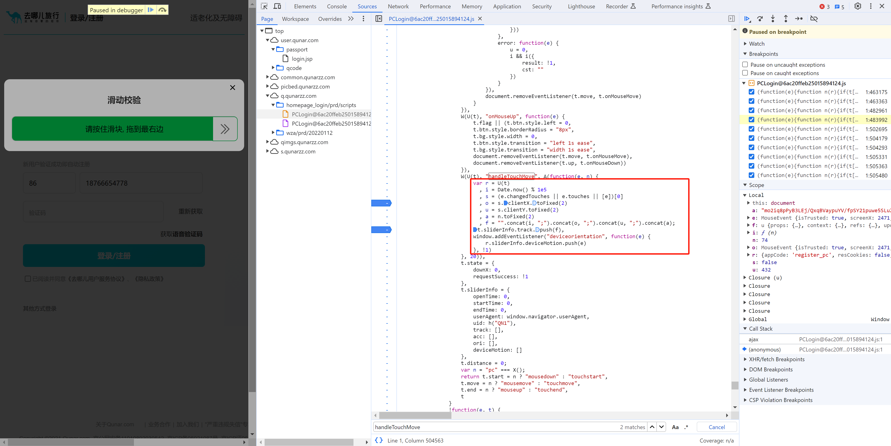

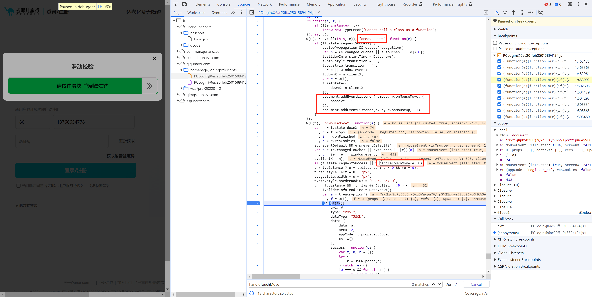


```javascript
t.sliderInfo = {
    openTime: 0,
    startTime: 0,
    endTime: 0,
    userAgent: window.navigator.userAgent,
    uid: h("QN1"), #  读取Cookie中的"QN1"
    track: [],
    acc: [],
    ori: [],
    deviceMotion: []
}
```

```javascript
var r = U(t)
, i = Date.now() % 1e5
, s = (e.changedTouches || e.touches || [e])[0]  # e事件
, o = s.clientX.toFixed(2)  # 横坐标，小数点后2位
, u = s.clientY.toFixed(2)  # 纵坐标，小数点后2位
, a = n.toFixed(2)          # 当前移动的横坐标 - 开始时的横坐标，数据：1/2/3....(移动了多远的距离)
, f = "".concat(i, ";").concat(o, ";").concat(u, ";").concat(a);

t.sliderInfo.track.push(f);

r.sliderInfo.deviceMotion.push(e)
```


基于Python来构建轨迹信息：

```python
# @课程    : 爬虫逆向实战课
# @讲师    : 武沛齐
# @课件获取 : wupeiqi666
import random
import time


def get_slider_info():
    slider_list = []
    
    client_x = 300
    client_y = 500
    
    start_time = int(int(time.time() * 1000) % 1e5)
    
    width = random.randint(419, 431)
    
    for slice_distance in range(3, width, 26):
        if width - slice_distance <= 26:
            slice_distance = width
        start_time += random.randint(10, 1000)
        i = start_time
        o = f"{client_x + slice_distance}.00"
        u = f"{client_y + random.randint(-5, 5)}.00"
        a = f"{slice_distance}.00"
        f = f"{i};{o};{u};{a}"
        slider_list.append(f)
    return slider_list


def run():
    slider_list = get_slider_info()
    print(slider_list)


if __name__ == '__main__':
    run()
```


## 2.3 AES加密

```
pip install pycryptodome
```

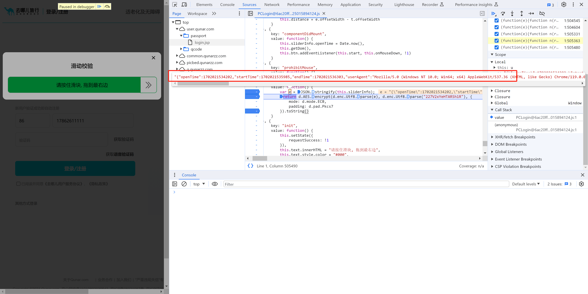

```
e = '{"openTime":1702021534202,"startTime":1702021535985,"endTime":1702021536303,"userAgent":"Mozilla/5.0 (Windows NT 10.0; Win64; x64) AppleWebKit/537.36 (KHTML, like Gecko) Chrome/119.0.0.0 Safari/537.36","uid":"0000f800254059475ae0ab8d","track":["36040;58.00;273.00;1.00","36061;112.00;277.00;55.00","36085;222.00;291.00;165.00","36108;309.00;294.00;252.00","36128;385.00;294.00;328.00","36150;405.00;294.00;348.00","36172;421.00;294.00;364.00","36192;428.00;294.00;371.00","36212;433.00;294.00;376.00","36233;443.00;294.00;386.00","36256;457.00;294.00;400.00","36276;468.00;294.00;411.00","36296;486.00;297.00;429.00"],"acc":[],"ori":[],"deviceMotion":[{"isTrusted":true},{"isTrusted":true},{"isTrusted":true},{"isTrusted":true},{"isTrusted":true},{"isTrusted":true},{"isTrusted":true},{"isTrusted":true},{"isTrusted":true},{"isTrusted":true},{"isTrusted":true},{"isTrusted":true},{"isTrusted":true},{"isTrusted":true},{"isTrusted":true},{"isTrusted":true},{"isTrusted":true},{"isTrusted":true},{"isTrusted":true},{"isTrusted":true},{"isTrusted":true},{"isTrusted":true},{"isTrusted":true},{"isTrusted":true},{"isTrusted":true},{"isTrusted":true},{"isTrusted":true},{"isTrusted":true},{"isTrusted":true},{"isTrusted":true},{"isTrusted":true},{"isTrusted":true},{"isTrusted":true},{"isTrusted":true},{"isTrusted":true},{"isTrusted":true},{"isTrusted":true},{"isTrusted":true},{"isTrusted":true},{"isTrusted":true},{"isTrusted":true},{"isTrusted":true}]}'
```

```
key = 227V2xYeHTARSh1R   或 32323756327859654854415253683152
iv = 无
```

```
AES加密后="/rbk3gF/w9E6nxeN9/KAwkfV/Suaadocu+lITcBeF8Otqk1I7U5YdIehRxzb3zQmP3nuWBUTC3eYj2iITgNXxqUEwqHFnIehVq4aj2POYtbbwIYdS4ceo1kLfu+9Hxv4Pf1bQK7GBdkHOn+pynXZ5rf/Cry06pPfR/Hf7BrFSk1rvLNqcTBvq6730+O1VcEkBJTDTx/lnSA+jwK9ypQ44HRjonU347dLl4qbCximrSMU4Ffa8UWz5/7Za6IUpI8bGJBsICcW13u/6VrdJ1k9i4R0Prk8WdJuRpPDmIzzHtIGj0jWVcoGykitY334e/I3HBU0J/9zF4IVyilOvRoCHlNCX33K/W7o8ZfhTuyEHeSmfUDXII+y60so3sgjyL6Jx2mPbqAUf4i3BN0Nf8+Ehmop4nOd/4umofKpm8l3CNKBmsyKr+Lqd4PM0ePZnNsy8z6K4fZYN/Z/3cK8fD6Ud3uaIIBmoAkNOBwOYs/a2Qp4U4qa57YtADX/SpDbBGlX+P2knhf7c4WU7qMJW6UzFA/1woeCPGNBbxwxhh/7fC0E/tmOnvNZWeohdzc86US7Ic0MrdHeX9bsQ3dGBPy86XZ6j2fJSYNwxfB3m4ExpeEDtg09manx7bkh8qXv4LpLMDfnzhAz/wJ9ikXYq93ImkAlu5PWFWsKycWz2scjfhg48P+aP/OHkbKV2th/b97Np3iHNye/HQA4zTadhYs0EIKu5YTCp5l1xLDKxuz3P/xFW6BtATFuF5MpH0mljqahfBpV9puaOaCyDP3zIgGTIWqniLuY3HqA3yLZ6IUCorv94ueBMYHq1MwAIzL32OjfviDgo+7B9qh9zVQukaR2gwSmia+CRDJ2uwyZUETpm3NOzhR356QqA+IvQ2aHc7zKnKk3M7fJBrZNDi6sELSRVOVsdO+7uxrqQu7c0h9/NxNeNiBRN5LaB5R+ocEji3KeR6IZbrOAtcIS9RNkOHu0P/G2yNNJc372MPQtfjnzRwKFf8VcRH/zsFhQuA/KZSDqYQBU/4L4Drj8BGNSF38kUPU2GkEFTTigl5RrL1qEBX7xXK+6PIjrKcYC0HlDR0UvmjMMi9JKMMJAPR4FHBDh6hsZmjmMayZVBwgTUQ9DubuLOzB9+B4/Dn6dYM1rxJNlZMzHuAkhnb1Qm3ewUWA3+S6m49NpM1GTYTjP4G9I5s2+BkingUHSxSD5qBIHRUwamypxs71L3mUXtScON+PWa9K+9Ruib9Jjr6ZkXN5jv9mTAQt7vEKXxQBdivxADUY9Ts4Ud+ekKgPiL0Nmh3O8ypypNzO3yQa2TQ4urBC0kVTlbHTvu7sa6kLu3NIffzcTXjYgUTeS2geUfqHBI4tynkeiGW6zgLXCEvUTZDh7tD/xtsjTSXN+9jD0LX4580cChX/FXER/87BYULgPymUg6mEAVP+C+A64/ARjUhd/JFD1NhpBBU04oJeUay9ahAV+8VyvujyI6ynGAtB5Q0dFL5ozDIvSSjDCQD0eBRwQ4eobGZo5jGsmVQcIE1EPQ7m7izswffgePw5+nWDNa8STZWTMx7gJIZ29UJt3sFFgN/kupuPTaTNRk2E4z+BvSObNvgZIp4FB0sUg+agSB0VMGpsqcbO9S95lF7UnDjfj1mvSvvUbom/SY6+mZFzeY7/ZkwELe7xCl8UAXYr8QA1GPU7OFHfnpCoD4i9DZodzvMqcqTczt8kGtk0OLqwQtJFU5Wx077u7GupC7tzSH383E142IFE3ktoHlH6hwSOLcp5Hohlus4C1whL1E2Q4e7Q/8bbI00lzfvYw9C1+OfNHAoV/xVxEf/OwWFC4D8plIOphAFT/gvgOuPwEY1IXfyRQ9TYaQQVNOKCXlGsvWoQFfvFcr7o8iOspxgLQeUNHRS+aMwyL0kowwkA9HgUcEOHqYHfDji5duSuitXuWLO57/A=="
```


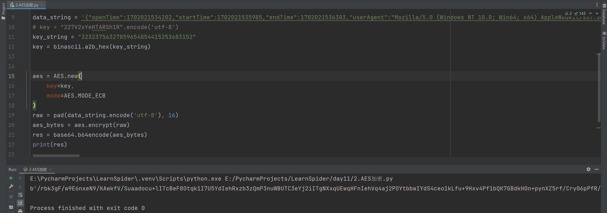

```python
# @课程    : 爬虫逆向实战课
# @讲师    : 武沛齐
# @课件获取 : wupeiqi666
import base64
import binascii
from Crypto.Cipher import AES
from Crypto.Util.Padding import pad

data_string = '{"openTime":1702021534202,"startTime":1702021535985,"endTime":1702021536303,"userAgent":"Mozilla/5.0 (Windows NT 10.0; Win64; x64) AppleWebKit/537.36 (KHTML, like Gecko) Chrome/119.0.0.0 Safari/537.36","uid":"0000f800254059475ae0ab8d","track":["36040;58.00;273.00;1.00","36061;112.00;277.00;55.00","36085;222.00;291.00;165.00","36108;309.00;294.00;252.00","36128;385.00;294.00;328.00","36150;405.00;294.00;348.00","36172;421.00;294.00;364.00","36192;428.00;294.00;371.00","36212;433.00;294.00;376.00","36233;443.00;294.00;386.00","36256;457.00;294.00;400.00","36276;468.00;294.00;411.00","36296;486.00;297.00;429.00"],"acc":[],"ori":[],"deviceMotion":[{"isTrusted":true},{"isTrusted":true},{"isTrusted":true},{"isTrusted":true},{"isTrusted":true},{"isTrusted":true},{"isTrusted":true},{"isTrusted":true},{"isTrusted":true},{"isTrusted":true},{"isTrusted":true},{"isTrusted":true},{"isTrusted":true},{"isTrusted":true},{"isTrusted":true},{"isTrusted":true},{"isTrusted":true},{"isTrusted":true},{"isTrusted":true},{"isTrusted":true},{"isTrusted":true},{"isTrusted":true},{"isTrusted":true},{"isTrusted":true},{"isTrusted":true},{"isTrusted":true},{"isTrusted":true},{"isTrusted":true},{"isTrusted":true},{"isTrusted":true},{"isTrusted":true},{"isTrusted":true},{"isTrusted":true},{"isTrusted":true},{"isTrusted":true},{"isTrusted":true},{"isTrusted":true},{"isTrusted":true},{"isTrusted":true},{"isTrusted":true},{"isTrusted":true},{"isTrusted":true}]}'
# key = "227V2xYeHTARSh1R".encode('utf-8')
key_string = "32323756327859654854415253683152"
key = binascii.a2b_hex(key_string)


aes = AES.new(
    key=key,
    mode=AES.MODE_ECB
)
raw = pad(data_string.encode('utf-8'), 16)
aes_bytes = aes.encrypt(raw)
res = base64.b64encode(aes_bytes)
print(res)
```


## 2.4 示例代码：轨迹+加密

```python
# @课程    : 爬虫逆向实战课
# @讲师    : 武沛齐
# @课件获取 : wupeiqi666
import json
import random
import time
import base64
import binascii
from Crypto.Cipher import AES
from Crypto.Util.Padding import pad


def get_slider_list():
    slider_list = []
    client_x = 300
    client_y = 500
    start_time = int(int(time.time() * 1000) % 1e5)
    width = random.randint(419, 431)
    for slice_distance in range(3, width, 26):
        if width - slice_distance <= 26:
            slice_distance = width
        start_time += random.randint(10, 1000)
        i = start_time
        o = f"{client_x + slice_distance}.00"
        u = f"{client_y + random.randint(-5, 5)}.00"
        a = f"{slice_distance}.00"
        f = f"{i};{o};{u};{a}"
        slider_list.append(f)
    return slider_list


def aes_encrypt(data_string):
    # key = "227V2xYeHTARSh1R".encode('utf-8')
    key_string = "32323756327859654854415253683152"
    key = binascii.a2b_hex(key_string)

    aes = AES.new(
        key=key,
        mode=AES.MODE_ECB
    )
    raw = pad(data_string.encode('utf-8'), 16)
    aes_bytes = aes.encrypt(raw)
    res_string = base64.b64encode(aes_bytes).decode('utf-8')
    return res_string


def run():
    cookie_qn1 = "0000ff0025405942b0d0087b"
    slider_list = get_slider_list()
    slider_info = {
        "openTime": int((time.time() - random.randint(500, 3000)) * 1000),
        "startTime": int((time.time() - random.uniform(2, 4)) * 1000),
        "endTime": int((time.time() - random.uniform(0, 1)) * 1000),
        "userAgent": "Mozilla/5.0 (Windows NT 10.0; Win64; x64) AppleWebKit/537.36 (KHTML, like Gecko) Chrome/119.0.0.0 Safari/537.36",
        "uid": cookie_qn1,
        "track": slider_list,
        "acc": [],
        "ori": [],
        "deviceMotion": [{"isTrusted": True} for _ in range(random.randint(10, 100))]
    }

    data_string = json.dumps(slider_info, separators=(',', ':'))
    data = aes_encrypt(data_string)

    r = {
        "appCode": "register_pc",
        "cs": "pc",
        "data": data,
        "orca": 2
    }
    print(r)


if __name__ == '__main__':
    run()
```


## 2.5 请求

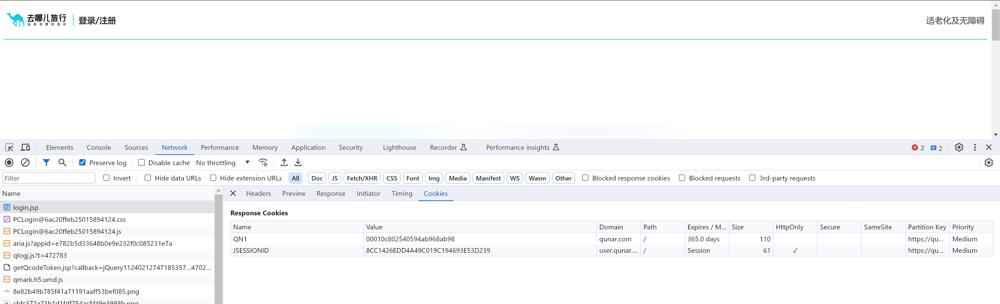

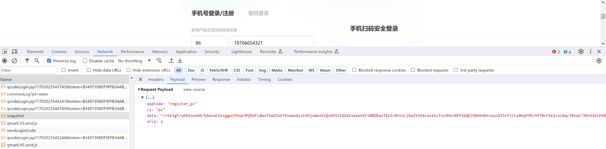

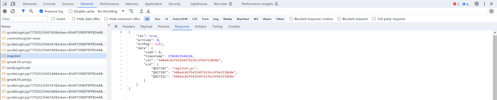


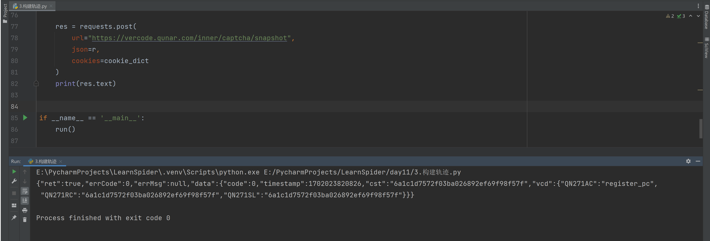

```python
# @课程    : 爬虫逆向实战课
# @讲师    : 武沛齐
# @课件获取 : wupeiqi666
import json
import random
import time
import base64
import binascii

import requests
from Crypto.Cipher import AES
from Crypto.Util.Padding import pad


def get_slider_list():
    slider_list = []
    client_x = 300
    client_y = 500
    start_time = int(int(time.time() * 1000) % 1e5)
    width = random.randint(419, 431)
    for slice_distance in range(3, width, 26):
        if width - slice_distance <= 26:
            slice_distance = width
        start_time += random.randint(10, 1000)
        i = start_time
        o = f"{client_x + slice_distance}.00"
        u = f"{client_y + random.randint(-5, 5)}.00"
        a = f"{slice_distance}.00"
        f = f"{i};{o};{u};{a}"
        slider_list.append(f)
    return slider_list


def aes_encrypt(data_string):
    # key = "227V2xYeHTARSh1R".encode('utf-8')
    key_string = "32323756327859654854415253683152"
    key = binascii.a2b_hex(key_string)

    aes = AES.new(
        key=key,
        mode=AES.MODE_ECB
    )
    raw = pad(data_string.encode('utf-8'), 16)
    aes_bytes = aes.encrypt(raw)
    res_string = base64.b64encode(aes_bytes).decode('utf-8')
    return res_string


def run():
    res = requests.get("https://user.qunar.com/passport/login.jsp")
    cookie_dict = res.cookies.get_dict()
    cookie_qn1 = cookie_dict['QN1']

    slider_list = get_slider_list()
    slider_info = {
        "openTime": int((time.time() - random.randint(500, 3000)) * 1000),
        "startTime": int((time.time() - random.uniform(2, 4)) * 1000),
        "endTime": int((time.time() - random.uniform(0, 1)) * 1000),
        "userAgent": "Mozilla/5.0 (Windows NT 10.0; Win64; x64) AppleWebKit/537.36 (KHTML, like Gecko) Chrome/119.0.0.0 Safari/537.36",
        "uid": cookie_qn1,
        "track": slider_list,
        "acc": [],
        "ori": [],
        "deviceMotion": [{"isTrusted": True} for _ in range(random.randint(10, 100))]
    }

    data_string = json.dumps(slider_info, separators=(',', ':'))
    data = aes_encrypt(data_string)

    r = {
        "appCode": "register_pc",
        "cs": "pc",
        "data": data,
        "orca": 2
    }

    res = requests.post(
        url="https://vercode.qunar.com/inner/captcha/snapshot",
        json=r,
        cookies=cookie_dict
    )
    print(res.text)
    # {"ret":true,"errCode":0,"errMsg":null,"data":{"code":0,"timestamp":1702023820826,"cst":"6a1c1d7572f03ba026892ef69f98f57f","vcd":{"QN271AC":"register_pc","QN271RC":"6a1c1d7572f03ba026892ef69f98f57f","QN271SL":"6a1c1d7572f03ba026892ef69f98f57f"}}}


if __name__ == '__main__':
    run()

```


# 3.逆向提交sendLoginCode

轨迹提交后，接下来提交手机号信息。

```
    mobile : 手机号信息            
slideToken : 轨迹请求返回的cst字段   
     bella : 加密算法需你想         【未知】
```

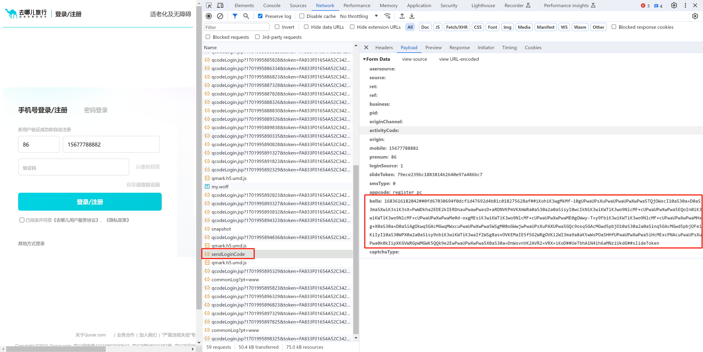


## 3.1 请求分析

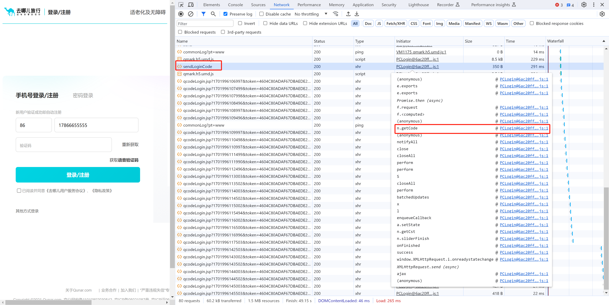

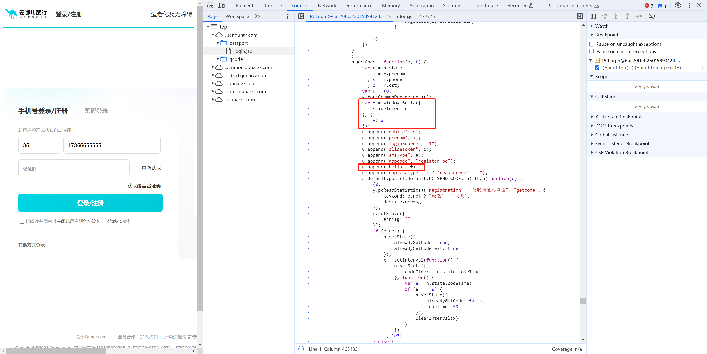


## 3.2 window.Bella

看到这个 `window.Bella` 后就应该想到一个开发的潜规则：记载某个js文件，在内部将函数赋值给window，后续其他文件中就可以调用此方法。


### 3.2.1 猜想

网页加载`qlogj.js`文件，在内部给`window.Bella`赋值，以供后续PCLoginxxxx.js调用。

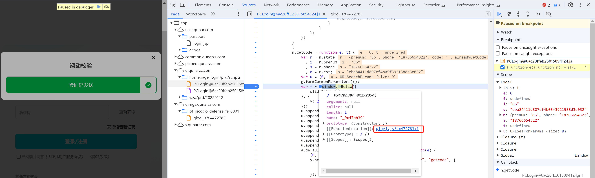

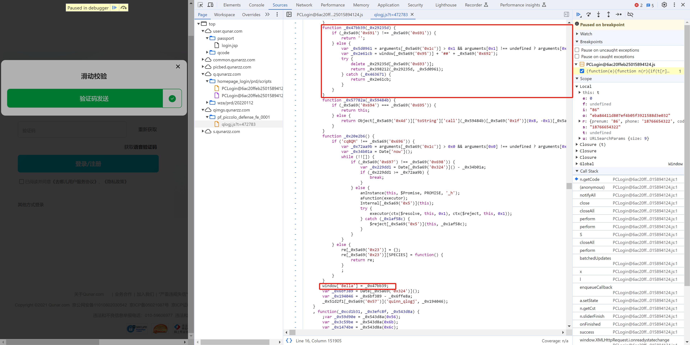


### 3.2.2 HTML验证

将整个js文件拷贝下来，并编写一个HTML文件去引入，然后在浏览器中打开测试。

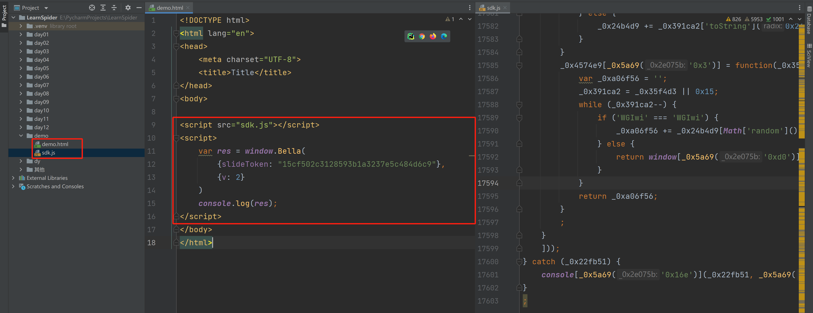

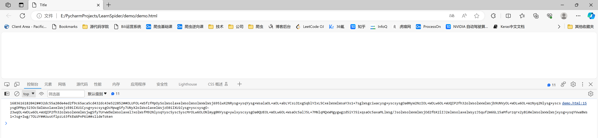

```html
<!DOCTYPE html>
<html lang="en">
<head>
    <meta charset="UTF-8">
    <title>Title</title>
</head>
<body>

<script src="sdk.js"></script>
<script>
    var res = window.Bella(
        {slideToken: "15cf502c3128593b1a3237e5c484d6c9"},
        {v: 2}
    )
    console.log(res);
</script>
</body>
</html>
```


## 3.3 浏览器补环境实现

无需逆向底层实现，用 `jsdom` 构造一个浏览器环境去加载js，加载成功后，就可以利用 `window.Bella` 调用算法。


### 3.3.1 基础环境

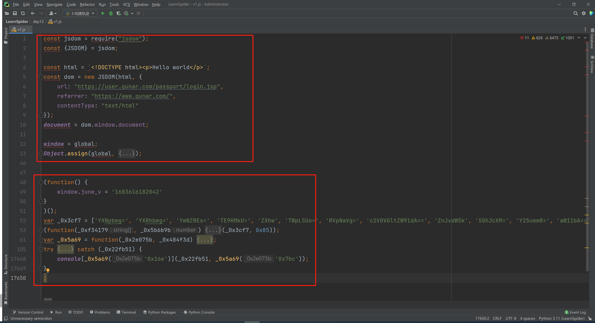

```javascript
const jsdom = require("jsdom");
const {JSDOM} = jsdom;

const html = `<!DOCTYPE html><p>Hello world</p>`;
const dom = new JSDOM(html, {
    url: "https://user.qunar.com/passport/login.jsp",
    referrer: "https://www.qunar.com/",
    contentType: "text/html"
});
document = dom.window.document;

window = global;
Object.assign(global, {
    location: {
        hash: "",
        host: "user.qunar.com",
        hostname: "user.qunar.com",
        href: "https://user.qunar.com/passport/login.jsp",
        origin: "https://user.qunar.com",
        pathname: "/passport/login.jsp",
        port: "",
        protocol: "https:",
        search: "",
    },
    navigator: {
        appCodeName: "Mozilla",
        appName: "Netscape",
        appVersion: "5.0 (Macintosh; Intel Mac OS X 10_15_7) AppleWebKit/537.36 (KHTML, like Gecko) Chrome/93.0.4577.82 Safari/537.36",
        cookieEnabled: true,
        deviceMemory: 8,
        doNotTrack: null,
        hardwareConcurrency: 4,
        language: "zh-CN",
        languages: ["zh-CN", "zh"],
        maxTouchPoints: 0,
        onLine: true,
        platform: "MacIntel",
        product: "Gecko",
        productSub: "20030107",
        userAgent: "Mozilla/5.0 (Macintosh; Intel Mac OS X 10_15_7) AppleWebKit/537.36 (KHTML, like Gecko) Chrome/93.0.4577.82 Safari/537.36",
        vendor: "Google Inc.",
        vendorSub: "",
        webdriver: false
    }
});
```


### 3.3.2 报错

```
_0x3d079c = ActiveXObject('Microsoft.XMLHTTP');
```

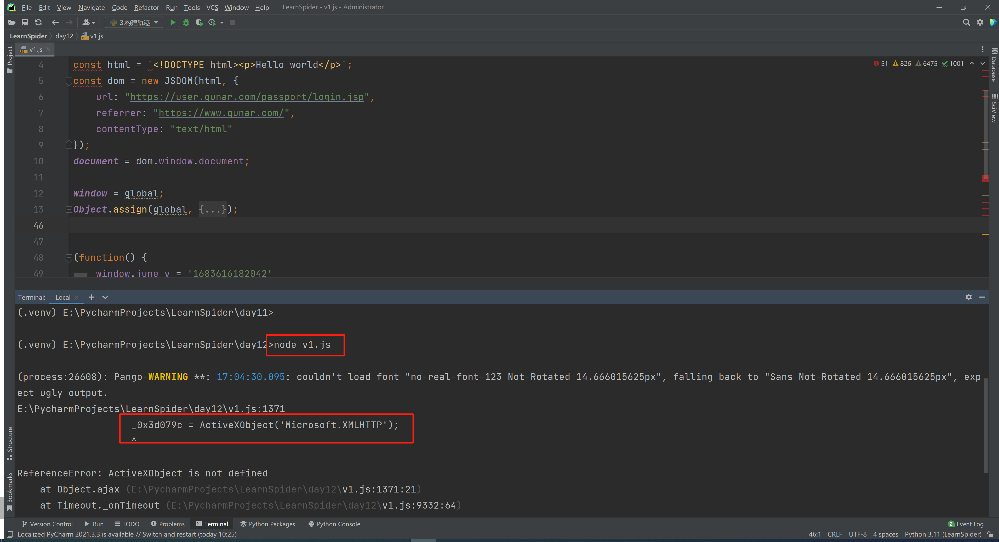


定位到代码进行分析：

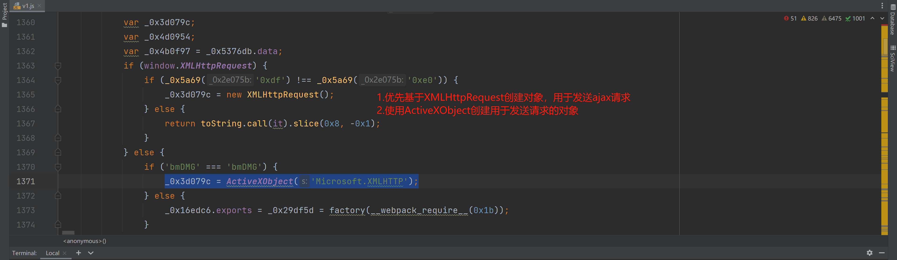


如果无脑补的话，就是创建 `window.XMLHttpRequest` 或者 `ActiveXObject('Microsoft.XMLHTTP');`，例如：

```
XMLHttpRequest = function () {
    return {
        open:function (){},
        send:function (){},
        onreadystatechange :function (){}
    };
};

window.XMLHttpRequest = XMLHttpRequest;
```

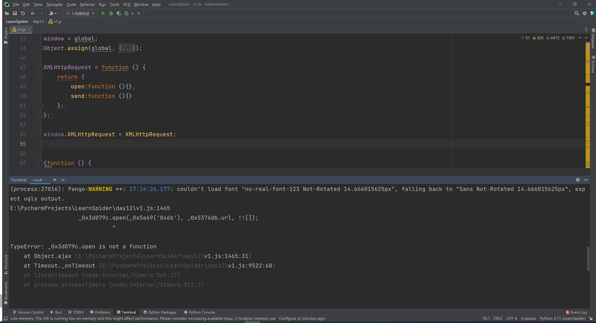


### 3.3.3 报错

```
_0x2c4be4[_0x5a69('0x6c')](_0x5a69('0x6d'), _0x5a69('0x6e'));
```

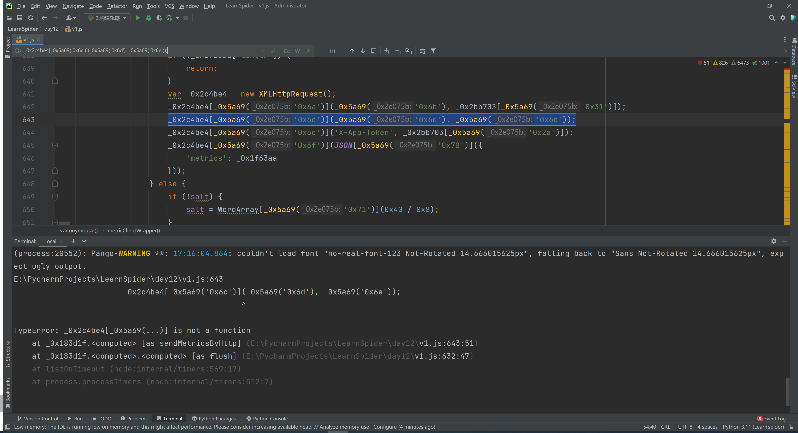

看样子，这又是在发送ajax请求，先创建 `XMLHttpRequest` 然后调用 send 、open 等方法。


**猜想：**加载js的时，难道还发送ajax请求？果然发送了，还不只一个。
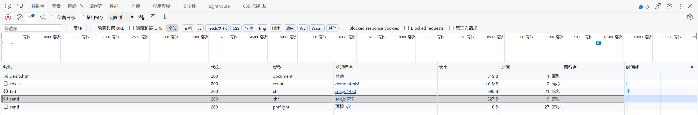


**猜想：**ajax请求如果和我们的`window.Bella`算法没关系，是不是可以把这段代码注释掉（不让他发送请求）。

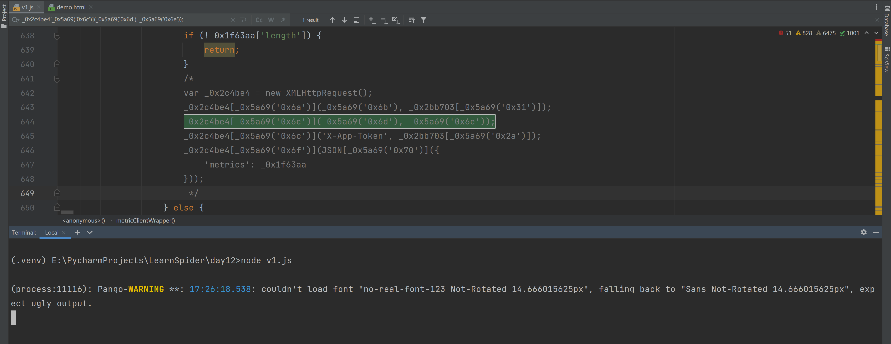


### 3.3.5 不报错，但卡死

这就有点恶心了。

想要解决，就只能再去分析js代码了（不到万不得已，先不这么干）。


### 3.3.6 再换个思路

寻找谁给 `window.Bella`的赋值，如果他在卡主前，那就可以早调用 ，然后主动让程序终止（不走卡主的代码）。

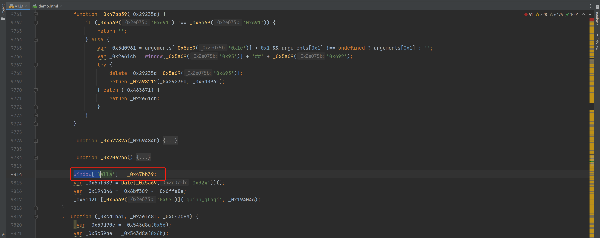


```javascript
var res = window.Bella(
    {slideToken: "15cf502c3128593b1a3237e5c484d6c9"},
    {v: 2}
)
console.log(res);
process.exit(0);
```


### 3.3.7 参数化调用

```javascript
var res = window.Bella(
    {slideToken: process.argv[2]},
    {v: 2}
)
console.log(res);
process.exit(0);
```

```
>>>node v1.js "15cf502c3128593b1a3237e5c484d6c9"
```

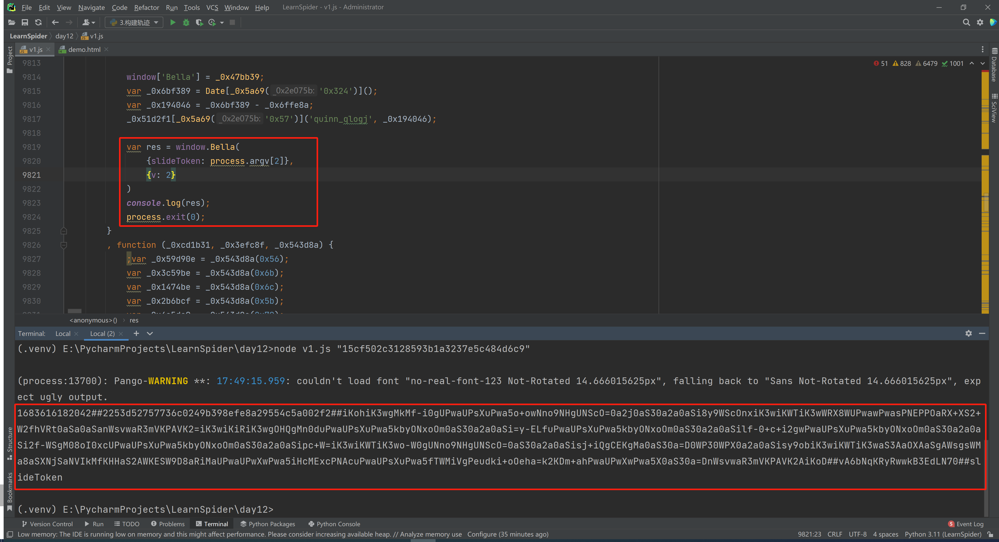


## 3.4 代码示例（整合）

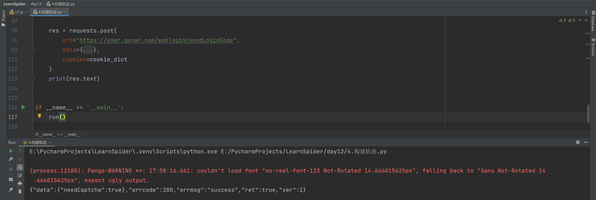

```python
# @课程    : 爬虫逆向实战课
# @讲师    : 武沛齐
# @课件获取 : wupeiqi666
import json
import random
import time
import base64
import binascii

import requests
from Crypto.Cipher import AES
from Crypto.Util.Padding import pad


def get_slider_list():
    slider_list = []
    client_x = 300
    client_y = 500
    start_time = int(int(time.time() * 1000) % 1e5)
    width = random.randint(419, 431)
    for slice_distance in range(3, width, 26):
        if width - slice_distance <= 26:
            slice_distance = width
        start_time += random.randint(10, 1000)
        i = start_time
        o = f"{client_x + slice_distance}.00"
        u = f"{client_y + random.randint(-5, 5)}.00"
        a = f"{slice_distance}.00"
        f = f"{i};{o};{u};{a}"
        slider_list.append(f)
    return slider_list


def aes_encrypt(data_string):
    # key = "227V2xYeHTARSh1R".encode('utf-8')
    key_string = "32323756327859654854415253683152"
    key = binascii.a2b_hex(key_string)

    aes = AES.new(
        key=key,
        mode=AES.MODE_ECB
    )
    raw = pad(data_string.encode('utf-8'), 16)
    aes_bytes = aes.encrypt(raw)
    res_string = base64.b64encode(aes_bytes).decode('utf-8')
    return res_string


def run():
    res = requests.get("https://user.qunar.com/passport/login.jsp")
    cookie_dict = res.cookies.get_dict()
    cookie_qn1 = cookie_dict['QN1']

    slider_list = get_slider_list()
    slider_info = {
        "openTime": int((time.time() - random.randint(500, 3000)) * 1000),
        "startTime": int((time.time() - random.uniform(2, 4)) * 1000),
        "endTime": int((time.time() - random.uniform(0, 1)) * 1000),
        "userAgent": "Mozilla/5.0 (Windows NT 10.0; Win64; x64) AppleWebKit/537.36 (KHTML, like Gecko) Chrome/119.0.0.0 Safari/537.36",
        "uid": cookie_qn1,
        "track": slider_list,
        "acc": [],
        "ori": [],
        "deviceMotion": [{"isTrusted": True} for _ in range(random.randint(10, 100))]
    }

    data_string = json.dumps(slider_info, separators=(',', ':'))
    data = aes_encrypt(data_string)

    r = {
        "appCode": "register_pc",
        "cs": "pc",
        "data": data,
        "orca": 2
    }

    res = requests.post(
        url="https://vercode.qunar.com/inner/captcha/snapshot",
        json=r,
        cookies=cookie_dict
    )
    res_dict = res.json()
    slide_token = res_dict['data']["cst"]
    cookie_dict.update(res.cookies.get_dict())

    import subprocess
    res = subprocess.check_output(f'node v1.js "{slide_token}"', shell=True)
    bella_string = res.decode('utf-8').strip()

    res = requests.post(
        url="https://user.qunar.com/weblogin/sendLoginCode",
        data={
            "usersource": "",
            "source": "",
            "ret": "",
            "ref": "",
            "business": "",
            "pid": "",
            "originChannel": "",
            "activityCode": "",
            "origin": "",
            "mobile": "自己的手机号",
            "prenum": "86",
            "loginSource": "1",
            "slideToken": slide_token,
            "smsType": "0",
            "appcode": "register_pc",
            "bella": bella_string,
            "captchaType": ""
        },
        cookies=cookie_dict
    )
    print(res.text)


if __name__ == '__main__':
    run()
```


# 4.短信登录

没啥难度，直接携带验证码去登录就行了。

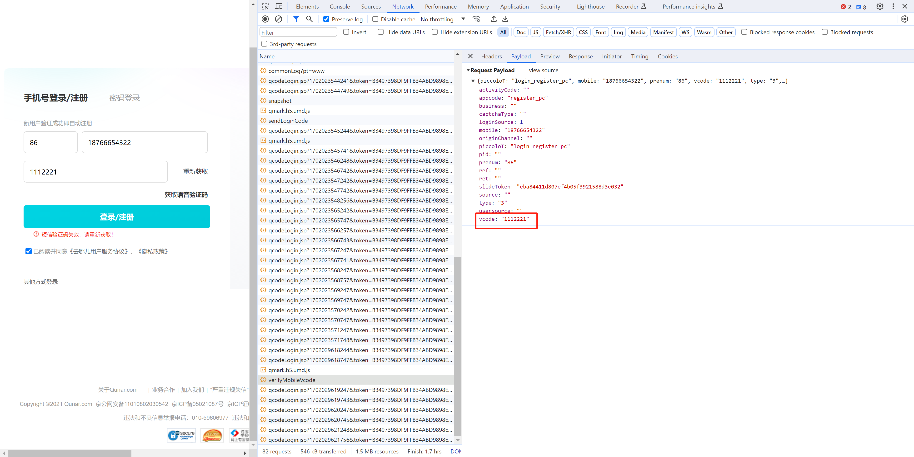

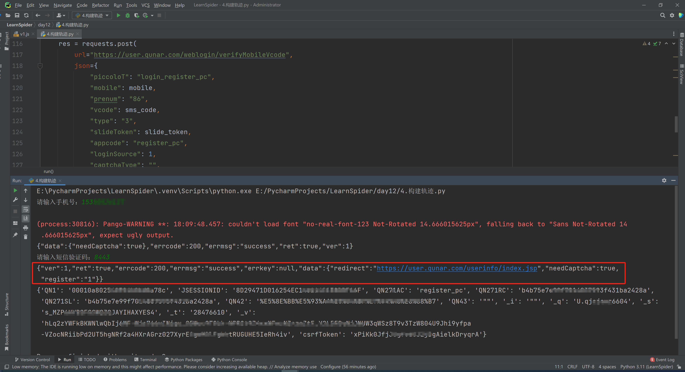

```python
# @课程    : 爬虫逆向实战课
# @讲师    : 武沛齐
# @课件获取 : wupeiqi666
import json
import random
import time
import base64
import binascii

import requests
from Crypto.Cipher import AES
from Crypto.Util.Padding import pad


def get_slider_list():
    slider_list = []
    client_x = 300
    client_y = 500
    start_time = int(int(time.time() * 1000) % 1e5)
    width = random.randint(419, 431)
    for slice_distance in range(3, width, 26):
        if width - slice_distance <= 26:
            slice_distance = width
        start_time += random.randint(10, 1000)
        i = start_time
        o = f"{client_x + slice_distance}.00"
        u = f"{client_y + random.randint(-5, 5)}.00"
        a = f"{slice_distance}.00"
        f = f"{i};{o};{u};{a}"
        slider_list.append(f)
    return slider_list


def aes_encrypt(data_string):
    # key = "227V2xYeHTARSh1R".encode('utf-8')
    key_string = "32323756327859654854415253683152"
    key = binascii.a2b_hex(key_string)

    aes = AES.new(
        key=key,
        mode=AES.MODE_ECB
    )
    raw = pad(data_string.encode('utf-8'), 16)
    aes_bytes = aes.encrypt(raw)
    res_string = base64.b64encode(aes_bytes).decode('utf-8')
    return res_string


def run():
    mobile = input("请输入手机号：")

    res = requests.get("https://user.qunar.com/passport/login.jsp")
    cookie_dict = res.cookies.get_dict()
    cookie_qn1 = cookie_dict['QN1']

    slider_list = get_slider_list()
    slider_info = {
        "openTime": int((time.time() - random.randint(500, 3000)) * 1000),
        "startTime": int((time.time() - random.uniform(2, 4)) * 1000),
        "endTime": int((time.time() - random.uniform(0, 1)) * 1000),
        "userAgent": "Mozilla/5.0 (Windows NT 10.0; Win64; x64) AppleWebKit/537.36 (KHTML, like Gecko) Chrome/119.0.0.0 Safari/537.36",
        "uid": cookie_qn1,
        "track": slider_list,
        "acc": [],
        "ori": [],
        "deviceMotion": [{"isTrusted": True} for _ in range(random.randint(10, 100))]
    }

    data_string = json.dumps(slider_info, separators=(',', ':'))
    data = aes_encrypt(data_string)
    res = requests.post(
        url="https://vercode.qunar.com/inner/captcha/snapshot",
        json={
            "appCode": "register_pc",
            "cs": "pc",
            "data": data,
            "orca": 2
        },
        cookies=cookie_dict
    )
    res_dict = res.json()
    slide_token = res_dict['data']["cst"]
    cookie_dict.update(res.cookies.get_dict())

    import subprocess
    res = subprocess.check_output(f'node v1.js "{slide_token}"', shell=True)
    bella_string = res.decode('utf-8').strip()

    res = requests.post(
        url="https://user.qunar.com/weblogin/sendLoginCode",
        data={
            "usersource": "",
            "source": "",
            "ret": "",
            "ref": "",
            "business": "",
            "pid": "",
            "originChannel": "",
            "activityCode": "",
            "origin": "",
            "mobile": mobile,
            "prenum": "86",
            "loginSource": "1",
            "slideToken": slide_token,
            "smsType": "0",
            "appcode": "register_pc",
            "bella": bella_string,
            "captchaType": ""
        },
        cookies=cookie_dict
    )
    print(res.text)
    cookie_dict.update(res.cookies.get_dict())

    sms_code = input("请输入短信验证码：")
    res = requests.post(
        url="https://user.qunar.com/weblogin/verifyMobileVcode",
        json={
            "piccoloT": "login_register_pc",
            "mobile": mobile,
            "prenum": "86",
            "vcode": sms_code,
            "type": "3",
            "slideToken": slide_token,
            "appcode": "register_pc",
            "loginSource": 1,
            "captchaType": "",
            "source": "",
            "usersource": "",
            "ret": "",
            "ref": "",
            "business": "",
            "pid": "",
            "originChannel": "",
            "activityCode": ""
        }
    )
    cookie_dict.update(res.cookies.get_dict())

    print(res.text)
    print(cookie_dict)

if __name__ == '__main__':
    run()
```


