# day16 x美


**注意：**这是其实是一个**x美**的点选验证。

```
https://secure.elong.com/passport/login_cn.html?nexturl=https://www.elong.com/
https://www.ishumei.com/trial/captcha.html
```


# 1.必备知识点

在开始逆向案例之前，先来学一些前置必备的技能。


## 1.1 动态无法调试

网页定位到某个js文件中的位置，想要断点调试，但由于每次js的网址都会更新（返回内容虽然一样），导致断点无法执行，这种情况下怎么办？

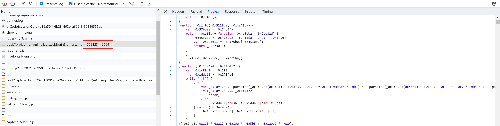


解决方案：找到返回此js地址的页面，将返回值其替换为固定的值，具体步骤：

- 安装抓包工具Charles，让Charles代理网页的请求

- 在Charles中配置，当请求网址时，返回我们指定的HTML数据（网页上加载js地址就是固定的了）

  

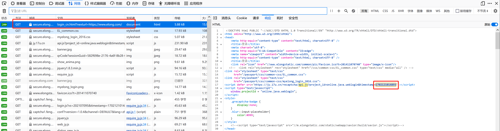


### 1.Charles安装

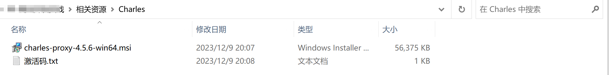

```
注册码
	Registered Name:  https://zhile.io
	License Key:      48891cf209c6d32bf4
```


### 2.Charles证书

如果想要让charles抓取浏览器的请求包，必须将charles证书安装到电脑上。

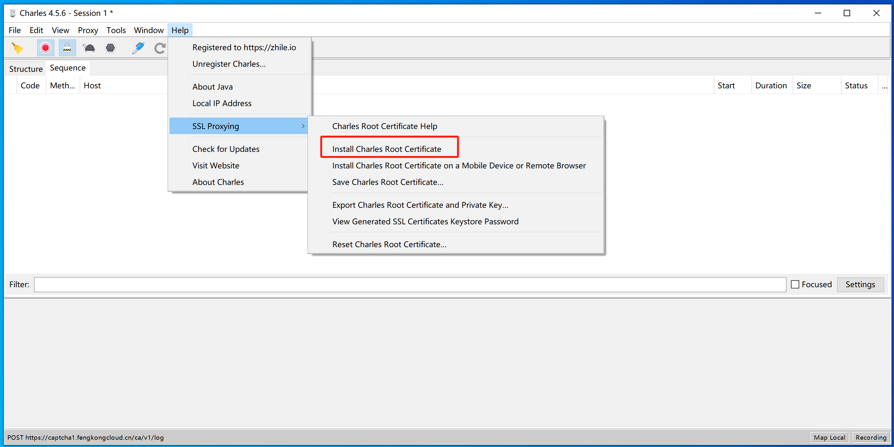

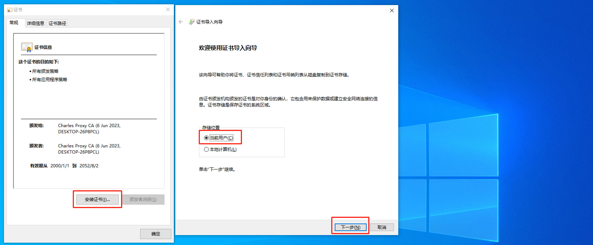


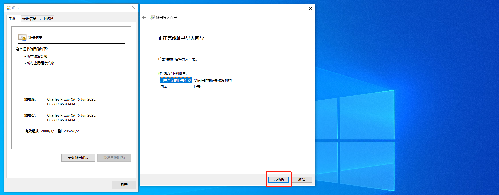


当安装成功后，让charles开始代理电脑的请求（必须勾选上）：

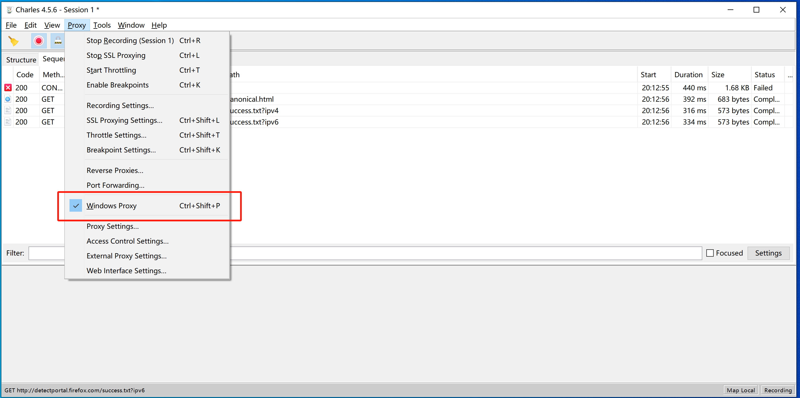

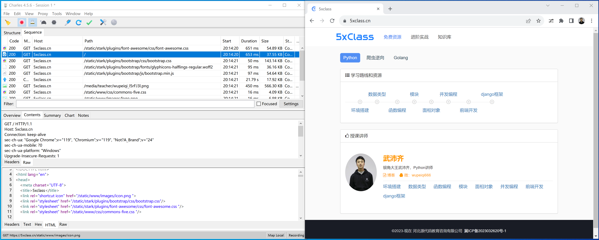


### 3.Charles页面替换

当charles可以作为代理之后，可以在Charles中配置：如果浏览器上访问某网址，给他返回特定的内容。

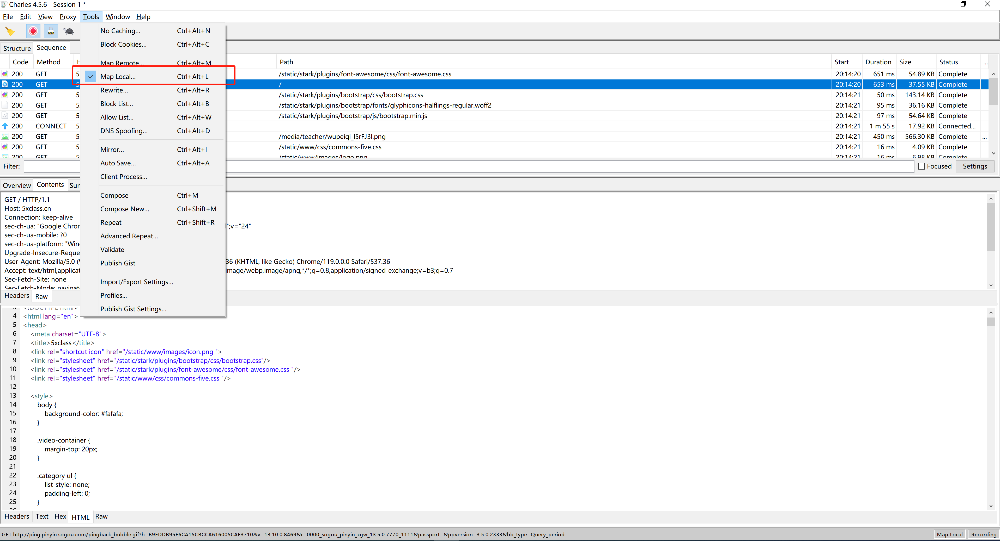

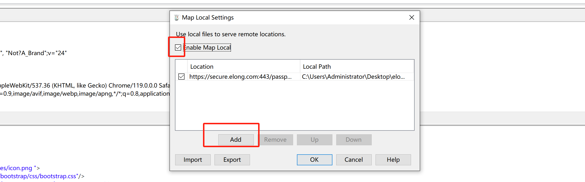

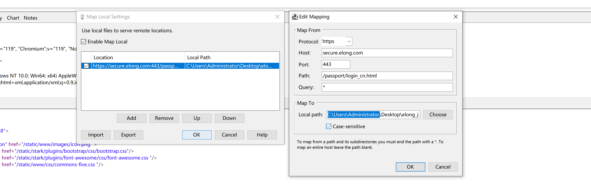

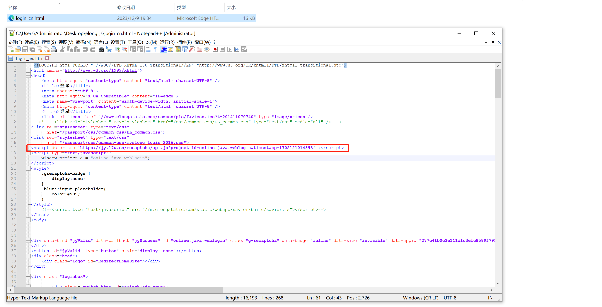


### 4.网页访问和调试

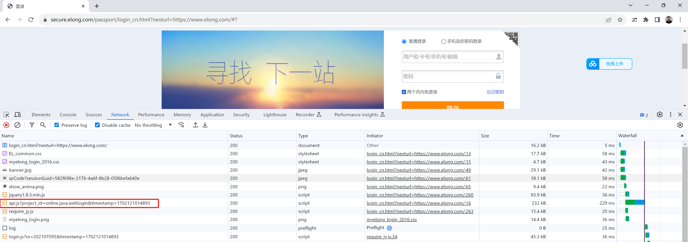


## 1.2 数美示例

https://www.ishumei.com/trial/captcha.html

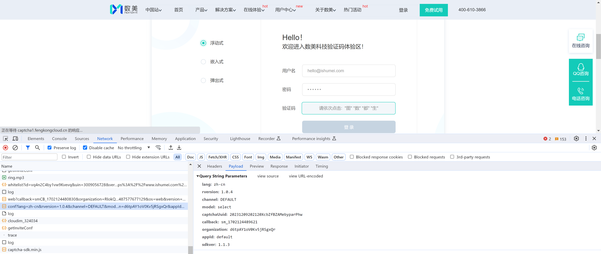


## 1.3 文本替换

### 1.单独替换

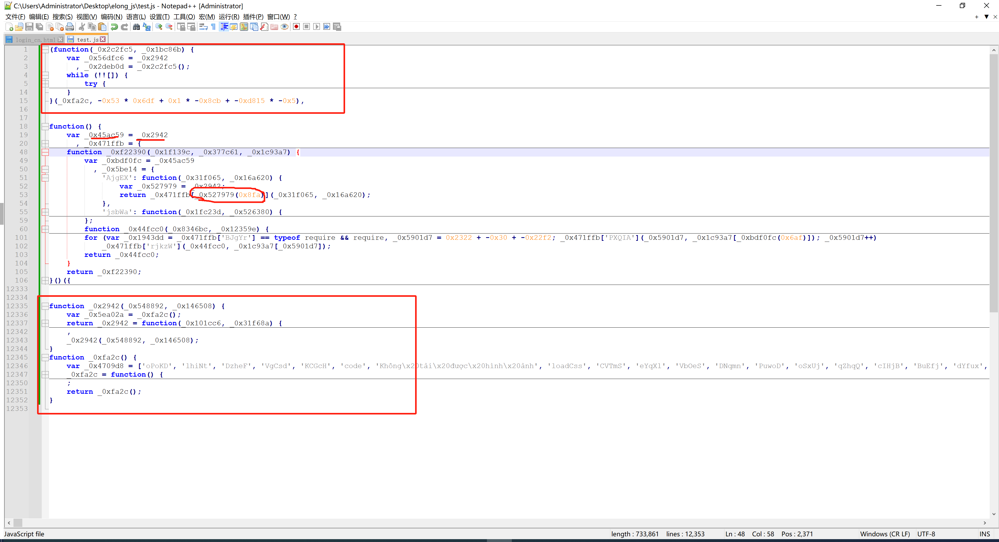

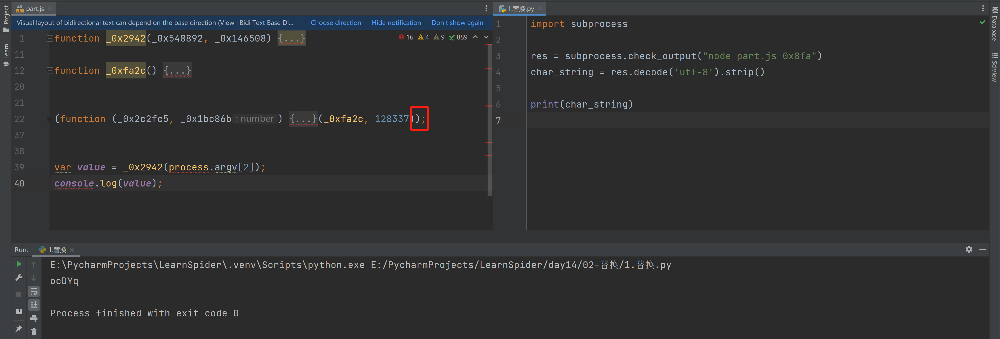

```python
import subprocess

res = subprocess.check_output("node part.js 0x8fa")
char_string = res.decode('utf-8').strip()

print(char_string)
```


### 2.整体替换

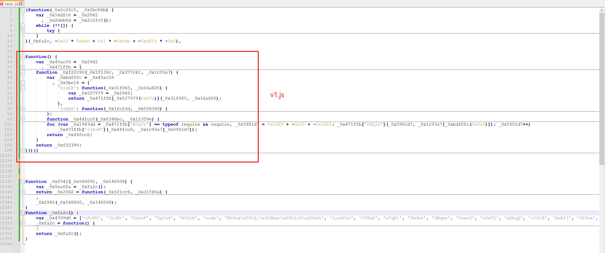

```python
import re
import subprocess


def exec_value(hex_string):
    res = subprocess.check_output(f"node part.js {hex_string}")
    char_string = res.decode('utf-8').strip()
    return char_string


def get_total_set():
    data_set = set()
    with open("v1.js", mode='r', encoding='utf-8') as f1:
        for line in f1:
            if not line:
                continue
            match_list = re.findall(r"var (.*) = _0x2942", line)
            if match_list:
                data_set.add(match_list[0])
    return data_set


def loop_re_match(data_set, line):
    for func in data_set:
        match_list = re.findall(f"({func}\((.*?)\))", line)
        if not match_list:
            continue
        for total, arg in match_list:
            real_value = exec_value(arg)
            line = line.replace(total, f'"{real_value}"')
    return line


def run():
    data_set = get_total_set()
    counter = 0
    with open("v1.js", mode='r', encoding='utf-8') as f1, open("v2.js", mode='w', encoding='utf-8') as f2:
        for line in f1:
            counter += 1
            print(counter)
            if not line:
                f2.write(line)
                continue
            line = loop_re_match(data_set, line)
            f2.write(line)


if __name__ == '__main__':
    run()
```


# 2.整体请求分析

https://secure.elong.com/passport/login_cn.html?nexturl=https://www.elong.com/#?


## 2.1 配置

```
https://captcha1.fengkongcloud.cn/ca/v1/conf?organization=xQsKB7v2qSFLFxnvmjdO&lang=zh-cn&sdkver=1.1....
```

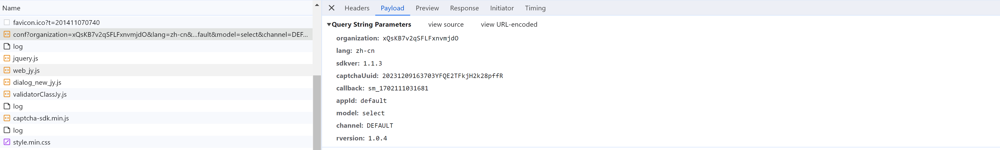

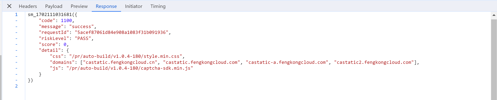


## 2.2 获取验证码

点击登录或验证失败，出现验证码。

```
https://captcha1.fengkongcloud.cn/ca/v1/register?rversion=1.0.4&model=select&captchaUuid=20231209163703YF....
```

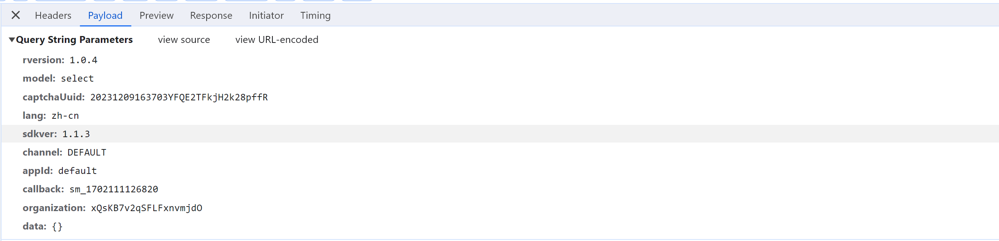

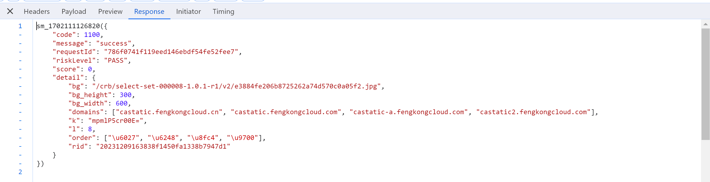


## 2.3 提交验证

点击4个验证码后，自动提交。

```
https://captcha1.fengkongcloud.cn/ca/v2/fverify?qd=tbJHTr9SEFvL5eG%2B...
```

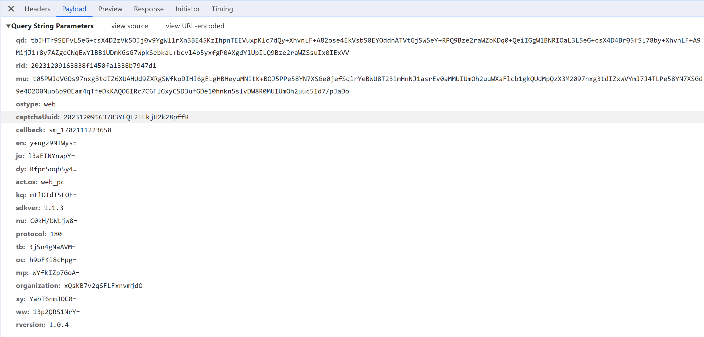

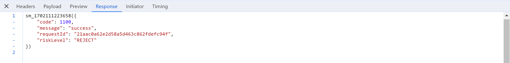

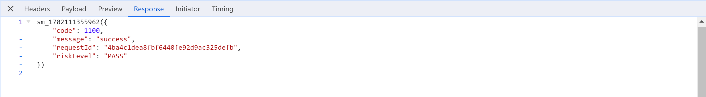


# 3.逆向：配置

## 3.1 请求分析

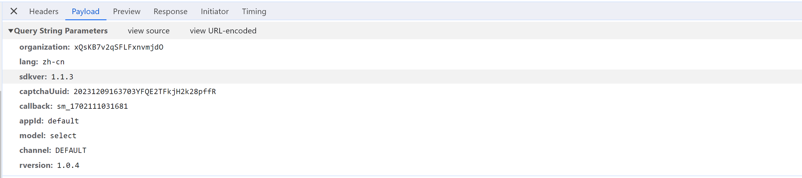

```
organization: xQsKB7v2qSFLFxnvmjdO               固定，应该是购买数美产品给的ID
lang: zh-cn
sdkver: 1.1.3
captchaUuid: 20231209163703YFQE2TFkjH2k28pffR    动态，每次刷新不一样【需逆向】
callback: sm_1702111031681
appId: default
model: select                                    应该是验证模式：点选、滑块
channel: DEFAULT
rversion: 1.0.4
```


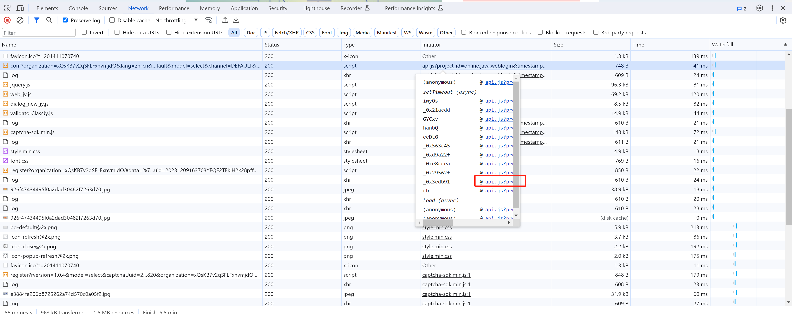

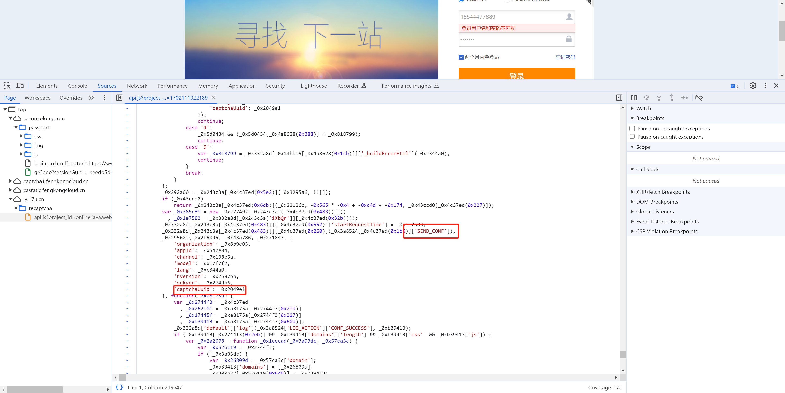

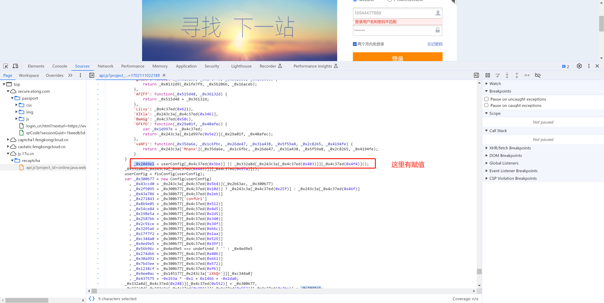

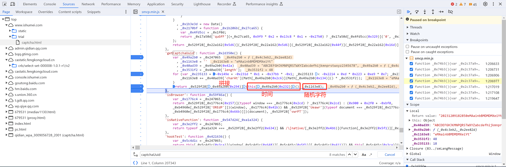

```javascript
'getCaptchaUuid': function _0x2d350e() {
    var _0x49a2b0 = _0x247065
    , _0x1163e8 = ''
    , _0x40ad39 = "ABCDEFGHJKMNPQRSTWXYZabcdefhijkmnprstwxyz2345678"
    , _0x3531f2 = 48;
    for (var _0x235133 = 0; _0x235133 < 18; _0x235133++) {
        _0x1163e8 += _0x40ad39['charAt'](Math['floor'](Math['random']() * _0x3531f2));
    }
    // this[_0x49a2b0(0x232)]()是时间：'20231209202652'   年月日时分秒
    // _0x529f28[_0x49a2b0(0x294)]是个函数，将两个参数拼接起来
    return _0x529f28[_0x49a2b0(0x294)](this[_0x49a2b0(0x232)](), _0x1163e8);
}
```

所以，CaptchaUuid的生成其实就是：时间  + 随机字符串（例如："20231209202804MKhadf765PiJNRwYAG"）

```python
import random
import datetime

total_string = "ABCDEFGHJKMNPQRSTWXYZabcdefhijkmnprstwxyz2345678"

part = "".join([random.choice(total_string) for i in range(18)])
ctime = datetime.datetime.now().strftime("%Y%m%d%H%M%S")

captcha_uuid = f"{ctime}{part}"
print(captcha_uuid)
```


## 3.2 发送请求

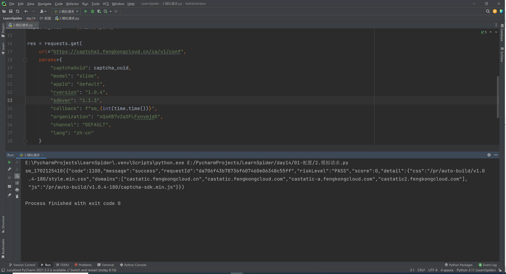

```python
# @课程    : 爬虫逆向实战课
# @讲师    : 武沛齐
# @课件获取 : wupeiqi666
import time

import requests
import random
import datetime

total_string = "ABCDEFGHJKMNPQRSTWXYZabcdefhijkmnprstwxyz2345678"

part = "".join([random.choice(total_string) for i in range(18)])
ctime = datetime.datetime.now().strftime("%Y%m%d%H%M%S")
captcha_uuid = f"{ctime}{part}"

res = requests.get(
    url="https://captcha1.fengkongcloud.cn/ca/v1/conf",
    params={
        "captchaUuid": captcha_uuid,
        "model": "select",
        "appId": "default",
        "rversion": "1.0.4",
        "sdkver": "1.1.3",
        "callback": f"sm_{int(time.time())}",
        "organization": "xQsKB7v2qSFLFxnvmjdO",
        "channel": "DEFAULT",
        "lang": "zh-cn"
    }
)

print(res.text)
```


# 4.逆向：获取验证码

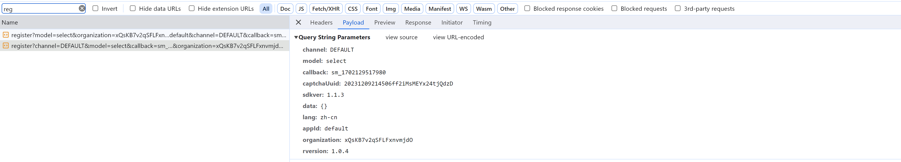

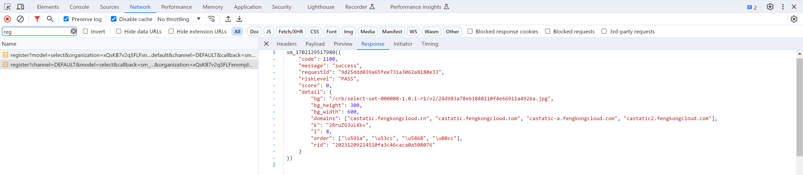

无需逆向，直接请求：

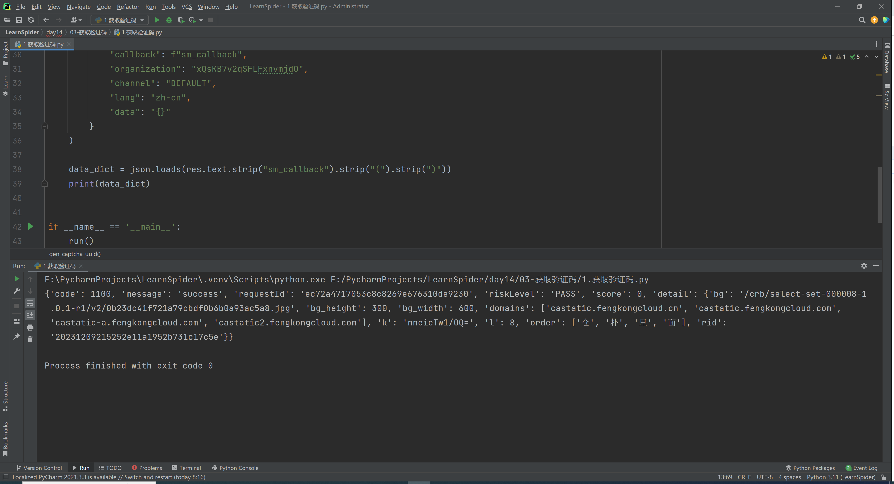

```python
# @课程    : 爬虫逆向实战课
# @讲师    : 武沛齐
# @课件获取 : wupeiqi666
import time
import json
import requests
import random
import datetime


def gen_captcha_uuid():
    total_string = "ABCDEFGHJKMNPQRSTWXYZabcdefhijkmnprstwxyz2345678"
    part = "".join([random.choice(total_string) for i in range(18)])
    ctime = datetime.datetime.now().strftime("%Y%m%d%H%M%S")
    captcha_uuid = f"{ctime}{part}"
    return captcha_uuid


def run():
    captcha_uuid = gen_captcha_uuid()

    res = requests.get(
        url="https://captcha1.fengkongcloud.cn/ca/v1/register",
        params={
            "captchaUuid": captcha_uuid,
            "model": "select",
            "appId": "default",
            "rversion": "1.0.4",
            "sdkver": "1.1.3",
            "callback": f"sm_callback",
            "organization": "xQsKB7v2qSFLFxnvmjdO",
            "channel": "DEFAULT",
            "lang": "zh-cn",
            "data": "{}"
        }
    )

    data_dict = json.loads(res.text.strip("sm_callback").strip("(").strip(")"))
    print(data_dict)


if __name__ == '__main__':
    run()

```


# 5.逆向：提交指纹

```
https://captcha1.fengkongcloud.cn/ca/v2/fverify
```

```json
{
    "organization": "xQsKB7v2qSFLFxnvmjdO",
    "tb": "3jSn4gNaAVM%3D",
    "qd": "C0bn16G5KCfL5eG%2BcsX4D2zVk5OJj0v9yp%2FobhabiHPSaRWTFZHwqEESQabyF%2Bifwqvw%2FubnvtTyjoquNCrB09JpFZMVkfCoT3%2BuLCX%2BA5yyOD%2FPFvS%2B51EucGdmqC6MjXlEf1fmqIBRKHWSYzFoY7qCDMDWbBnp0mkVkxWR8Kg1lrHsO5vreY15RH9X5qiA49vPYosSTsacp4eCSlsHhGkN0N7e7dNRy%2BXhvnLF%2BA9BEkGm8hfon663Z%2B5nHqIc",
    "ostype": "web",
    "xy": "YabT6nmJOC0%3D",
    "dy": "Rfpr5oqb5y4%3D",
    "en": "y%2Bugz9NIWys%3D",
    "rversion": "1.0.4",
    "sdkver": "1.1.3",
    "nu": "C0kH%2FbWLjw8%3D",
    "mu": "8LlSNopqsqQ97nxg3tdIZ6XUAHUd9ZXRv1tmsN36Xi4fSW76upB2jGHRX517zf%2Bb%2Bc1ERqOHAyjeY2BarYayPR9Jbvq6kHaMYZZm%2FG7Dqv70lf%2BNyEwjJti6s6NuBhD3X3AJlc40WilxEDbwniT602l%2BVxoLs71sH0lu%2BrqQdozaurDbYgC84l9wCZXONFopdgBBtTGOrxytgM41ZQbVteQJ8SC%2F%2FSvbPe58YN7XSGdh0V%2Bde83%2Fm7RQACrkbzLP",
    "captchaUuid": "20231209214506ff2iMsMEYx24tjQdzD",
    "jo": "l3aEINYnwpY%3D",
    "act.os": "web_pc",
    "protocol": "180",
    "rid": "20231209214510fa3c46caca0a508076",
    "callback": "sm_1702130040080",
    "mp": "WYfkIZp7GoA%3D",
    "oc": "h9oFKi8cHpg%3D",
    "ww": "jYqq0U9Wjos%3D",
    "kq": "mtlOTdT5LOE%3D"
}
```

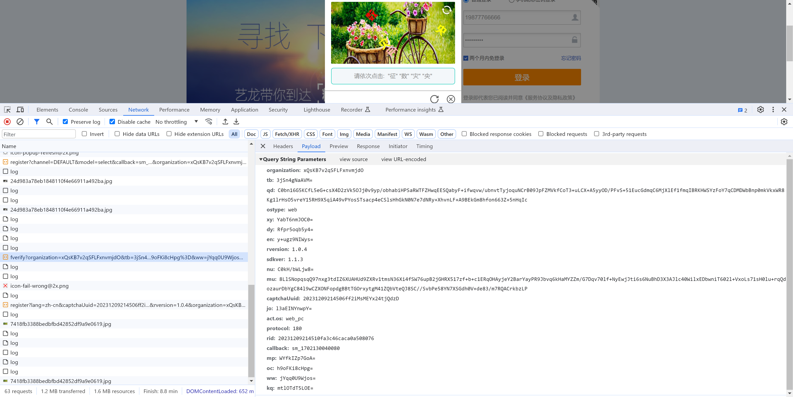


## 5.1 定位

当在图片上点击第4标记时，触发请求。

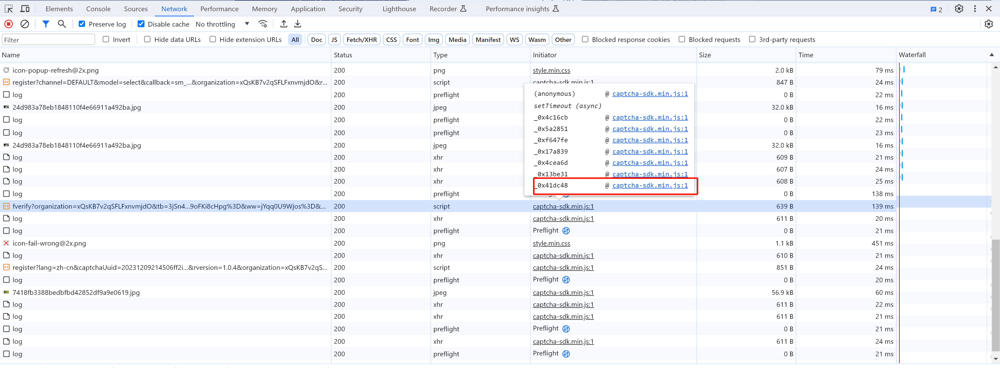


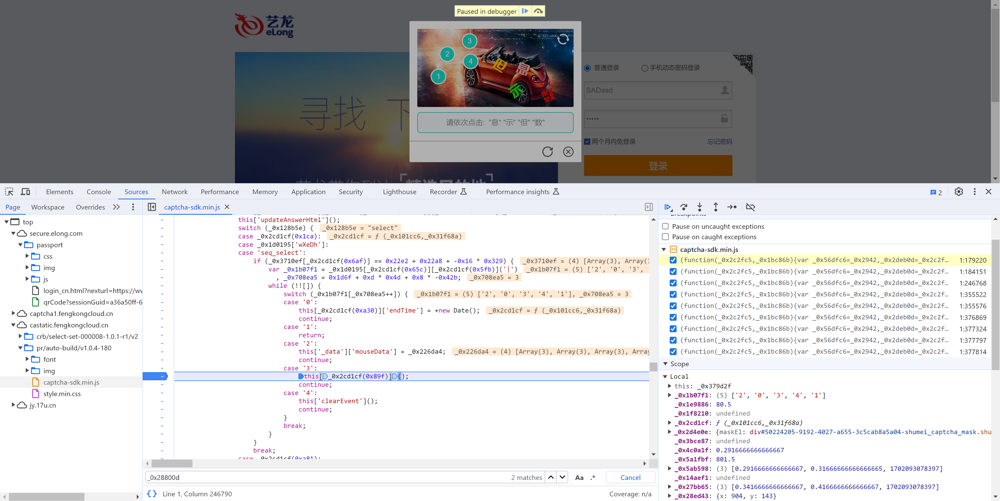


## 5.2 特殊替换


```python
import re
import subprocess


def exec_value(hex_string):
    res = subprocess.check_output(f"node part.js {hex_string}")
    char_string = res.decode('utf-8').strip()
    return char_string


def run():
    counter = 0
    with open("v2.js", mode='r', encoding='utf-8') as f1, open("v3.js", mode='w', encoding='utf-8') as f2:
        for line in f1:
            counter += 1
            print(counter)
            if not line:
                f2.write(line)
                continue

            match_list = re.findall(r"(_0x2cd1cf\((.*?)\))", line)
            for total, arg in match_list:
                real_value = exec_value(arg)
                line = line.replace(total, f'"{real_value}"')
            f2.write(line)


if __name__ == '__main__':
    run()
```


## 5.3 第4次请求

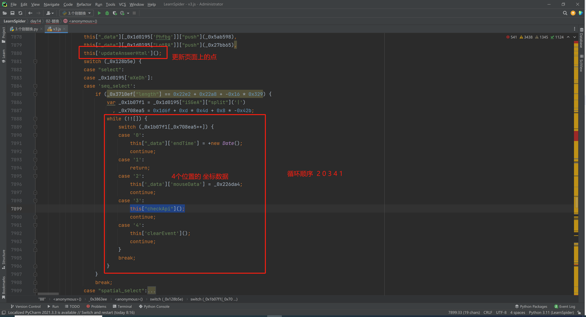

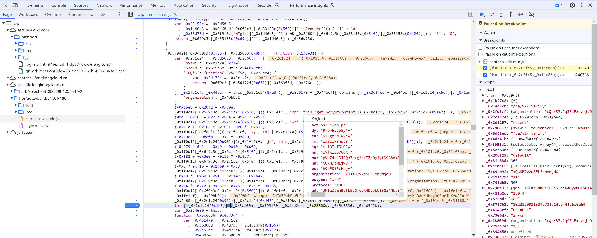

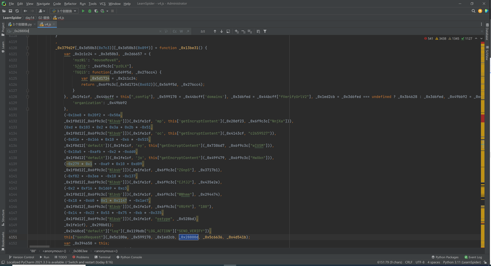

```javascript
var _0x2c1c24 = _0x3d50b3, _0x2d6657 = {
                    'nyzWi': "mouseMoveX",
                    'SZdlb': _0x6f9c3c["pzOLX"],
                    'TGQiS': function(_0x569f5d, _0x276cc4) {
                        var _0x5d1724 = _0x2c1c24;
                        return _0x6f9c3c["onIeC"](_0x569f5d, _0x276cc4);
                    }
                }, _0x1fe1cf, _0x44bcff = this["_config"], _0x599170 = _0x44bcff['domains'], _0x3d6fed = _0x44bcff["fVerifyUrlV2"], _0x1ed2cb = _0x3d6fed === undefined ? _0x3b4628 : _0x3d6fed, _0x49bb92 = _0x44bcff["organization"], _0x20df23 = _0x44bcff["appId"], _0x4143cf = _0x44bcff["channel"], _0x435e2e = _0x44bcff['VERSION'], _0x7306d7 = _0x44bcff['lang'], _0x294474 = _0x44bcff["SDKVER"], _0x1b27c8 = _0x44bcff["_successCallback"], _0x2d5257 = _0x44bcff["mode"], _0x5b58d1 = this['_data'], _0x536387 = _0x5b58d1["errMsg"], _0x74fdb5 = _0x5b58d1["trueWidth"], _0x31e834 = _0x6f9c3c["tIGQt"](_0x74fdb5, undefined) ? -0x1338 + -0x145f + -0x7eb * -0x5 : _0x74fdb5, _0x3717b1 = this["getRegisterData"](_0x6f9c3c["ZGnpS"]), _0x298b01 = this["getMouseAction"](), _0x528bd = _0x6f9c3c["VQpVP"], _0x49f479 = this["getSafeParams"](), _0x28800d = _0x2460cd[_0x6f9c3c["Nlbsb"]]["extend"]((_0x1fe1cf = {
                    'organization': _0x49bb92
                },
                (-0x1be8 + 0x20f2 + -0x50a,
                _0x1f0d12[_0x6f9c3c["Nlbsb"]])(_0x1fe1cf, 'mp', this['getEncryptContent'](_0x20df23, _0x6f9c3c["NnjXa"])),
                (0xd * 0x103 + 0x2 * 0x3a + 0x2b * -0x51,
                _0x1f0d12[_0x6f9c3c["Nlbsb"]])(_0x1fe1cf, 'oc', this["getEncryptContent"](_0x4143cf, "c2659527")),
                (-0x81e + -0x166 * 0x10 + -0x6 * -0x515,
                _0x1f0d12['default'])(_0x1fe1cf, 'xy', this["getEncryptContent"](_0x7306d7, _0x6f9c3c["wIUSM"])),
                (-0x10a5 + -0xafb + -0x2 * -0xdd0,
                _0x1f0d12["default"])(_0x1fe1cf, 'jo', this["getEncryptContent"](_0x49f479, _0x6f9c3c["HwXkn"])),
                (-0x279 * 0x1 + -0xa9 * 0x10 + 0xd09,
                _0x1f0d12[_0x6f9c3c["Nlbsb"]])(_0x1fe1cf, _0x6f9c3c["ZGnpS"], _0x3717b1),
                (-0xf82 + -0x3ee + -0x10 * -0x137,
                _0x1f0d12[_0x6f9c3c["Nlbsb"]])(_0x1fe1cf, _0x6f9c3c["CJfJJ"], _0x435e2e),
                (-0x2 * 0xf16 + 0x1d69 + 0xc3,
                _0x1f0d12[_0x6f9c3c['Nlbsb']])(_0x1fe1cf, _0x6f9c3c["WWhmm"], _0x294474),
                (-0x18 * -0x60 + 0x1 * 0x1147 + -0x1a47,
                _0x1f0d12[_0x6f9c3c['Nlbsb']])(_0x1fe1cf, _0x6f9c3c["VRUfH"], "180"),
                (-0x14 * -0x22 + 0x53 * -0x75 + -0xb * -0x335,
                _0x1f0d12[_0x6f9c3c["Nlbsb"]])(_0x1fe1cf, "ostype", _0x528bd),
                _0x1fe1cf), _0x298b01);
                _0x2460cd["default"]["log"](_0x119bdb["LOG_ACTION"]["SEND_VERIFY"]),
                this["sendRequest"](_0x5c100a, _0x599170, _0x1ed2cb, _0x28800d, _0x5c6636, _0x4d541b);
```

```javascript
var _0x2c1c24 = _0x3d50b3;
var _0x2d6657 = {
    'nyzWi': "mouseMoveX",
    'SZdlb': 'mouseEndX',
    'TGQiS': function(_0x569f5d, _0x276cc4) {
        var _0x5d1724 = _0x2c1c24;
        // _0x6f9c3c["onIeC"]用于判断两个值是否相等，内部：return  _0x569f5d != _0x569f5d;
        return _0x6f9c3c["onIeC"](_0x569f5d, _0x569f5d);
    }
};
var _0x1fe1cf;
var _0x44bcff = this["_config"];
var _0x599170 = _0x44bcff['domains']
var _0x3d6fed = _0x44bcff["fVerifyUrlV2"];
var _0x1ed2cb = _0x3d6fed === undefined ? _0x3b4628 : _0x3d6fed;
var _0x49bb92 = _0x44bcff["organization"];
var _0x20df23 = _0x44bcff["appId"];
var _0x4143cf = _0x44bcff["channel"];
var _0x435e2e = _0x44bcff['VERSION'];
var _0x7306d7 = _0x44bcff['lang'];
var _0x294474 = _0x44bcff["SDKVER"];
var _0x1b27c8 = _0x44bcff["_successCallback"];
var _0x2d5257 = _0x44bcff["mode"]; 
var _0x5b58d1 = this['_data'];
var _0x536387 = _0x5b58d1["errMsg"];
var _0x74fdb5 = _0x5b58d1["trueWidth"];
var _0x31e834 = _0x6f9c3c["tIGQt"](_0x74fdb5, undefined) ? -0x1338 + -0x145f + -0x7eb * -0x5 : _0x74fdb5;
var _0x3717b1 = this["getRegisterData"]("rid");
// {"qd":"JMTaZ9mhBafL5eG+csX4DyykOT58z4NkvEylF9PEJf7L5eG+csX4D99Jw/pxKLyZXDGGiPXI3qKOTQVxDcRTT8vl4b5yxfgPCOtHpI8vokEhvIaN1eVD3J/VbVfaGFhTe2zsfSFY0HHL5eG+csX4D2zVk5OJj0v9aN98yIZfXFAFVo8CcJXqET4/o/Xm4TM8IqH+lfRKs4nL5eG+csX4D0nKUbNy9O0wcJHXvw3IxzW+4fUG0TddNA==","mu":"pVx74d45J5Q97nxg3tdIZ/0y4ytD9A8okEmxa7DPFbc97nxg3tdIZ0Iv9A4eLBoHN4bO+sawYrQ4vvTzU3B2tD3ufGDe10hn6YzZYianpoalBvuJfSGuOVhLRHjg97pupzIANY/0R2A97nxg3tdIZ6XUAHUd9ZXR6MGQBiNUcNNyI8hU9pnNqbePBqpC9rB5D36gNvYfg2E97nxg3tdIZ3QQRwUdc7LcgEXxAfwdlAw77pLU1Nb2VA==","ww":"PN3c45aazWY=","nu":"C0kH/bWLjw8=","dy":"Rfpr5oqb5y4=","act.os":"web_pc","tb":"3jSn4gNaAVM=","en":"y+ugz9NIWys=","kq":"mtlOTdT5LOE="}
var _0x298b01 = this["getMouseAction"]();
var _0x528bd = _0x6f9c3c["VQpVP"];
var _0x49f479 = this["getSafeParams"]();

// _0x28800d = _0x298b01中的键值对 + _0x1fe1cf中的键值对
var _0x28800d = _0x2460cd["default"]["extend"](
    (
        var _0x1fe1cf = {
            'organization': _0x49bb92
        };
        _0x1f0d12['default'])(_0x1fe1cf, 'mp', this['getEncryptContent']('default', '9cc268c1');
		_0x1f0d12['default'])(_0x1fe1cf, 'oc', this["getEncryptContent"]('DEFAULT', "c2659527");
		_0x1f0d12['default'])(_0x1fe1cf, 'xy', this["getEncryptContent"]('zh-cn', 'b1807581');
		_0x1f0d12["default"])(_0x1fe1cf, 'jo', this["getEncryptContent"]("11", '6d005958);
		_0x1f0d12['default'])(_0x1fe1cf, 'rid', _0x3717b1);
		_0x1f0d12['default'])(_0x1fe1cf, 'rversion', _0x435e2e);
		_0x1f0d12['default'])(_0x1fe1cf, 'sdkver', _0x294474);
		_0x1f0d12['default'])(_0x1fe1cf, 'protocol', "180");
		_0x1f0d12['default'])(_0x1fe1cf, "ostype", _0x528bd);
		_0x1fe1cf
    ), 
    _0x298b01 
);

_0x2460cd["default"]["log"]('sendVerify');
this["sendRequest"](_0x5c100a, _0x599170, _0x1ed2cb, _0x28800d, _0x5c6636, _0x4d541b);
```


## 5.4 getEncryptContent

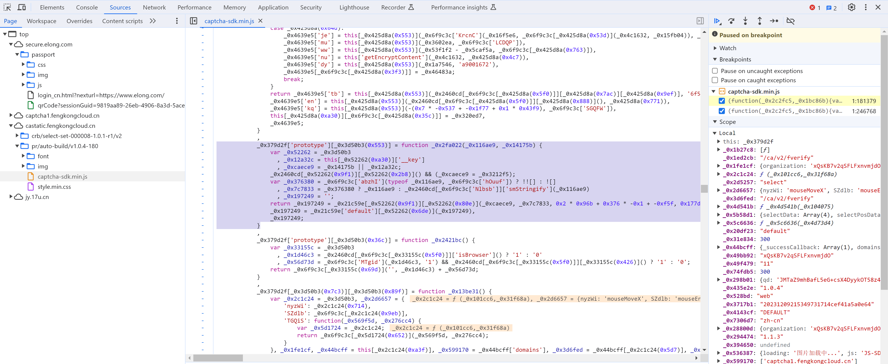

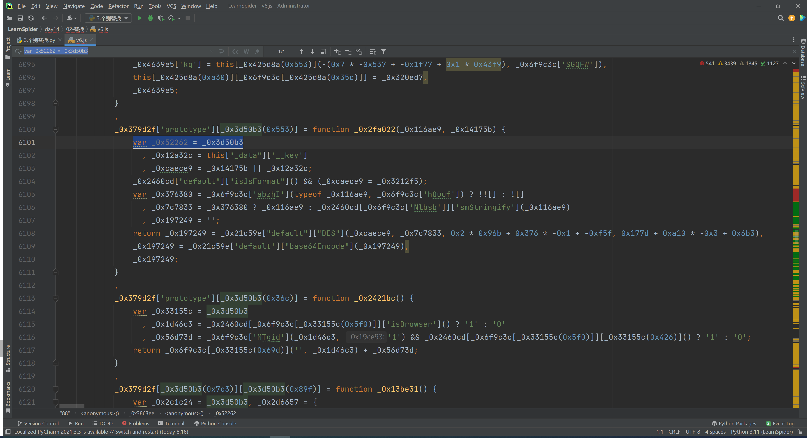

```javascript
_0x379d2f['prototype'][_0x3d50b3(0x553)] = function _0x2fa022(_0x116ae9, _0x14175b) {
    var _0x52262 = _0x3d50b3
    , _0x12a32c = this["_data"]['__key']
    , _0xcaece9 = _0x14175b || _0x12a32c;
    _0x2460cd["default"]["isJsFormat"]() && (_0xcaece9 = _0x3212f5);
    var _0x376380 = _0x6f9c3c['abzhI'](typeof _0x116ae9, _0x6f9c3c['hOuuf']) ? !![] : ![]
    , _0x7c7833 = _0x376380 ? _0x116ae9 : _0x2460cd[_0x6f9c3c['Nlbsb']]['smStringify'](_0x116ae9)
    , _0x197249 = '';
    return _0x197249 = _0x21c59e["default"]["DES"](_0xcaece9, _0x7c7833, 0x2 * 0x96b + 0x376 * -0x1 + -0xf5f, 0x177d + 0xa10 * -0x3 + 0x6b3),
        _0x197249 = _0x21c59e['default']["base64Encode"](_0x197249),
        _0x197249;
}
```

```javascript
### 断点重大发现执行多次，猜想参数的生成也会走这里 ### 

function _0x2fa022(_0x116ae9, _0x14175b) {
    var _0x12a32c = this["_data"]['__key'];
    var _0xcaece9 = _0x14175b || _0x12a32c; // 如果函数第二个参数值为第二个参数，否则： this["_data"]['__key'];
    
    // _0x3212f5 = "1702133023321.823ishumei.com"   -> 时间戳 + "ishumei.com"
    _0x2460cd["default"]["isJsFormat"]() && (_0xcaece9 = _0x3212f5);
    
    // _0x376380 = false
    var _0x376380 = _0x6f9c3c['abzhI'](typeof _0x116ae9, _0x6f9c3c['hOuuf']) ? !![] : ![];
    
    // 对第1个参数进行序列化
    var  _0x7c7833 = _0x376380 ? _0x116ae9 : _0x2460cd[_0x6f9c3c['Nlbsb']]['smStringify'](_0x116ae9);
    var  _0x197249 = '';
    
    // DES加密（ 参数2或this["_data"]['__key']，    参数1序列化,   1,   0  )
    _0x197249 = _0x21c59e["default"]["DES"](_0xcaece9, _0x7c7833, 1, 0);
    // base64编码
	_0x197249 = _0x21c59e['default']["base64Encode"](_0x197249);
	return _0x197249;
}
```

```javascript
'ZtRQP': function(_0xb10f2e, _0x58b43b) {
    return _0xb10f2e + _0x58b43b;
}
// Math["random"](), +new Date()  ---> 1702133279842
_0x3212f5 = _0x1d0195['ZtRQP'](   _0x1d0195["ZtRQP"](  Math["random"](), +new Date()  )    , "ishumei.com")
```


## 5.5 DES加密

### 1.node

```
npm install crypto-js -g
```

```javascript
var CryptoJS = require("crypto-js")

function DESEncrypt(key, word) {
    var key_ = CryptoJS.enc.Utf8.parse(key);
    var srcs = CryptoJS.enc.Utf8.parse(word);
    var encrypted = CryptoJS.DES.encrypt(srcs, key_, {
        mode: CryptoJS.mode.ECB,
        padding: CryptoJS.pad.ZeroPadding
    });
    return encrypted.toString();
}

function DESDecrypt(key, word) {
    var key_ = CryptoJS.enc.Utf8.parse(key);
    var decrypt = CryptoJS.DES.decrypt(word, key_, {
        mode: CryptoJS.mode.ECB,
        padding: CryptoJS.pad.ZeroPadding
    });
    return decrypt.toString(CryptoJS.enc.Utf8);
}


var result = DESEncrypt("6f5e9847","1");
console.log(result);
```


### 2.Python

```python
import base64
from Crypto.Cipher import DES


key = b'6f5e9847'
data_string = '1'

pad_func = lambda text: text + '\0' * (DES.block_size - (len(text.encode('utf-8')) % DES.block_size))
aes = DES.new(key, DES.MODE_ECB)
enc_data = aes.encrypt(pad_func(data_string).encode("utf8"))
res = base64.b64encode(enc_data).decode('utf-8')
print(res)
```

```python
from Crypto.Cipher import DES
import base64


class EncryptDate:
    def __init__(self, key):
        self.key = key  # 初始化密钥
        self.length = DES.block_size  # 初始化数据块大小
        self.aes = DES.new(self.key, DES.MODE_ECB)  # 初始化AES,ECB模式的实例
        # 截断函数，去除填充的字符
        self.unpad = lambda date: date[0:-ord(date[-1])]

    def pad(self, text):
        """
        #填充函数，使被加密数据的字节码长度是block_size的整数倍
        """
        count = len(text.encode('utf-8'))
        add = self.length - (count % self.length)
        entext = text + '\0' * add
        return entext

    def encrypt(self, encrData):  # 加密函数
        res = self.aes.encrypt(self.pad(encrData).encode("utf8"))
        msg = str(base64.b64encode(res), encoding="utf8")
        return msg

    def decrypt(self, decrData):  # 解密函数
        res = base64.decodebytes(decrData.encode("utf8"))
        msg = self.aes.decrypt(res).decode("utf8")
        return self.unpad(msg)


if __name__ == '__main__':
    cr = EncryptDate(b'6f5e9847')
    cr_res = cr.encrypt('1')
    print(cr_res)
```


## 5.6 意外收获-其他参数

在调试getEncryptContent时，发现除了 `_0x298b01` 相关的参数也走了 `getEncryptContent`。

```javascript
// _0x28800d = _0x298b01中的键值对 + _0x1fe1cf中的键值对
var _0x28800d = _0x2460cd["default"]["extend"](
    (
        var _0x1fe1cf = {
            'organization': _0x49bb92
        };
        _0x1f0d12['default'])(_0x1fe1cf, 'mp', this['getEncryptContent']('default', '9cc268c1');
		_0x1f0d12['default'])(_0x1fe1cf, 'oc', this["getEncryptContent"]('DEFAULT', "c2659527");
		_0x1f0d12['default'])(_0x1fe1cf, 'xy', this["getEncryptContent"]('zh-cn', 'b1807581');
		_0x1f0d12["default"])(_0x1fe1cf, 'jo', this["getEncryptContent"]("11", '6d005958);
                                                                         
		_0x1f0d12['default'])(_0x1fe1cf, 'rid', _0x3717b1);
		_0x1f0d12['default'])(_0x1fe1cf, 'rversion', _0x435e2e);
		_0x1f0d12['default'])(_0x1fe1cf, 'sdkver', _0x294474);
		_0x1f0d12['default'])(_0x1fe1cf, 'protocol', "180");
		_0x1f0d12['default'])(_0x1fe1cf, "ostype", _0x528bd);
		_0x1fe1cf
    ), 
    _0x298b01 
);
```

```python
{
	
    "mp":"WYfkIZp7GoA=",
    "oc":"h9oFKi8cHpg=",
    "xy":"YabT6nmJOC0=",
    "jo":"l3aEINYnwpY=",
    
    "qd":"iUUzUpbSrVLL5eG+cs....",
    "mu":"Gcxg3RiVeoM97nxg3tdIZ3nzK3R7...",
    "ww":"iLL8K/VHX50=",
    "nu":"C0kH/bWLjw8=",
    "dy":"Rfpr5oqb5y4=",
    "tb":"3jSn4gNaAVM=",
    "en":"y+ugz9NIWys=",
    "kq":"mtlOTdT5LOE=",
    
	"rid":"2023121111394173034a940e0c5d82cc",
    "organization":"xQsKB7v2qSFLFxnvmjdO",
    "rversion":"1.0.4",
    "sdkver":"1.1.3",
    "protocol":"180",
    "ostype":"web",
    "callback":"随便写",
	"act.os":"web_pc",
    "captchaUuid":"20231211113934kRf2pzsG3e7ACCJzDt"
}
```

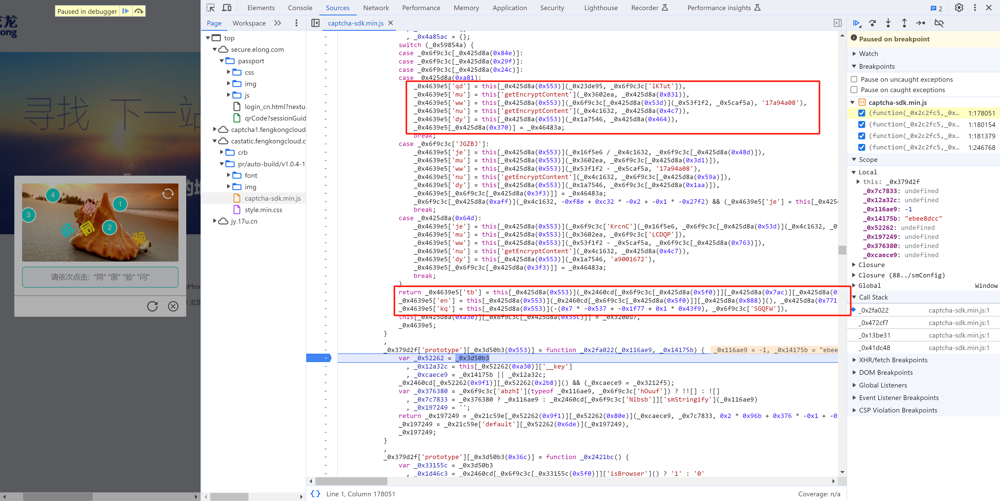


## 5.7 替换再观察

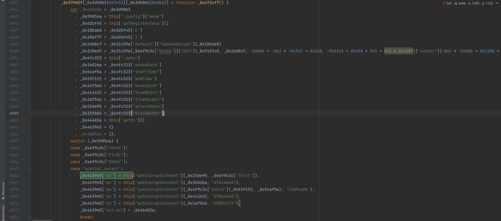

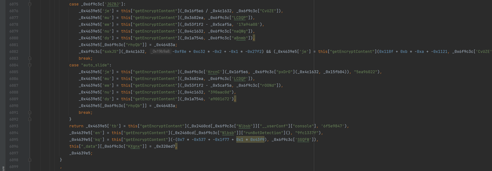

```javascript
_0x379d2f[_0x3d50b3(0x7c3)][_0x3d50b3(0x8b6)] = function _0x472cf7() {
    var _0x425d8a = _0x3d50b3
    , _0x59854a = this["_config"]["mode"]
    , _0xd2bf45 = this['getRegisterData']()
    , _0x18bde8 = _0xd2bf45['k']
    , _0x10af77 = _0xd2bf45['l']
    , _0x2dd8cf = _0x21c59e["default"]["base64Decode"](_0x18bde8)
    , _0x320ed7 = _0x21c59e[_0x6f9c3c["Nlbsb"]]["DES"](_0x913fc8, _0x2dd8cf, -0x8d6 + -0x2 * -0x347 + 0x248, -0x23c1 + 0x158 * 0x5 + 0x1 * 0x1d09)["substr"](-0xc * -0x206 + 0x118d + -0x29d5, _0x10af77)
    , _0x4fc323 = this['_data']
    , _0x3602ea = _0x4fc323['mouseData']
    , _0x5caf5a = _0x4fc323["startTime"]
    , _0x53f1f2 = _0x4fc323['endTime']
    , _0x16f5e6 = _0x4fc323['mouseEndX']
    , _0x4c1632 = _0x4fc323["trueWidth"]
    , _0x1a7546 = _0x4fc323["trueHeight"]
    , _0x23de95 = _0x4fc323["selectData"]
    , _0x15fb04 = _0x4fc323["blockWidth"]
    , _0x46483a = this['getOs']()
    , _0x4639e5 = {}
    , _0x4a85ac = {};
    switch (_0x59854a) {
        case _0x6f9c3c["rbFkk"]:
        case _0x6f9c3c["ClrAc"]:
        case _0x6f9c3c["XOdyC"]:
        case "spatial_select":
            _0x4639e5['qd'] = this["getEncryptContent"](_0x23de95, _0x6f9c3c['lKTut']),
                _0x4639e5['mu'] = this['getEncryptContent'](_0x3602ea, "e7e1eb0d"),
                _0x4639e5['ww'] = this["getEncryptContent"](_0x6f9c3c["pxDrO"](_0x53f1f2, _0x5caf5a), '17a94a08'),
                _0x4639e5['nu'] = this['getEncryptContent'](_0x4c1632, "390aac0d"),
                _0x4639e5['dy'] = this["getEncryptContent"](_0x1a7546, "a9001672"),
                _0x4639e5["act.os"] = _0x46483a;
            break;
        case _0x6f9c3c['JGZBJ']:
            _0x4639e5['je'] = this["getEncryptContent"](_0x16f5e6 / _0x4c1632, _0x6f9c3c["CvUZE"]),
                _0x4639e5['mu'] = this["getEncryptContent"](_0x3602ea, _0x6f9c3c["LCDQP"]),
                _0x4639e5['ww'] = this["getEncryptContent"](_0x53f1f2 - _0x5caf5a, '17a94a08'),
                _0x4639e5['nu'] = this['getEncryptContent'](_0x4c1632, _0x6f9c3c["naQWg"]),
                _0x4639e5['dy'] = this["getEncryptContent"](_0x1a7546, _0x6f9c3c["aBnmb"]),
                _0x4639e5[_0x6f9c3c["rhyQb"]] = _0x46483a;
            _0x6f9c3c["sxkJS"](_0x4c1632, -0xf8e + 0xc32 * -0x2 + -0x1 * -0x27f2) && (_0x4639e5['je'] = this["getEncryptContent"](0x118f + 0xb * -0xa + -0x1121, _0x6f9c3c['CvUZE']));
            break;
        case "auto_slide":
            _0x4639e5['je'] = this["getEncryptContent"](_0x6f9c3c['KrcnC'](_0x16f5e6, _0x6f9c3c["pxDrO"](_0x4c1632, _0x15fb04)), "5ea96022"),
                _0x4639e5['mu'] = this["getEncryptContent"](_0x3602ea, _0x6f9c3c['LCDQP']),
                _0x4639e5['ww'] = this["getEncryptContent"](_0x53f1f2 - _0x5caf5a, _0x6f9c3c["rOONd"]),
                _0x4639e5['nu'] = this['getEncryptContent'](_0x4c1632, "390aac0d"),
                _0x4639e5['dy'] = this["getEncryptContent"](_0x1a7546, 'a9001672'),
                _0x4639e5[_0x6f9c3c["rhyQb"]] = _0x46483a;
            break;
    }
    return _0x4639e5['tb'] = this["getEncryptContent"](_0x2460cd[_0x6f9c3c["Nlbsb"]]["__userConf"]["console"], '6f5e9847'),
        _0x4639e5['en'] = this["getEncryptContent"](_0x2460cd[_0x6f9c3c["Nlbsb"]]["runBotDetection"](), "9fc1337f"),
        _0x4639e5['kq'] = this["getEncryptContent"](-(0x7 * -0x537 + -0x1f77 + 0x1 * 0x43f9), _0x6f9c3c['SGQFW']),
        this["_data"][_0x6f9c3c["KXgnx"]] = _0x320ed7,
        _0x4639e5;
}
```


分析参数值：

```javascript
	_0x4639e5['qd'] = this["getEncryptContent"](this['_data']["selectData"],'3c9ed5cb'),
    _0x4639e5['mu'] = this['getEncryptContent'](this['_data']['mouseData'], "e7e1eb0d"),
    _0x4639e5['ww'] = this["getEncryptContent"](
        _0x6f9c3c["pxDrO"](this['_data']['endTime'], this['_data']["startTime"]),   // 函数=第1个值-第2个值
        '17a94a08'
    ),
    _0x4639e5['nu'] = this['getEncryptContent'](this['_data']["trueWidth"], "390aac0d"),
    _0x4639e5['dy'] = this["getEncryptContent"](this['_data']["trueHeight"], "a9001672"),
    _0x4639e5["act.os"] = _0x46483a;
```

```javascript
    //_0x4639e5['tb'] = this["getEncryptContent"](_0x2460cd['default']["__userConf"]["console"], '6f5e9847'),
    _0x4639e5['tb'] = this["getEncryptContent"](1, '6f5e9847'),
    
    //_0x4639e5['en'] = this["getEncryptContent"](_0x2460cd['default']["runBotDetection"](), "9fc1337f"),
	_0x4639e5['en'] = this["getEncryptContent"](0, "9fc1337f"),
        
    _0x4639e5['kq'] = this["getEncryptContent"](-1, 'ebee8dcc'),
```

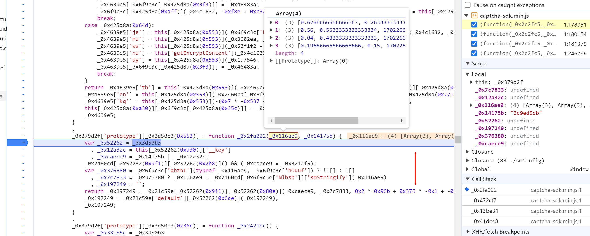

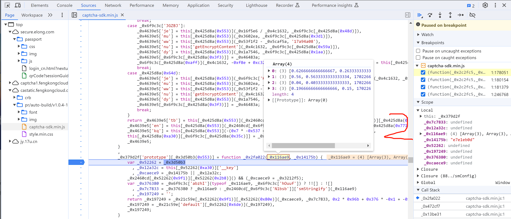


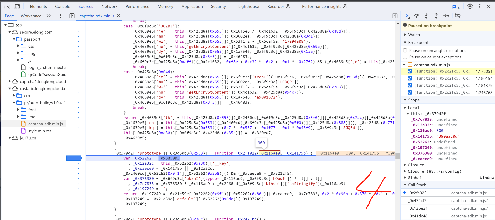

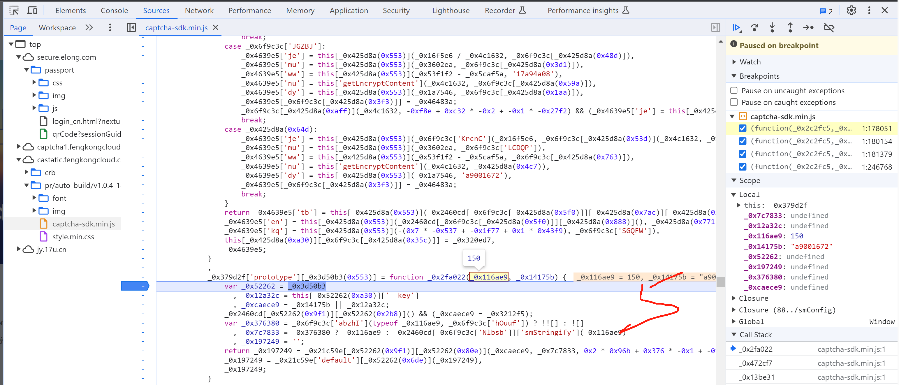

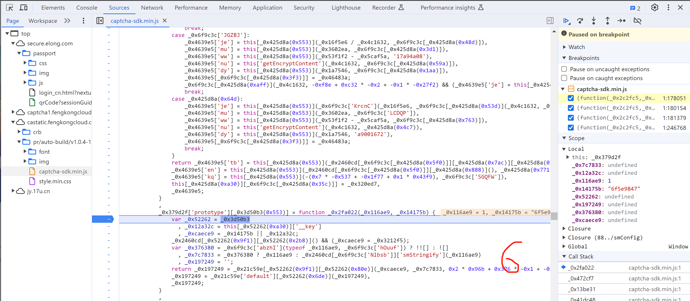

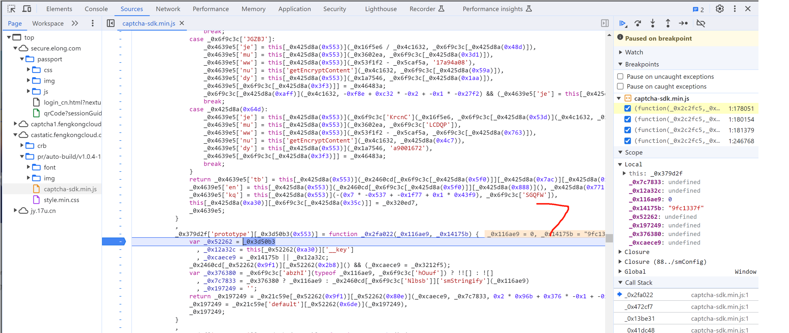

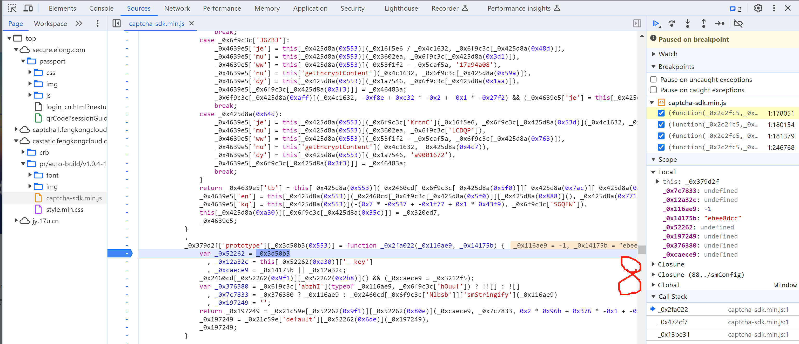


## 5.8 selectData

接下来就是搞定：`this['_data']["selectData"]或 this['_data']['mouseData'] ` 两个值在点选时是一样的。

在刚开始定位有相关赋值：

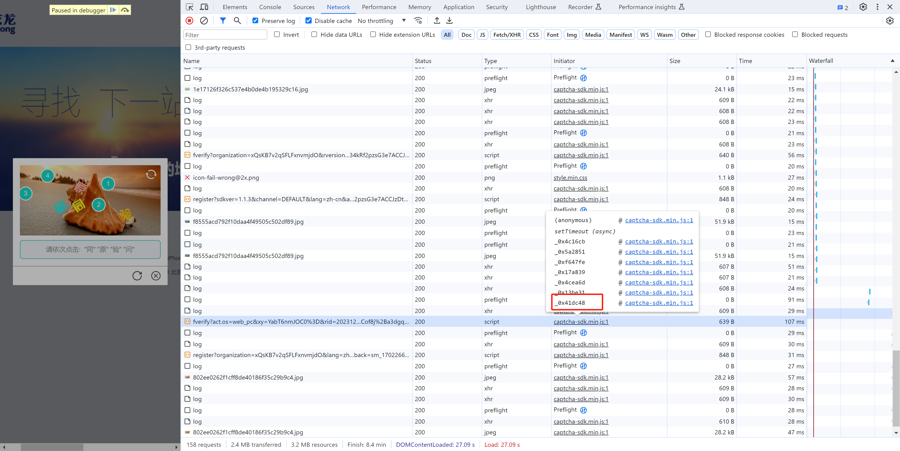

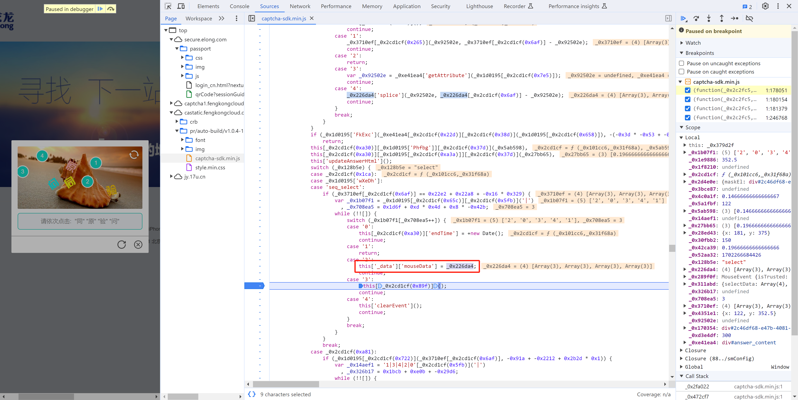

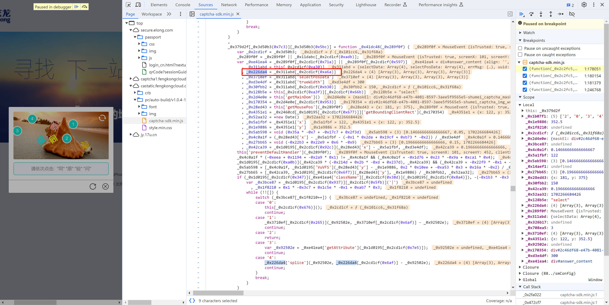


这其实是 mousedown事件，每次点击都会执行，在这里生成相应的数据：

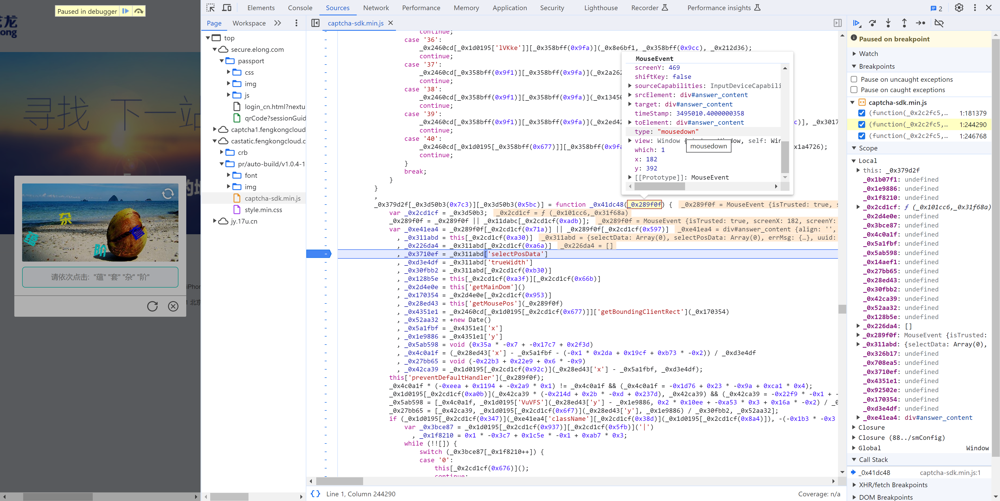

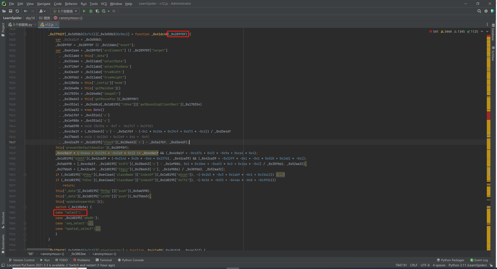


## 5.9 单步调试

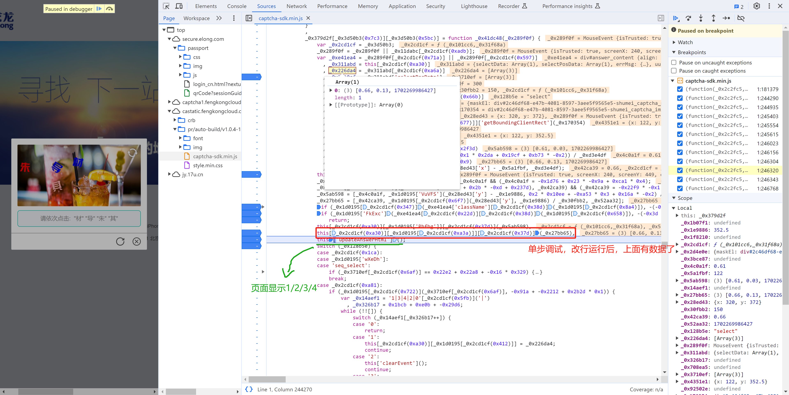

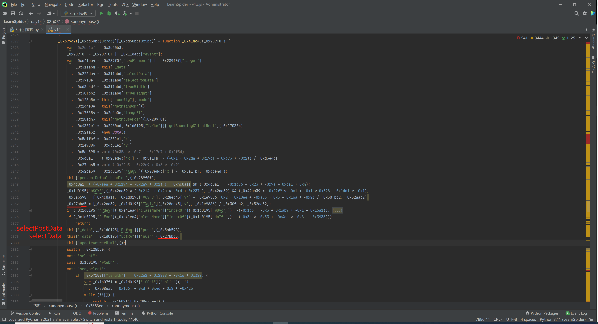

```javascript
_0x52aa32 = +new Date()

_0x27bb65 = [_0x42ca39,  _0x1d0195["IXgiz"](_0x28ed43['y'], _0x1e9886) / _0x30fbb2,    _0x52aa32];
```

### 1.第1个值

```javascript
_0x27bb65 = [_0x42ca39,  _0x1d0195["IXgiz"](_0x28ed43['y'], _0x1e9886) / _0x30fbb2,    _0x52aa32];
```

```javascript
// _0x1d0195["rlnuS"]函数是：第1个参数/第2个参数
// _0x28ed43['x']是鼠标横坐标，事件.pageX
// _0x5a1fbf是图片距可视窗口的left距离
// _0xd3e4df是div图片真实大小300
_0x42ca39 = _0x1d0195["rlnuS"](_0x28ed43['x'] - _0x5a1fbf, _0xd3e4df);
```

```javascript
_0x289f0f = event事件
_0x28ed43 = this['getMousePos'](_0x289f0f)   // 读取鼠标位置：pageX、pageY


_0x4351e1 = _0x2460cd['default']['getBoundingClientRect'](_0x170354)  // _0x170354是图片div的DOM对象，距离可视窗口的距离
_0x5a1fbf = _0x4351e1['x']   // 图片div的DOM对象left距离可是窗口left距离

_0xd3e4df = _0x311abd['trueWidth']  // div图片真实大小300


// _0x1d0195["rlnuS"]函数是：第1个参数/第2个参数
// _0x28ed43['x']是鼠标横坐标，事件.pageX
// _0x5a1fbf是图片距可视窗口的left距离
// _0xd3e4df是div图片真实大小300
_0x42ca39 = _0x1d0195["rlnuS"](_0x28ed43['x'] - _0x5a1fbf, _0xd3e4df);
```

```javascript
'getBoundingClientRect': function _0x5322a8(_0x1e09b6) {
    var _0x4dc5c0 = _0x177388
    // _0x1e09b6是图片div的DOM对象
    // getBoundingClientRect是Javascript中的一种方法,用于获取一个元素相对于视口的位置和大小
    , _0x5bf4ef = _0x1e09b6['getBoundingClientRect']()
    // 滚动距离，可以为0
    , _0x462c70 = _0x3d223c["documentElement"]["scrollLeft"] ? _0x3d223c['documentElement']["scrollLeft"] : _0x3d223c['body']['scrollLeft']
    // 滚动距离，可以为
    , _0x82d331 = _0x3d223c['documentElement']["scrollTop"] ? _0x3d223c["documentElement"]["scrollTop"] : _0x3d223c["body"]["scrollTop"];
    return {
        'x': _0x5bf4ef["left"] + _0x462c70,
        'y': _0x5bf4ef["top"] + _0x82d331
    };
}
```

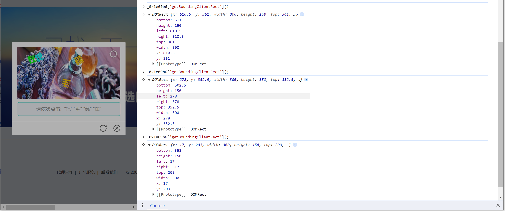

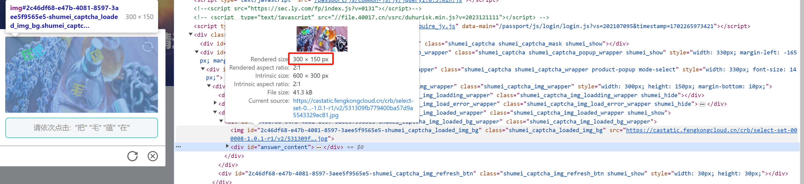


### 3.第2个值

```javascript
_0x27bb65 = [_0x42ca39,  _0x1d0195["IXgiz"](_0x28ed43['y'], _0x1e9886) / _0x30fbb2,    _0x52aa32];
```

```javascript
_0x1d0195["IXgiz"](_0x28ed43['y'], _0x1e9886) / _0x30fbb2
```

```javascript
 _0x28ed43 = this['getMousePos'](_0x289f0f)
_0x28ed43['y']  // 鼠标的y轴距离

_0x4351e1 = _0x2460cd['default']['getBoundingClientRect'](_0x170354)  // _0x170354是图片div的DOM对象，距离可视窗口的距离
 _0x1e9886 = _0x4351e1['y']  // 图片div的DOM对象距离可视窗口top的距离。

_0x30fbb2 = _0x311abd["trueHeight"]  // 图片真实宽度 150

_0x1d0195["IXgiz"](_0x28ed43['y'], _0x1e9886) / _0x30fbb2
```

```
0.11666666666666667  * 300
0.7633333333333333 * 150
```


## 5.10 第4次点击

第

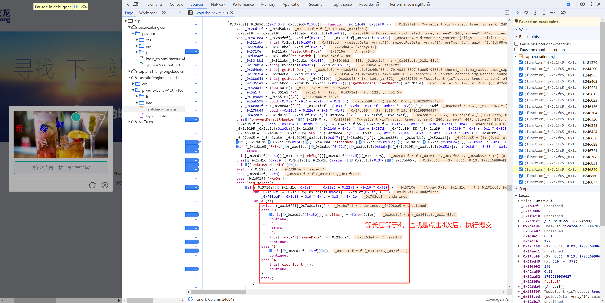


# 6.识别和测试


## 6.1 验证码识别

```python
# @课程   : 爬虫逆向实战课
# @讲师   : 武沛齐
# @课件获取: wupeiqi666

import base64
import requests
from hashlib import md5

file_bytes = open('code.jpg', 'rb').read()

res = requests.post(
    url='http://upload.chaojiying.net/Upload/Processing.php',
    data={
        'user': "wupeiqi",
        'pass2': md5("密码".encode('utf-8')).hexdigest(),
        'codetype': "9501",
        'file_base64': base64.b64encode(file_bytes)
    },
    headers={
        'Connection': 'Keep-Alive',
        'User-Agent': 'Mozilla/4.0 (compatible; MSIE 8.0; Windows NT 5.1; Trident/4.0)',
    }
)

res_dict = res.json()
# {'err_no': 0, 'err_str': 'OK', 'pic_id': '1234612060701120002', 'pic_str': '的,86,73|粉,111,38|菜,40,49|香,198,101', 'md5': 'faac71fc832b2ead01ffb4e813f3be60'}

# 8.每个字的坐标  {"鸭":(196,85), ...}    target_word_list = ["花","鸭","字"]
bg_word_dict = {}
for item in res_dict["pic_str"].split("|"):
    word, x, y = item.split(",")
    bg_word_dict[word] = (x, y)

```


## 6.1 提交点选【搞定】

```python
# @课程    : 爬虫逆向实战课
# @讲师    : 武沛齐
# @课件获取 : wupeiqi666
import time
import json
import requests
import random
import datetime
import base64
import requests
from hashlib import md5
import base64
from Crypto.Cipher import DES


def gen_captcha_uuid():
    total_string = "ABCDEFGHJKMNPQRSTWXYZabcdefhijkmnprstwxyz2345678"
    part = "".join([random.choice(total_string) for i in range(18)])
    ctime = datetime.datetime.now().strftime("%Y%m%d%H%M%S")
    captcha_uuid = f"{ctime}{part}"
    return captcha_uuid


def register(captcha_uuid):
    res = requests.get(
        url="https://captcha1.fengkongcloud.cn/ca/v1/register",
        params={
            "captchaUuid": captcha_uuid,
            "model": "select",
            "appId": "default",
            "rversion": "1.0.4",
            "sdkver": "1.1.3",
            "callback": f"sm_callback",
            "organization": "xQsKB7v2qSFLFxnvmjdO",
            "channel": "DEFAULT",
            "lang": "zh-cn",
            "data": "{}"
        }
    )

    data_dict = json.loads(res.text.strip("sm_callback").strip("(").strip(")"))
    return data_dict


def image_ocr(file_bytes):
    res = requests.post(
        url='http://upload.chaojiying.net/Upload/Processing.php',
        data={
            'user': "wupeiqi",
            'pass2': md5("密码".encode('utf-8')).hexdigest(),
            'codetype': "9501",
            'file_base64': base64.b64encode(file_bytes)
        },
        headers={
            'Connection': 'Keep-Alive',
            'User-Agent': 'Mozilla/4.0 (compatible; MSIE 8.0; Windows NT 5.1; Trident/4.0)',
        }
    )

    res_dict = res.json()
    # {'err_no': 0, 'err_str': 'OK', 'pic_id': '1234612060701120002', 'pic_str': '的,86,73|粉,111,38|菜,40,49|香,198,101', 'md5': 'faac71fc832b2ead01ffb4e813f3be60'}

    # 8.每个字的坐标  {"鸭":(196,85), ...}    target_word_list = ["花","鸭","字"]
    bg_word_dict = {}
    for item in res_dict["pic_str"].split("|"):
        word, x, y = item.split(",")
        bg_word_dict[word] = (int(x), int(y))
    return bg_word_dict


def des_encrypt(data_string, key):
    pad_func = lambda text: text + '\0' * (DES.block_size - (len(text.encode('utf-8')) % DES.block_size))
    aes = DES.new(key.encode('utf-8'), DES.MODE_ECB)
    enc_data = aes.encrypt(pad_func(data_string).encode("utf8"))
    res = base64.b64encode(enc_data).decode('utf-8')
    return res


def run():
    captcha_uuid = gen_captcha_uuid()

    # 注册请求
    data_dict = register(captcha_uuid)

    # 获取图片和识别的文字
    bg_img_url = f'https://castatic.fengkongcloud.cn{data_dict["detail"]["bg"]}'
    char_list = data_dict["detail"]['order']
    rid = data_dict["detail"]['rid']
    print("图上文字验证码：", char_list)

    res = requests.get(url=bg_img_url).content
    ocr_word_dict = image_ocr(res)
    print("识别的验证码：", ocr_word_dict)

    char_list.reverse()
    select_data = []
    for idx, char in enumerate(char_list, 1):
        group = ocr_word_dict.get(char)
        if not group:
            continue
        x, y = group
        real_x = x / 2 / 300
        real_y = y / 2 / 150
        ctime = int((time.time() - random.uniform(idx - 1, idx) * 1000))
        select_data.insert(0, [real_x, real_y, ctime])
        time.sleep(1)

    print("构造点选坐标：", select_data)

    select_data_string = json.dumps(select_data, separators=(',', ':'))
    start_time = select_data[0][-1]
    end_time = int(time.time() * 1000)

    mapping = {
        "mp": ('default', '9cc268c1'),
        "oc": ('DEFAULT', "c2659527"),
        "xy": ('zh-cn', 'b1807581'),
        "jo": ("11", '6d005958'),
        "qd": (select_data_string, '3c9ed5cb'),
        "mu": (select_data_string, "e7e1eb0d"),
        "ww": (str(end_time - start_time), '17a94a08'),
        "nu": ("300", "390aac0d"),
        "dy": ("150", "a9001672"),
        "tb": ("1", '6f5e9847'),
        "en": ("0", "9fc1337f"),
        "kq": ("-1", 'ebee8dcc'),
    }

    verify_dict = {
        "rid": rid,
        "organization": "xQsKB7v2qSFLFxnvmjdO",
        "rversion": "1.0.4",
        "sdkver": "1.1.3",
        "protocol": "180",
        "ostype": "web",
        "callback": "func_callback",
        "act.os": "web_pc",
        "captchaUuid": captcha_uuid
    }
    for k, group in mapping.items():
        data_string, key = group
        enc = des_encrypt(data_string, key)
        verify_dict[k] = enc

    res = requests.get(
        url="https://captcha1.fengkongcloud.cn/ca/v2/fverify",
        params=verify_dict,
        headers={
            "user-agent": "Mozilla/5.0 (Windows NT 10.0; Win64; x64) AppleWebKit/537.36 (KHTML, like Gecko) Chrome/119.0.0.0 Safari/537.36",
            "Referer": "https://secure.elong.com/",
            "Host": "captcha1.fengkongcloud.cn",
            "Origin": "https://secure.elong.com",

        }
    )
    print("识别结果：", res.text)


if __name__ == '__main__':
    run()
```

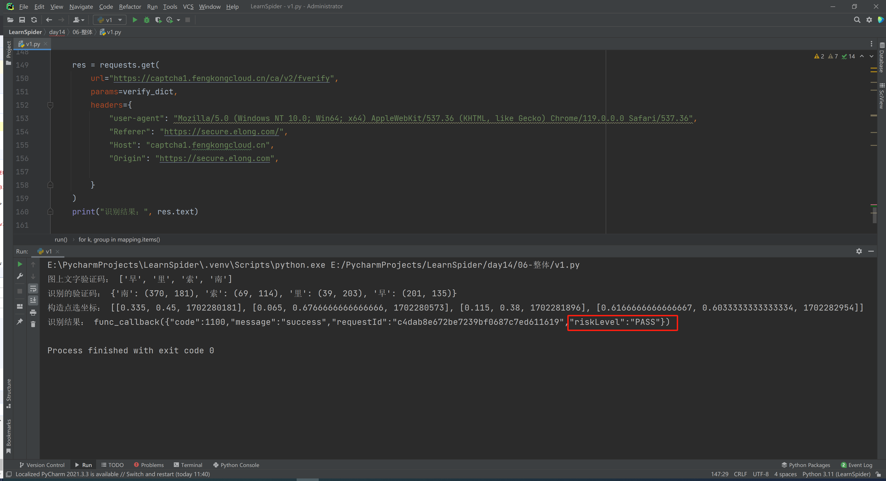


# 7.登录

点选搞定之后，提交登录就简单了，直接携带 `rid`发送请求就行了。

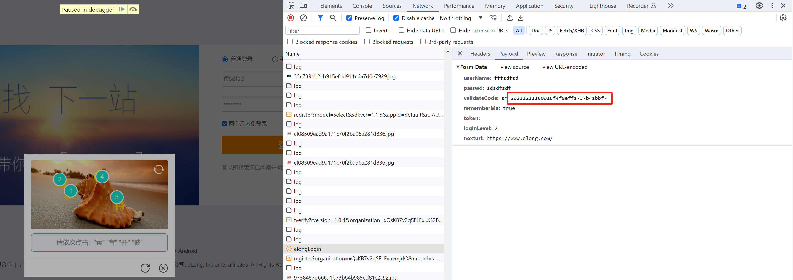

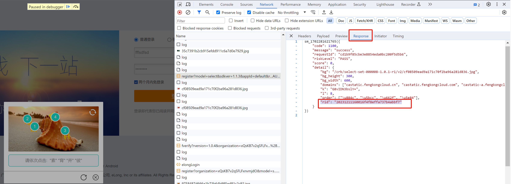


